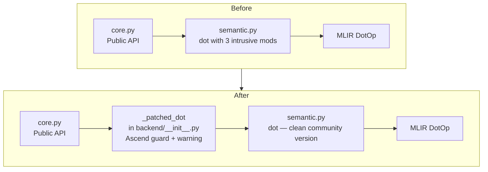
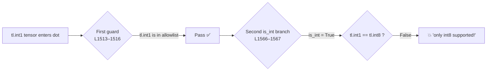
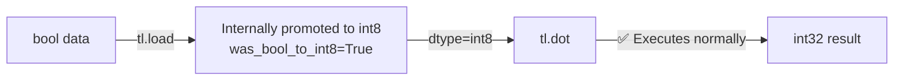
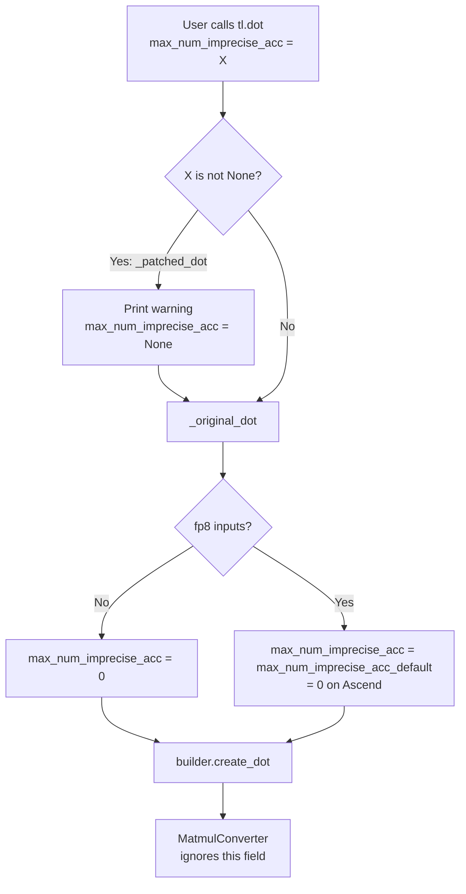
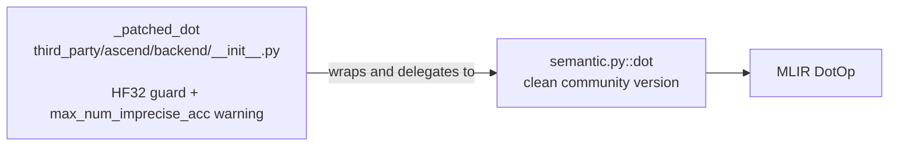

# Eliminate Three Intrusive Modifications to the dot Function

## Background

The `tl.dot` operator in the upstream file `python/triton/language/semantic.py` contains 3 Ascend-specific intrusive modifications, introduced by commit `af7e69d9b` (HF32 support) and commit `f6324548d` (allow_tf32 adaptation). These modifications are written directly into upstream code, incurring high long-term maintenance costs — every upstream merge requires manual conflict resolution.

Goal of this PR: **fully restore the `dot` function in upstream `semantic.py` to the community version, eliminating unnecessary intrusive modifications, and relocate all Ascend-specific logic into `third_party/ascend/backend/__init__.py` via monkey-patch**.



---

## Detailed Changes

### Change 1: Remove `tl.int1` from dtype assertion

**Location**: `semantic.py` lines 1513–1516

```diff
- assert lhs.dtype in (tl.int1, tl.int8, tl.uint8, tl.float16, tl.bfloat16, tl.float32,
+ assert lhs.dtype in (tl.int8, tl.uint8, tl.float16, tl.bfloat16, tl.float32,
                       tl.float64), ...
- assert rhs.dtype in (tl.int1, tl.int8, tl.uint8, tl.float16, tl.bfloat16, tl.float32,
+ assert rhs.dtype in (tl.int8, tl.uint8, tl.float16, tl.bfloat16, tl.float32,
                       tl.float64), ...
```

#### Why `int1` was added (history)

Commit `af7e69d9b` added `tl.int1` to the dtype allowlist, intending to allow bool-type tensors to be used as dot inputs for matrix multiplication.

#### Why it can be removed

The `int1` exemption is **half-baked**: it passes the first dtype guard, but the downstream integer-handling branch was never updated to match —

```python
# semantic.py L1566–1567 (still present after this PR)
if lhs.type.scalar.is_int():
    assert lhs.type.scalar == tl.int8, "only int8 supported!"
```

`int1.is_int()` returns `True`, but `tl.int1 == tl.int8` is `False`, causing an assertion failure with `"only int8 supported!"`:



Furthermore, Ascend's `was_bool_to_int8` mechanism already covers the most common bool → dot path — when `tl.load` loads `int1` data, it internally promotes it to `int8` and marks `was_bool_to_int8 = True`, making load-derived bool data completely transparent to dot:



Native `int1` tensors produced by comparison/logical operations (e.g., `mask = a > 0`) entering dot are a rare edge case. After removing `int1`, users receive a clear `"Unsupported lhs dtype int1"` error at the entry point — far more helpful than the confusing `"only int8 supported!"` error — and will naturally think to use `.to(tl.int8)` for an explicit conversion.

---

### Change 2: Relocate HF32 precision guard to monkey-patch

**Location**: removed from `semantic.py` lines 1584–1587, re-implemented in `backend/__init__.py`

```diff
- # ---- semantic.py: removed ----
- if (input_precision == getattr(ir.INPUT_PRECISION, "HF32")):
-     if (not lhs.dtype.is_fp32() or not rhs.dtype.is_fp32() or not ret_scalar_ty.is_fp32()):
-         input_precision = self._str_to_dot_input_precision(
-             self.builder.options.default_dot_input_precision)
```

```python
# ---- backend/__init__.py: re-implemented via monkey-patch ----
def _patched_dot(self, lhs, rhs, acc, input_precision, max_num_imprecise_acc, out_dtype):
    # HF32 guard: only valid for fp32 x fp32.
    # When lhs is fp32 ret_scalar_ty is guaranteed fp32 by upstream,
    # so checking lhs and rhs alone is sufficient.
    if input_precision is not None and input_precision.lower() == "hf32":
        if not lhs.dtype.is_fp32() or not rhs.dtype.is_fp32():
            input_precision = self.builder.options.default_dot_input_precision
    ...
    return _original_dot(self, lhs, rhs, acc, input_precision,
                         max_num_imprecise_acc, out_dtype)
```

#### Why the guard condition is sufficient

The original intrusive code checked three conditions:

```python
not lhs.dtype.is_fp32() or not rhs.dtype.is_fp32() or not ret_scalar_ty.is_fp32()
```

The monkey-patch only checks two:

```python
not lhs.dtype.is_fp32() or not rhs.dtype.is_fp32()
```

These are equivalent because the upstream `_original_dot` guarantees that when `lhs` is fp32, the internally-computed accumulator type (`ret_scalar_ty`) is **always** fp32 (see `semantic.py` L1564–1572). Therefore the third condition is statically redundant — if `lhs` and `rhs` are both fp32, `ret_scalar_ty` cannot be anything else.

#### Why the HF32 guard is needed

HF32 (High-precision Float32) is the internal truncation precision format used by Ascend NPU Cube units for FP32 matrix multiplication, analogous to NVIDIA's TF32. This precision is **only meaningful for `fp32 × fp32`**:

- If either input is not fp32, HF32 cannot take effect
- Upstream Triton has no concept of HF32 and performs no such validation
- Without this guard, users would silently get unexpected precision (IEEE instead of HF32)

---

### Change 3: Restore upstream `max_num_imprecise_acc` logic, keep warning

**Location**: `semantic.py` lines 1589–1591 restored to upstream logic; warning moved to `backend/__init__.py`

```diff
- # ---- semantic.py: removed Ascend intrusive change ----
- if max_num_imprecise_acc is not None:
-     print("max_num_imprecise_acc in tl.dot is not supported on Ascend yet.")
- max_num_imprecise_acc = 0

+ # ---- semantic.py: restored to upstream logic ----
+ # max_num_imprecise_acc only applies to fp8 -> fp32 dot on sm_90
+ if max_num_imprecise_acc is None:
+     if lhs.dtype.is_fp8() and rhs.dtype.is_fp8():
+         max_num_imprecise_acc = self.builder.options.max_num_imprecise_acc_default
+     else:
+         max_num_imprecise_acc = 0
+ else:
+     if lhs.dtype.is_fp8() and rhs.dtype.is_fp8() and max_num_imprecise_acc > K:
+         raise ValueError(...)
```

```python
# ---- backend/__init__.py: monkey-patch preserves user warning ----
def _patched_dot(self, ...):
    # Ascend NPU does not support imprecise accumulation.
    # Force max_num_imprecise_acc to None so the upstream None
    # branch handles it (via max_num_imprecise_acc_default = 0),
    # avoiding the fp8 ValueError path which is NVIDIA-only.
    if max_num_imprecise_acc is not None:
        print("max_num_imprecise_acc in tl.dot is not supported on Ascend yet. "
              "Thus it is ignored.")
        max_num_imprecise_acc = None
    return _original_dot(self, lhs, rhs, acc, input_precision,
                         max_num_imprecise_acc, out_dtype)
```

#### Why the value is reset to None

After printing the warning, the monkey-patch resets `max_num_imprecise_acc` to `None`, delegating entirely to the existing upstream resolution path:

- Upstream sees `None` → enters the `if max_num_imprecise_acc is None:` branch
- Non-fp8: sets `max_num_imprecise_acc = 0`
- fp8: sets `max_num_imprecise_acc = max_num_imprecise_acc_default` (0 on Ascend)
- The `else` branch (NVIDIA-only `ValueError` when K is exceeded) is **never reached**

> After the Ascend monkey-patch resets the value to `None`, execution continues into the upstream dot logic. There the `if max_num_imprecise_acc is None:` branch applies `max_num_imprecise_acc_default` (0 on Ascend) or directly assigns `0`. The final value reaching `create_dot` is therefore `0` — identical to the original intrusive code which unconditionally forced it to `0`.

#### Why the upstream logic can be restored

`max_num_imprecise_acc` is a precision control parameter for NVIDIA Hopper (SM90) WGMMA instructions, controlling how many imprecise accumulations are allowed in FP8 matrix multiplication. This parameter is **completely ignored throughout the entire Ascend compilation pipeline**:

- C++ code under `third_party/ascend/`: **0 references**
- Ascend's `MatmulConverter` only reads `inputPrecision`, never `maxNumImpreciseAcc`
- `NPUOptions.max_num_imprecise_acc_default = 0` is already set, covering the case where the user passes no value

The monkey-patch prints a warning and resets the value to `None`; the upstream `None` branch then resolves it to 0 (non-fp8) or the default value (fp8, also 0 on Ascend), ensuring the NVIDIA-specific `ValueError` path is never reached.



---

## Behavioral Consistency Tests

To ensure the monkey-patch is behaviorally equivalent to the original intrusive code, four unit tests were added in `third_party/ascend/unittest/pytest_ut/test_dot.py` (class `TestDotAscendPatch`).

### Test approach

The tests use Python mocks (`unittest.mock.MagicMock`) to intercept the arguments forwarded from the monkey-patch to `_original_dot` and ultimately to `self.builder.create_dot`. This avoids requiring a full compilation pipeline while precisely verifying the values that reach the MLIR layer.

### Test cases

| # | Test | Input | Verification |
|---|------|------|------|
| 1 | `test_hf32_fp32_inputs_keep_hf32` | fp32 × fp32, `input_precision="hf32"` | `input_precision` forwarded as `"hf32"` |
| 2 | `test_hf32_fp16_inputs_fallback_to_ieee` | fp16 × fp16, `input_precision="hf32"` | `input_precision` forwarded as `"ieee"` |
| 3 | `test_max_imprecise_explicit_forced_to_zero` | `max_num_imprecise_acc=16`, fp16 inputs | Warning printed; `create_dot` receives `0` |
| 4 | `test_max_imprecise_none_no_warning_and_zero` | `max_num_imprecise_acc=None`, fp16 inputs | No warning; `create_dot` receives `0` |

### Coverage

- **HF32 guard**: tests both the "guard triggered" (fp16 → fallback) and "guard not triggered" (fp32 → keep hf32) branches.
- **`max_num_imprecise_acc`**: verifies that (a) a warning is printed when the user explicitly passes a value, (b) no warning is printed for the default `None`, and (c) in both cases the final value reaching `create_dot` is `0`.
- Test 3 and 4 let the real `_original_dot` execute → the upstream `max_num_imprecise_acc is None` branch resolves it to `0` → captured at `create_dot`. This end-to-end verification confirms the `max_num_imprecise_acc = None` assignment in the monkey-patch works correctly with the upstream logic.

---

## Summary

| Change | Action | `semantic.py` diff | `backend/__init__.py` diff | Tests |
|--------|------|:---:|:---:|:---:|
| 1. Remove `tl.int1` | Remove from dtype assertion | −2 lines | — | — |
| 2. HF32 guard | Remove from `semantic.py`, re-implement in monkey-patch | −4 lines | +8 lines | 2 cases (TestDotAscendPatch) |
| 3. `max_num_imprecise_acc` | Restore upstream logic, move warning to monkey-patch | −3 / +8 lines | +8 lines | 2 cases (TestDotAscendPatch) |

**Final architecture**:



- **Upstream `semantic.py`**: the dot function is fully restored to the community version with zero Ascend custom code
- **Ascend-specific logic**: entirely contained within the `_patched_dot` monkey-patch in `third_party/ascend/backend/__init__.py`, approximately 24 lines
- **Maintainability**: if the upstream dot method signature changes, the patch will **fail explicitly** due to parameter mismatch rather than silently misbehaving, making it easy to detect and adapt
- **Backward compatibility**: user-visible behavior is completely unchanged — the HF32 non-fp32 silent fallback and the `max_num_imprecise_acc` warning are both preserved, verified by unit tests in `third_party/ascend/unittest/pytest_ut/test_dot.py`