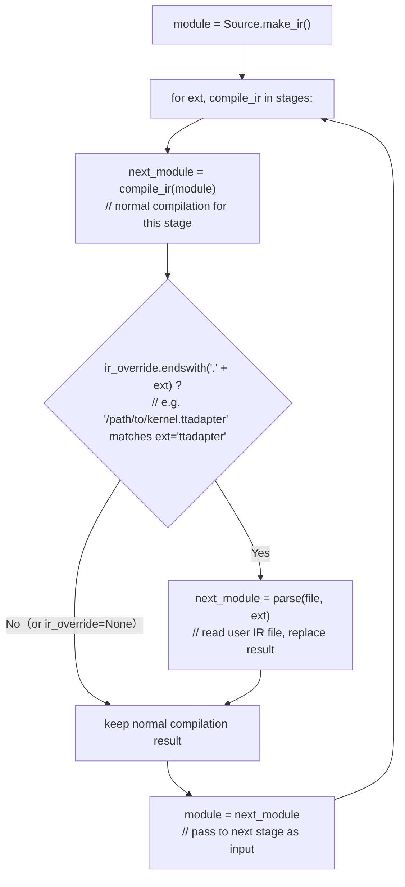

# Optimize NPUOptions: remove dead warp-spec fields and support `ir_override` feature

## 1. Remove 4 warp specialization fields

### Affected fields

| Field | Type | Removed default | Purpose |
|------|------|-------------|------|
| `num_buffers_warp_spec` | `int` | `0` | Number of async buffers between producer and consumer |
| `num_consumer_groups` | `int` | `0` | Number of consumer warp groups |
| `reg_dec_producer` | `int` | `0` | Producer warp register reduction |
| `reg_inc_consumer` | `int` | `0` | Consumer warp register increment |

### Background

These fields are **warp specialization** compilation parameters for NVIDIA SM90+ (Hopper) GPUs. They rely on the `setmaxnreg` instruction and async warp scheduling, which are Hopper-specific features. They were added to `triton.Config.__init__` and `CUDAOptions` in upstream Triton v3.2.0, but were **removed from `triton.Config.__init__` starting in v3.4.0** (warp specialization is now handled internally via TTIR encoding).

triton-ascend is a fork based on upstream v3.5.0, where `triton.Config.__init__` no longer accepts these parameters. However, `NPUOptions` still carries these fields with a constant default of `0`. Ascend NPU hardware has no warp specialization support — these fields are **dead code**.

### Problem

Although these fields serve no purpose on Ascend, they are serialized into `compilation_metadata` and written to NDJSON logs. When tritonparse generates a reproducer script using `--kernel-import override-ttir`, these field values (always `0`) are written into the generated `triton.Config(...)` call:

```python
# Generated reproducer script (broken)
triton.Config(
    kwargs={"BLOCK_SIZE_M": 16, ...},
    num_warps=32,
    num_stages=2,
    num_ctas=1,
    num_buffers_warp_spec=0,   # ← Config.__init__ does not accept this
    num_consumer_groups=0,      # ← Config.__init__ does not accept this
    reg_dec_producer=0,         # ← Config.__init__ does not accept this
    reg_inc_consumer=0,         # ← Config.__init__ does not accept this
    ir_override=_IR_OVERRIDE_FILE,
)
```

Since these parameters are not in `Config.__init__`'s signature in Triton 3.5.0, Python raises `TypeError` at import time, making the reproducer script unusable:

```
TypeError: Config.__init__() got an unexpected keyword argument 'num_buffers_warp_spec'
```

### Change

Remove the four field definitions from `NPUOptions`:

```diff
  cluster_dims: tuple = (1, 1, 1)
  num_warps: int = 32
  num_ctas: int = 1
  num_stages: int = 1 if is_compile_on_910_95 else 2
  warp_size: int = 32
- num_buffers_warp_spec: int = 0
- num_consumer_groups: int = 0
- reg_dec_producer: int = 0
- reg_inc_consumer: int = 0
```

Also clean up two `triton.Config(...)` call sites in `third_party/ascend/backend/runtime/autotuner.py` that pass these four parameters (these calls would also crash with the same `TypeError` if executed).

---

## 2. Support `ir_override` feature

`ir_override` is a standard feature in upstream Triton (already supported by the NVIDIA backend). It allows users to supply a pre-compiled intermediate IR file, and the compilation pipeline skips the corresponding stage, using the provided IR in its place.

**How it works:** The compilation pipeline processes a kernel through multiple stages in sequence — `ttir` → `ttadapter` → `mlirbc` → `bcmlir` → `npubin`. At each stage, the compiler checks whether `ir_override` is set and its file extension matches the current stage（via `ir_override.endswith(f".{ext}")`）. If it matches, the normal compilation result is discarded and the file content is used instead.



When `ir_override` is `None`, the check always fails — every stage keeps its normal compilation result, equivalent to the standard pipeline. When set, only the stage whose extension matches is overridden; all other stages proceed normally.

This is a prerequisite for **tritonparse's reproducer feature** (`--kernel-import override-ttir`), which generates scripts that re-execute kernels by injecting dumped IR files.

To enable this feature on Ascend, two gaps need to be addressed:

1. **`NPUOptions` must accept the `ir_override` kwarg.** The shared `_pack_args` validation logic rejects any keyword not present in `NPUOptions.__dataclass_fields__`. Without this field, passing `ir_override` raises `KeyError`.

2. **The shared `compiler.py:parse()` function must handle Ascend-specific IR extensions.** The community `parse` only recognizes NVIDIA and AMD extensions (`.ttir`, `.ttgir`, `.llir`, `.ptx`, `.cubin`, `.hsaco`, etc.). Ascend's compilation pipeline uses four additional extensions — `.ttadapter`, `.bcmlir`, `.mlirbc`, and `.npubin` — which `parse` does not know how to read.

### Change

Add `ir_override` to `NPUOptions`:

```diff
  cluster_dims: tuple = (1, 1, 1)
  num_warps: int = 32
  num_ctas: int = 1
  num_stages: int = 1 if is_compile_on_910_95 else 2
  warp_size: int = 32
+ ir_override: Optional[str] = None  # filename of a user-defined IR (*.{ttir|ttadapter|mlirbc|bcmlir|npubin})
```

### Adapt `compiler.parse` via monkey-patch

The community `parse` function maps IR extensions to read operations — MLIR module parsing for `.ttir`/`.ttgir`, text reads for `.llir`/`.ptx`/`.amdgcn`, and binary reads for `.cubin`/`.hsaco`. Ascend's additional extensions need the same treatment:

| Extension | Read method | Rationale |
|-----------|-------------|-----------|
| `.ttadapter` | `read_text()` | Returns a string (linalg MLIR text), same as the original `ttir_to_linalg` stage |
| `.bcmlir` | `read_text()` | Returns a string (MLIR text from bytecode), same as the original `bc_to_linalg_by_bishengir_opt` stage |
| `.mlirbc` | `read_bytes()` | Returns bytes (MLIR bytecode) |
| `.npubin` | `read_bytes()` | Returns bytes (NPU binary) |

`.ttir` is already handled by the community `parse` (MLIR module parsing).

Rather than modifying the shared `compiler.py`, we extend the existing `_apply_ascend_patch()` mechanism in `third_party/ascend/backend/__init__.py`. The patched `parse` preserves the community logic verbatim and adds Ascend extensions to the existing branches:

```python
def _patched_parse(full_name, ext, context):
    if ext == "ttir" or ext == "ttgir":                           # community unchanged
        module = ir.parse_mlir_module(full_name, context)
        module.context = context
        return module
    if ext in ("llir", "ptx", "amdgcn", "ttadapter", "bcmlir"):  # Ascend text extensions appended
        return Path(full_name).read_text()
    if ext in ("cubin", "hsaco", "mlirbc", "npubin"):            # Ascend binary extensions appended
        return Path(full_name).read_bytes()
```

---

## Files changed

| File | Change |
|------|--------|
| `third_party/ascend/backend/compiler.py` | `NPUOptions`: remove 4 warp spec fields, add `ir_override` |
| `third_party/ascend/backend/__init__.py` | `_apply_ascend_patch()`: append `compiler.parse` monkey-patch for Ascend IR extensions |
| `third_party/ascend/backend/runtime/autotuner.py` | Remove 4 warp spec params from default Config construction |
| `third_party/ascend/backend/runtime/autotuner.py` | Remove 4 warp spec params from Config clone |
| `third_party/ascend/unittest/autotune_ut/test_ir_override.py` | New: 3 end-to-end override tests (`.ttir`, `.ttadapter`, `.bcmlir`) |

---

## Test strategy

Three end-to-end tests (`test_override_ttir`, `test_override_ttadapter`, `test_override_bcmlir`) validate the `ir_override` pipeline:

1. Compile a "donor" kernel (`×10` operation) with IR dumping enabled to obtain compiled IR files.
2. For each test, copy the donor's dumped IR for the target stage, rename the kernel function, and pass it as `ir_override` to a "target" kernel (identity operation).
3. Verify the target produces `×10` output — confirming the overridden IR replaced the original compilation stage.

The IR is dumped at test time rather than hardcoded, ensuring compatibility across different Ascend hardware generations.

---

## Summary

- **Remove `num_buffers_warp_spec` and related fields**: NVIDIA Hopper-specific parameters with no purpose on Ascend NPU. Kept as dead code they break tritonparse reproducer scripts.
- **Support `ir_override` feature**: Enable tritonparse's `--kernel-import override-ttir` reproducer mode on Ascend. Adds the `ir_override` field to `NPUOptions` for keyword validation, and extends the community `compiler.parse` function via monkey-patch to handle Ascend-specific IR extensions (`.ttadapter`, `.bcmlir`, `.mlirbc`, `.npubin`).
- **Add `ir_override` tests**: Three end-to-end test cases validate the override pipeline at the `.ttir`, `.ttadapter`, and `.bcmlir` compilation stages.
