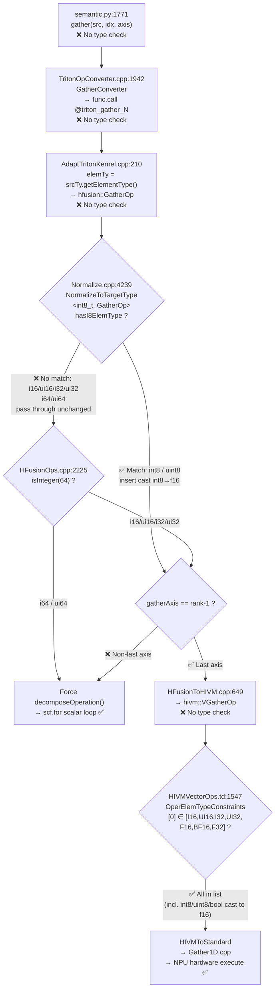

# [API](fix) Remove overly restrictive dtype check in `tl.gather`

## Background

`python/triton/language/semantic.py:1773-1774` added a dtype check on the `src` parameter of `tl.gather` that does not exist in upstream:

```python
if not (src.dtype.is_floating() or src.dtype.is_int8()):
    raise ValueError(...)
```

This check was first introduced in commit `65e7027a3` (2025-07) under `triton_patch/`, and later entered the mainline via the fork-mode mega-merge `313dccecf` (2025-12). At the time, the compiler pipeline was not yet complete and could not support lowering `gather` for certain integer types. The pipeline is now fully capable, and the check has degraded from "necessary safeguard" to "obsolete restriction".

## Current State

Types **allowed** by the check: `float16/bf16/float32/float64/fp8*/int8`

Types **blocked** by the check:

| Blocked Type | Actual Backend Capability | Verdict |
|-------------|---------------------------|---------|
| `i16, ui16, i32, ui32` | Hardware VGatherOp natively supports these (`HIVMVectorOps.td:1547`, `Gather1D.cpp:107-118`) | Frontend falsely blocks |
| `i64, ui64` | `HFusionOps.cpp:2225` `isInteger(64)` check forces scalar loop decomposition | Frontend falsely blocks |
| `uint8, bool` | `uint8`: matched by `NormalizeToTargetType` → cast int8→f16; `bool`: converted by Triton frontend via `tt.bitcast i1→i8` + `tt.load {was_bool_to_int8=true}` → Normalize pass casts to f16 | Frontend falsely blocks |

**Upstream behavior**: no dtype restriction on `src`. All Triton-supported scalar types can be passed to `tl.gather`.

## Why the Check Can Be Removed

### End-to-End Pipeline Verification

After removing the check, the blocked types pass through the compiler pipeline with **zero type-based interception** at any stage:



> \* `bool` is converted to `int8` at the Triton frontend in `semantic.py`: the Triton IR inserts `tt.bitcast !tt.ptr<i1> → !tt.ptr<i8>` + `tt.load {was_bool_to_int8 = true}`. By the time it reaches `NormalizeToTargetType<int8_t, GatherOp>`, the type is already `i8` — the pattern matches normally and casts to `f16`.

### Hardware Instruction-Level Evidence

**Last-axis gather (originally supported types + i16/ui16/i32/ui32) → hardware-native VGatherOp**:

```tablegen
// HIVMVectorOps.td:1547 — VGatherOp hardware instruction type constraints
def VGatherOp : HIVM_VectorOp<"vgather", [
    OperElemTypeConstraints<[0], [I16, UI16, I32, UI32, F16, BF16, F32]>,
    //                         ↑   ↑    ↑    ↑
    //           The four integer types falsely blocked by the frontend
    //           are natively supported by the hardware
]>

// Gather1D.cpp:107-118 — NPU template runtime registration, matches HIVM precisely
REGISTE_GATHER(1, int16_t);
REGISTE_GATHER(1, uint16_t);
REGISTE_GATHER(1, int32_t);
REGISTE_GATHER(1, uint32_t);
```

**Non-last-axis gather (any type) → decomposeOperation scalar loop decomposition**; **i64/ui64 (regardless of axis) → forced decomposition**:

```cpp
// HFusionOps.cpp:2224-2226 — i64 or non-last-axis takes the decomposition path,
//                             which uses pure scalar extract/insert
if (gatherAxis == rank - 1 && !srcElmTy.isInteger(64))
    return failure();  // failure = do NOT decompose → use VGatherOp hardware
//                               ^^^^^^^^^^^^^^^^^^^^
//   Non-last-axis (gatherAxis != rank-1) / i64 (isInteger(64)) do not satisfy
//   the condition → continue → scf.for loop + tensor.extract + tensor.insert
//   Scalar extract/insert imposes zero dtype constraints — any MLIR-legal type works.
```

## Validation

Based on the existing `generalization_cases/test_general_gather.py`, dtype parameterization was extended to cover all previously blocked types:

| src dtype | Test shape count | Result |
|-----------|:---:|------|
| `float32, float16, bfloat16` | 6 | ✅ All pass (originally supported) |
| `int8` | 6 | ✅ All pass (originally supported, normalize→f16) |
| **`int32, int16, int64`** | 6 | ✅ **All pass (newly allowed, incl. last-axis/non-last-axis)** |
| **`uint8, bool`** | 6 | ✅ **All pass (newly allowed, incl. last-axis/non-last-axis)** |

> Note: `[128,64]×[128,128]` large-shape cases are skipped due to UB memory shortage — this affects all dtypes uniformly and is not introduced by this change.

## Changes

```diff
-        if not (src.dtype.is_floating() or src.dtype.is_int8()):
-            raise ValueError(f"Expected dtype fp16/fp32/bf16/f8E5M2/f8E4M3FN/int8, but got {src.dtype}")
-
```

Only two lines deleted, no other changes. Behavior now matches upstream: all Triton-supported scalar types are accepted.
