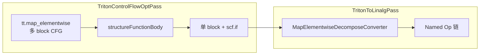
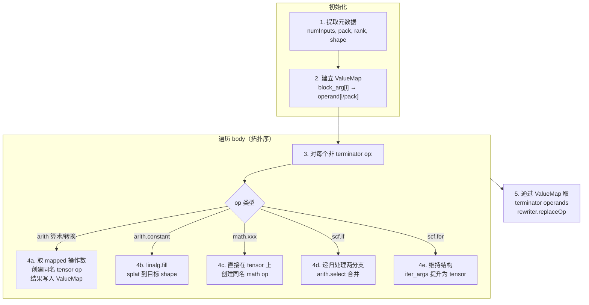

# Ascend 后端 `tt.map_elementwise` Lowering 方案（Region Decomposition 路径）

## 1. 背景

### 1.1 什么是 `tl.map_elementwise`

Triton 3.6 新增，commit `fdd694d48a`。它接收一个 `@triton.jit` 标量函数，将其映射到张量的每个元素上执行。

**核心动机**：让元素级计算具备真正的控制流。`tl.where(cond, a, b)` 两个分支都计算再二选一（`arith.select`），而 `tl.map_elementwise` 的 `if/else` 只执行走到的分支。

```python
@triton.jit
def add_scalar(a, b):
    return a + b

def add(x, y):
    return tl.map_elementwise(add_scalar, x, y)
```

### 1.2 算子 IR 结构

以 `add_scalar` 为例。

**pack=1**：region 的 block args 数量 = `2 × 1 = 2`：

```mlir
%z = "tt.map_elementwise"(%x, %y) <{pack = 1 : i32}> ({
^bb0(%a: i32, %b: i32):
  %sum = arith.addi %a, %b : i32
  tt.map_elementwise.return %sum : i32
}) : (tensor<128xi32>, tensor<128xi32>) -> tensor<128xi32>
```

**pack=2**：block args = `2 × 2 = 4`，排列为 interleaved：`[x[0], x[1], y[0], y[1]]`。region 内同样做加法，只是每个 op 出现两次：

```mlir
%z = "tt.map_elementwise"(%x, %y) <{pack = 2 : i32}> ({
^bb0(%x0: i32, %x1: i32, %y0: i32, %y1: i32):
  %s0 = arith.addi %x0, %y0 : i32
  %s1 = arith.addi %x1, %y1 : i32
  tt.map_elementwise.return %s0, %s1 : i32, i32
}) : (tensor<128xi32>, tensor<128xi32>) -> tensor<128xi32>
```

### 1.3 算子约束

| 约束项 | 规则 | 谁保证 |
|--------|------|--------|
| 输入数 ≥ 1 | `MapElementwiseOp::verify()` | 上游 |
| pack 是 2 的幂 | `MapElementwiseOp::verify()` | 上游 |
| region 参数数 = numInputs × pack | `verifyRegions()` | 上游 |
| region 返回数 = numOutputs × pack | `verifyRegions()` | 上游 |
| region 内禁止 Write | `verifyRegions()` | 上游 |
| 同 shape | `SameOperandsAndResultShape` trait | 上游 |

---

## 2. 候选方案分析

### 2.1 问题抽象

去 pack 后（pack 在 converter 阶段处理，不影响最终 IR 结构），`tt.map_elementwise` 需要表达的核心语义：

> 多输入、多输出的逐元素计算，region 内为任意标量运算（含控制流 `scf.if`）。

### 2.2 分析原则

方案合理性从 triton-ascend 视角评估，只问 op 自身能力，不问 NPUIR 当前能否处理：
- **语义可行性**：op 定义上能否表达多输出、控制流
- **实现复杂度**：converter 编写成本
- **性能**：这种 IR 形态的运行效率，以及 NPUIR 侧是否容易识别和优化

### 2.3 方案

#### A. `linalg::MapOp`

逐元素映射，region 内放标量计算 + `linalg.yield`。

- 语义：**单输出是硬伤**——MapOp 只 yield 一个值，多输出需拆成多个 MapOp 分别遍历，语义降级
- 实现：简单，IRMapping clone region body → mapper body
- 性能：结构化 op，后端易优化；但 LinalgToHFusion 仅识 `func::CallOp(__hmf_*)` 形态

#### B. `linalg::GenericOp`

`iterator_types = ["parallel"]` + identity `indexing_maps`，body 克隆自 region。

- 语义：**完美匹配**——"每个迭代点执行标量函数"即 GenericOp 定义本身
- 实现：简单，IRMapping clone，构造 identity maps 和 `tensor::EmptyOp` init
- 性能：`parallel` 声明了无依赖并行，后端可自由向量化/融合；模式固定（全 parallel + identity maps），NPUIR 易于识别
- 阻塞点：NPUIR 侧 `linalg::GenericOp` 被标记 illegal，需新增 pattern，支持难度大

#### C. `scf.for` + `tensor.extract/insert`

循环遍历元素，extract 取标量、insert 写回。

- 语义：功能可表达，但 map 语义丢失——loop 是串行构造，后端看不出"元素独立可并行"
- 实现：较复杂，需构建嵌套循环，多维索引处理 extract/insert
- 性能：`tensor.insert` 引入虚假跨迭代依赖，阻碍向量化/融合；循环体分析比结构化 op 更难优化

#### D. `scf.for` + `memref.load/store`

类似 C，用 memref 替代 tensor。

- 语义：同 C
- 实现：需额外管理 memref 分配和 bufferization 转回，代码量大
- 性能：别名分析优于 C，但仍丢失并行度信息

#### E. Region Decomposition（选定方案）

将 region body 内的**每个标量操作逐一提升为 tensor 级 Named Op**，而不是把整个 body 塞进一个 op。

```
tt.map_elementwise region:          产物:
  arith.addi                        arith.addi %A, %B       ← 直接 tensor
  math.exp                          math.exp %A             ← 直接 tensor
  scf.if                            arith.select            ← 两分支展开
       ↓                                  ↓
  一个 op（不可见 body）            多个独立的 Named Op
                                   （全链路已通）
```

- 语义：每个标量 op 有对应的 tensor 级 named op，功能可完整表达
- 实现：遍历 body + op 映射 + 标量→tensor 提升，约 200 行
- 性能：产物均为逐元素向量指令，天然匹配昇腾 SIMD 架构
- **零 NPUIR 改动**：arith on tensor（legal）、math 直接 on tensor（和 arith 一样 NPUIR 已支持）、arith.select（legal）

### 2.4 综合对比

| 方案 | 方案合理性 | triton-ascend 任务 | npuir 任务 | 可行性 |
|------|-----------|-------------------|-----------|--------|
| A. linalg::MapOp | 单输出硬伤，拆多 MapOp 语义降级 | 简单：IRMapping clone | 需支持非 `__hmf_*` 的 inline body | ❌ |
| B. linalg::GenericOp | 语义完美，多输出+控制流原生支持，parallel 声明可并行 | 简单：构造 identity maps + init + clone body ~80 行 | 新增 pattern，支持难度大 | ✅ |
| C. scf.for + tensor | 功能可表达，但丢失"元素独立"信息 | 较复杂：嵌套循环 + extract/insert | 无需特殊处理，但难以做融合优化 | ❌ |
| D. scf.for + memref | 同 C | 较复杂：memref 分配管理 | 同 C | ❌ |
| **E. Region Decomposition** | **标量→tensor 直接映射，arith/math 一律提升为同名 tensor op，控制流用 select/for** | 中等：遍历 body + op 映射 + 标量→tensor 提升 ~200 行 | **无** | ✅ |

### 2.5 结论

选择方案 E（Region Decomposition），原因：

1. **零 NPUIR 改动**：产物全是 NPUIR 当前可消化的 op，不需要新增任何 pattern
2. **SIMD 天然匹配**：向量指令是对昇腾硬件最自然的表达
3. **实现可控**：converter 核心逻辑是 op 遍历 + 类型映射，复杂度可控
4. **CFG 复用**：Phase 1 复用 `structureFunctionBody`，与方案 B 相同

## 3. Lowering 设计

### 3.1 总体流程



- **Phase 1**（`TritonControlFlowOptPass`）：复用 `structureFunctionBody` 将 region 内多 block CFG 转为单 block + 嵌套 `scf.if`
- **Phase 2**（`TritonToLinalgPass`）：`MapElementwiseDecomposeConverter` 将单 block region 分解为多个 tensor 级 Named Op

### 3.2 Phase 1：CFG 规范化（复用 structureFunctionBody）

`map_elementwise` 的 `scalar_fn` 经内联后 region 内产生多 block CFG（`cf.cond_br` / `cf.br`）。`structureFunctionBody` 已有全套 CFG 结构化能力（`cf.br` 链内联、`cf.cond_br` → `scf.if`、循环检测报错、多 exit block 收敛等），只需将 `map_elementwise` region 纳入其处理范围。

改动仅涉及 `TritonControlFlowOptPass.cpp`，两处：

**1. `isSupportedReturn`**：追加 `MapElementwiseReturnOp`

```cpp
static bool isSupportedReturn(Operation *op) {
    return isa<triton::ReturnOp, func::ReturnOp,
               triton::MapElementwiseReturnOp>(op);
}
```

**2. `runOnOperation()`**：收集 `MapElementwiseOp` 并调用 `structureFunctionBody`

```cpp
// walk 收集：
if (isa<triton::FuncOp, func::FuncOp, triton::MapElementwiseOp>(op))
    funcs.push_back(op);

// 处理：
if (auto mapOp = dyn_cast<triton::MapElementwiseOp>(op)) {
    if (failed(structureFunctionBody(mapOp, mapOp.getRegion()))) { ... }
}
```

`createReturnLike` 不需要修改——它通过 `sampleReturn->getName()` 创建 op，对任意 return-like op 泛型工作。

#### 3.2.1 嵌套控制流增强：Block 复制预变换

**问题**：`structureFunctionBody` 的树路径（tree path）要求每个 `cf.cond_br` 的两条分支最终收敛到同一个 join block。对于嵌套 if/else 中共享收敛块（shared convergence block，即多个不同前驱分支指向同一个 block）的场景，树路径无法处理——`findNearestCommonBlock` 可能对某一层 cond_br 找不到公共收敛点。

例如，以下嵌套 if：
```python
if x > 0:
    if y > 0:
        return x + y
    else:
        return x - y
else:
    return y - x
```

生成的 CFG 中，外层的 `cf.cond_br(false)` 和内层的 `cf.cond_br(false)` 可能指向同一个返回块（in-degree > 1）。树路径对外层 cond_br 能找到公共收敛，但对内层 cond_br 则找不到（一条分支到新 block，另一条到已收敛的 block），导致结构化失败。

**方案**：在调用 `structureFunctionBody` 之前，增加 `splitMultiPredecessorBlocks` 预变换——对 in-degree > 1 的 block，按前驱逐份复制，每份副本的 block argument 替换为对应前驱传入的具体值。迭代执行直到所有 block 的 in-degree ≤ 1。

**原理**：消除所有共享收敛的 block 后，CFG 退化为森林（每个 block 仅有一个前驱），`structureFunctionBody` 的树路径必然能成功结构化。

**消除冗余**：复制产生的临时冗余指令在 Phase 3（`MapElementwiseDecomposeConverter`）中会被平坦化到同一 block，由 CSE 自动消除（相同 op 合并为一份）。

**实现位置**：`TritonControlFlowOptPass.cpp` 中新增三个静态函数：
- `collectPredecessorInfo`：收集所有 block 的前驱信息
- `rewireBranchDest`：将前驱的分支指令重定向到新 block
- `splitMultiPredecessorBlocks`：迭代分裂直到所有 block in-degree ≤ 1

在 `runOnOperation()` 中，MapElementwiseOp 处理时先调用 `splitMultiPredecessorBlocks`，再调用 `structureFunctionBody`。

### 3.3 Phase 2：ScalarMathCanonicalizer 的豁免

`ScalarMathCanonicalizer` 是 `TritonToLinalgPass` 贪婪重写阶段的一个 pattern，处理函数体内出现的标量 op：通过 `splat → tensor<1> op → extract` 临时包装为单元素张量，以帮助 TypeConverter 统一类型。

但它不能碰 `map_elementwise` region 里的标量 op——原因有两个：一是它的 `tensor<1>` 包装不适用于我们需要的完整张量提升（`tensor<128>`）；二是 `extract` 无法变回 `map_elementwise` 的多元素输出。

`ScalarMathCanonicalizer` 已经内建了对 `map_elementwise`（以及 `reduce`、`scan`）的豁免——在 `matchAndRewrite` 中检查父 op，命中则主动跳过：

```cpp
if (auto linalgOp =
        op->template getParentOfType<triton::MapElementwiseOp>()) {
    return rewriter.notifyMatchFailure(
        op, "ScalarMathCanonicalizer handles op not within tt.map_elementwise.");
}
```

模板实现在 `TritonOpConverter.h` 131-136 行，无需改动 `.cpp`。我们的工作只是确保它继续存在，不被未来的重构误删。

### 3.4 Phase 3：MapElementwiseDecomposeConverter

维护 `scalar Value → tensor Value` 映射表，遍历 region body 将每个标量 op 提升为 tensor 级 Named Op。pack 处理与之前一致：`block_arg[i] → operand[i/pack]`。



处理流程对以下六类 op 的分发：

| op 类型 | 处理 | 产物 |
|---------|------|------|
| arith 算术/转换 | 取 mapped 操作数，创建同名 tensor op | `arith.addi %A, %B : tensor<...>` |
| arith.constant | 创建 `tensor.empty` + `linalg.fill` | `linalg.fill ins(%c) outs(...)` |
| math.xxx | 取 mapped 操作数，创建同名 tensor op | `math.exp %A : tensor<...>` |
| scf.if | 递归处理两分支，创建 `arith.select` | `arith.select %cond, %then, %else` |
| scf.for | 维持结构，iter_args 提升为 tensor | `scf.for ... iter_args(%tensor)` |

**各类 op 的详细处理：**

**arith 算术**（add/sub/mul/div/rem/neg/max/min）：arith 算子本身支持 tensor 操作数，直接映射。

```
标量:  %s = arith.addi %a, %b : i32
       ↓
tensor: %s_t = arith.addi %A, %B : tensor<128xi32>
```

覆盖：`addi/addf/subi/subf/muli/mulf/divsi/divui/divf/remsi/remui/remf/negf/maxf/minf/maxsi/minsi/maxui/minui`

**arith 类型转换**（sitofp/uitofp/fptosi/fptoui/ext/trunc）：同样支持 tensor，直接映射。

```
标量:  %s = arith.sitofp %a : i32 to f32
       ↓
tensor: %s_t = arith.sitofp %A : tensor<128xi32> to tensor<128xf32>
```

覆盖：`sitofp/uitofp/fptosi/fptoui/extsi/extui/extf/trunci/truncf`

**math 函数**（exp/sqrt/log/sin/cos/erf/ceil/floor/absf 等）：和 arith 一样，`math.xxx` 直接接受 tensor 操作数，不需要包装。

```
标量:  %e = math.exp %a : f32
       ↓
tensor: %e_t = math.exp %A : tensor<128xf32>
```

覆盖：`exp/exp2/log/log2/sqrt/rsqrt/sin/cos/erf/ceil/floor/absf/absi`

**控制流**（scf.if → arith.select）：两个分支完整展开为 tensor 链，用 `arith.select` 合并。SIMD 上两个分支都会执行，与 `arith.select` 语义完全一致。嵌套 `scf.if` 递归展开。

```
标量:
  %res = scf.if %cmp -> i32 {
    scf.yield %then_val : i32
  } else {
    %e = math.exp %x : i32
    scf.yield %e : i32
  }

tensor:
  %then_t = ...                         // then 分支的 tensor 链
  %e_t = math.exp %X : tensor<128xf32>    // else 分支的 tensor 链
  %res_t = arith.select %cmp_t, %then_t, %e_t : tensor<128xi32>
```

**常量**（arith.constant）：splat 为同 shape 的常量 tensor。

```
标量:  %c = arith.constant 0 : i32
       ↓
tensor: %init = tensor.empty() : tensor<128xi32>
        %c_t = linalg.fill ins(%c) outs(%init)
```

**结构化循环**（scf.for）：维持 `scf.for` 结构，`iter_args` 从标量提升为 tensor。（`scf.while` 不直接支持，因为 `scf.condition` 要求标量 `i1`，无法提升为 tensor。）

```
标量:
  %r = scf.for %i = %c0 to %cN step %c1
       iter_args(%acc = %init_s) -> i32 {
    %new = arith.addi %acc, %x : i32
    scf.yield %new
  }

tensor:
  %r_t = scf.for %i = %c0 to %cN step %c1
         iter_args(%acc_t = %init_t) -> tensor<128xi32> {
    %new_t = arith.addi %acc_t, %X : tensor<128xi32>
    scf.yield %new_t
  }
```

### 3.5 代码修改清单

| 文件 | 修改内容 |
|------|---------|
| `TritonControlFlowOptPass.cpp` | `isSupportedReturn` + `MapElementwiseReturnOp`；`runOnOperation()` + `MapElementwiseOp`；新增 `splitMultiPredecessorBlocks` + 辅助函数处理嵌套控制流共享收敛块 |
| `TritonOpConverter.h` | 删除 `MapElementwiseCFGCanonicalizer` 和 `MapElementwiseToGenericConverter`；新增 `MapElementwiseDecomposeConverter` |
| `TritonOpConverter.cpp` | 删除旧实现；实现 `MapElementwiseDecomposeConverter` |
| `TritonToLinalgPass.cpp` | 删除 `MapElementwiseCFGCanonicalizer` 注册；注册 `MapElementwiseDecomposeConverter` |

---

## 4. NPUIR 下游依赖

**无。** 产物均为 NPUIR 现有管线可消化的 op：

| 产出 op | NPUIR 处理 |
|---------|-----------|
| `arith.*` on tensor | LinalgToHFusion 中 `arith` dialect 整体 legal |
| `math.xxx` on tensor | LinalgToHFusion 中 `math` dialect 整体 legal |
| `arith.select` | legal |
| `linalg.fill` | named op，已支持 |
| `scf.for` | legal |

---

## 5. 测试设计

### 5.1 端到端 Python 测试

测试文件：`third_party/ascend/unittest/pytest_ut/test_map_elementwise_ops.py`

| 测试 | 场景 | 验证点 |
|------|------|--------|
| `test_map_arith_add_i` | 整型二元运算 | `arith.addi` 直接 on tensor |
| `test_map_arith_mul_f` | 浮点二元运算 | `arith.mulf` on tensor |
| `test_map_arith_bitwise` | 位运算 (and/or/xor) | `arith.andi/ori/xori` on tensor |
| `test_map_cmp_i` | 比较 + 外部常量 | `arith.cmpi` on tensor |
| `test_map_cast_sitofp` | 类型转换 | `arith.sitofp` on tensor |
| `test_map_math_exp` | 浮点 math | `math.exp` 直接 on tensor |
| `test_map_math_abs_i` | 整数 math | `math.absi` 直接 on tensor |
| `test_map_select_direct` | arith.select | `arith.select` on tensor |
| `test_map_2d` | 多维 tensor | rank 无关，arith 直接作用 |
| `test_map_for_loop` | scf.for | iter_args 提升为 tensor |
| `test_map_if_elif_chain` | 长 if/elif/else 链 | 多层 `scf.if` → `arith.select` 级联 |
| `test_map_if_no_return_in_branch` | if 分支内无 return（变量赋值） | 收敛块 + `arith.select` |
| `test_map_nested_if` | 嵌套 if/else（共享收敛块） | block 复制 + 树路径 + `arith.select` 级联 |
| `test_map_for_with_if` | for 循环内嵌 if | `scf.for` + `scf.if` → `arith.select` |
| `test_map_where` | `tl.where` 标量 op | `arith.select` 直接 on tensor |
| `test_map_elementwise` | 控制流 if/elif/else | `scf.if` → `arith.select` |
| `test_map_elementwise_multiple_outputs` | 多输出 divmod | `arith.divsi/remsi` on tensor |
| `test_map_elementwise_pack` | pack=2 | pack 抹除 |

注：后三个为社区原有用例，同时保留在 `test_core.py` 中。`uint32` 在 NPU 设备上不支持，test 文件中改为 `int32` 适配。`test_map_nested_if` 为之前 xfail 的测试，通过 block 复制预变换修复。

---

## 附录 C：端到端测试 DSL / TTIR / Adapter IR

### C.1 test_map_arith_add_i — 整型二元运算

```python
@triton.jit
def _add_i(a, b):
    return tl.add(a, b, sanitize_overflow=False)
```

**TTIR**：
```mlir
%z = "tt.map_elementwise"(%x_1, %y_3) <{pack = 1 : i32}> ({
^bb0(%z_4: i32, %z_5: i32):
  %2 = arith.addi %z_4, %z_5 : i32
  tt.map_elementwise.return %2 : i32
}) : (tensor<128xi32>, tensor<128xi32>) -> tensor<128xi32>
```

**Adapter IR**（标量 arith.addi → tensor arith.addi）：
```mlir
%z = arith.addi %x_1, %y_3 : tensor<128xi32>
```

---

### C.3 test_map_arith_bitwise — 位运算

```python
@triton.jit
def _bitwise(a, b):
    return a & b, a | b, a ^ b
```

**Adapter IR**（and/or/xor 直接作用在张量上）：
```mlir
%0 = arith.andi %a_1, %b_3 : tensor<128xi32>
%1 = arith.ori  %a_1, %b_3 : tensor<128xi32>
%2 = arith.xori %a_1, %b_3 : tensor<128xi32>
```

---

### C.4 test_map_cmp_i — 比较 + 外部常量

```python
@triton.jit
def _gt_zero(a):
    if a > 0: return 1
    else:     return 0
```

**Adapter IR**（arith.cmpi + extui 直接 on tensor，外部常量 0 由 getOperand 延迟 fill 提升）：
```mlir
%z = arith.constant 0 : i32
%z_4 = arith.cmpi sgt, %x_1, %z_fill : tensor<128xi32>
%z_5 = arith.extui %z_4 : tensor<128xi1> to tensor<128xi32>
```

---

### C.5 test_map_cast_sitofp — 类型转换

```python
@triton.jit
def _cast(a):
    return a.to(tl.float32)
```

**Adapter IR**（arith.sitofp 直接接受 tensor，结果类型自动推断）：
```mlir
%z = arith.sitofp %x_1 : tensor<128xi32> to tensor<128xf32>
```

---

### C.6 test_map_math_exp — 浮点 math

```python
@triton.jit
def _exp(a):
    return tl.exp(a)
```

**Adapter IR**（math.exp 直接接受 tensor，和 arith 一样无需包装）：
```mlir
%z = math.exp %x_1 : tensor<128xf32>
```

---

### C.10 test_map_elementwise — 控制流 if/elif/else

```python
@triton.jit
def _compare(x, y):
    if x < y:       return -1
    elif x == y:    return 0
    else:           return 1
```

**TTIR**（多 block CFG，由 structureFunctionBody 处理）：
```mlir
%z = "tt.map_elementwise"(%x_2, %y_4) <{pack = 1 : i32}> ({
^bb0(%z_5: i32, %z_6: i32):
  %2 = arith.cmpi slt, %z_5, %z_6 : i32
  cf.cond_br %2, ^bb2(%c-1_i32 : i32), ^bb1
^bb1:
  %3 = arith.cmpi eq, %z_5, %z_6 : i32
  cf.cond_br %3, ^bb2(%c0_i32 : i32), ^bb2(%c1_i32 : i32)
^bb2(%4: i32):
  tt.map_elementwise.return %4 : i32
}) : (tensor<128xi32>, tensor<128xi32>) -> tensor<128xi32>
```

**Adapter IR**（structureFunctionBody 折叠 CFG → arith.select；外部常量 fill 提升）：
```mlir
%z_4 = arith.cmpi slt, %x_1, %y_3 : tensor<128xi32>
%z_6 = linalg.fill ins(-1 : i32) ...
%z_7 = arith.cmpi ne, %x_1, %y_3 : tensor<128xi32>
%z_8 = arith.extui %z_7 : tensor<128xi1> to tensor<128xi32>
%z_9 = arith.select %z_4, %z_6, %z_8 : tensor<128xi1>, tensor<128xi32>
```

---

### C.11 test_map_elementwise_multiple_outputs — 多输出 divmod

```python
@triton.jit
def _divmod(a, b):
    return a // b, a % b
```

**Adapter IR**（多输出各自独立为 tensor op 链）：
```mlir
%0 = arith.divsi %a_1, %b_3 : tensor<512xi32>
%1 = arith.remsi %a_1, %b_3 : tensor<512xi32>
```

---

### C.12 test_map_elementwise_pack — pack=2

```python
@triton.jit
def _divmod_pack2(a0, a1, b0, b1):
    return a0 // b0, a1 // b1, a0 % b0, a1 % b1
```

**Adapter IR**（pack=2 的 4 个 block arg 映射为 2 个输入张量，CSE 消除重复计算，输出与 pack=1 一致）：
```mlir
%0 = arith.divsi %a_1, %b_3 : tensor<512xi32>
%1 = arith.remsi %a_1, %b_3 : tensor<512xi32>
```

---

### C.13 test_map_for_loop — scf.for 循环

```python
@triton.jit
def _accumulate(a):
    result = 0
    for i in range(5):
        result = result + a
    return result
```

**TTIR**：
```mlir
%z = "tt.map_elementwise"(%x_1) <{pack = 1 : i32}> ({
^bb0(%a: i32):
  %result = scf.for %i = %c0 to %c5 step %c1 iter_args(%acc = %c0_i32) -> i32 {
    %new = arith.addi %acc, %a : i32
    scf.yield %new : i32
  }
  tt.map_elementwise.return %result : i32
}) : (tensor<128xi32>) -> tensor<128xi32>
```

**Adapter IR**（循环骨架不变，iter_args 从标量提升为 tensor，body 内 arith.addi 提升为 tensor）：
```mlir
%z_fill = linalg.fill ins(0 : i32) ... → tensor<128xi32>
%z_result = scf.for %i = %c0 to %c5 step %c1 iter_args(%acc_t = %z_fill) -> tensor<128xi32> {
  %new_t = arith.addi %acc_t, %x_1 : tensor<128xi32>
  scf.yield %new_t : tensor<128xi32>
}
```
