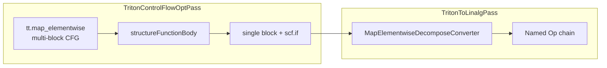
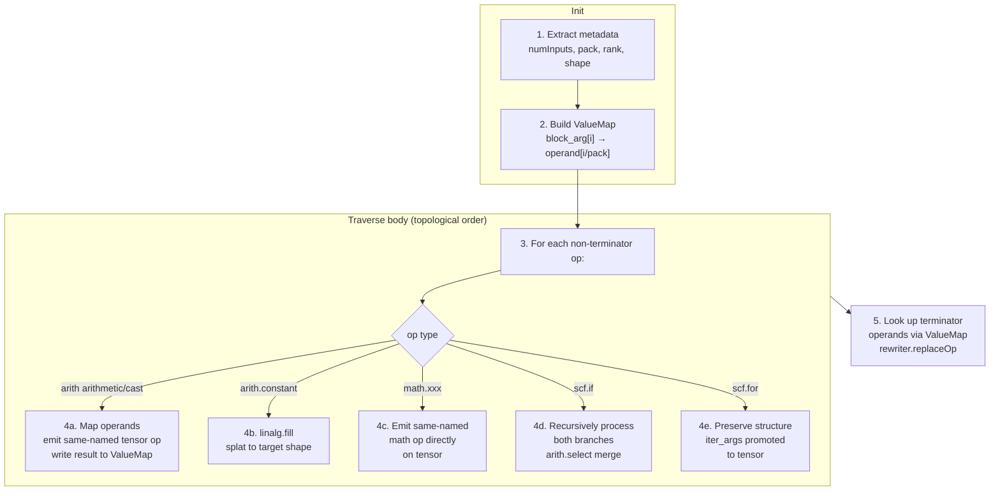

# Ascend Backend `tt.map_elementwise` Lowering — Region Decomposition

## 1. Background

### 1.1 What is `tl.map_elementwise`

Introduced in Triton 3.6 (commit `fdd694d48a`). It takes a `@triton.jit` scalar function and maps it over every element of a tensor.

**Core motivation**: enable true control flow in element-wise computation. `tl.where(cond, a, b)` computes both branches then selects (`arith.select`), while `tl.map_elementwise`'s `if/else` only executes the taken branch.

```python
@triton.jit
def add_scalar(a, b):
    return a + b

def add(x, y):
    return tl.map_elementwise(add_scalar, x, y)
```

### 1.2 Op IR Structure

Using `add_scalar` as the running example.

**pack=1**: block args = `2 × 1 = 2`:

```mlir
%z = "tt.map_elementwise"(%x, %y) <{pack = 1 : i32}> ({
^bb0(%a: i32, %b: i32):
  %sum = arith.addi %a, %b : i32
  tt.map_elementwise.return %sum : i32
}) : (tensor<128xi32>, tensor<128xi32>) -> tensor<128xi32>
```

**pack=2**: block args = `2 × 2 = 4`, layout `[x[0], x[1], y[0], y[1]]`. The same addition, with each op appearing twice:

```mlir
%z = "tt.map_elementwise"(%x, %y) <{pack = 2 : i32}> ({
^bb0(%x0: i32, %x1: i32, %y0: i32, %y1: i32):
  %s0 = arith.addi %x0, %y0 : i32
  %s1 = arith.addi %x1, %y1 : i32
  tt.map_elementwise.return %s0, %s1 : i32, i32
}) : (tensor<128xi32>, tensor<128xi32>) -> tensor<128xi32>
```

### 1.3 Op Constraints

| Constraint | Rule | Enforced By |
|-----------|------|------------|
| numInputs ≥ 1 | `MapElementwiseOp::verify()` | Upstream |
| pack is a power of 2 | `MapElementwiseOp::verify()` | Upstream |
| region args = numInputs × pack | `verifyRegions()` | Upstream |
| region returns = numOutputs × pack | `verifyRegions()` | Upstream |
| No Write inside region | `verifyRegions()` | Upstream |
| Same shape | `SameOperandsAndResultShape` trait | Upstream |

---

## 2. Approach Analysis

### 2.1 Problem Statement

After eliminating pack (handled at the converter level, no impact on final IR), the core semantics of `tt.map_elementwise` are:

> Multi-input, multi-output element-wise computation with arbitrary scalar operations (including control flow `scf.if`) inside the region.

### 2.2 Analysis Principles

Approach viability is evaluated from the triton-ascend perspective, based solely on op capability — not whether NPUIR currently supports it:
- **Semantic feasibility**: can the op express multi-output and control flow by definition
- **Implementation complexity**: converter development cost
- **Performance**: runtime efficiency and how easily NPUIR can recognize/optimize the IR

### 2.3 Approaches

#### A. `linalg::MapOp`

Element-wise mapping — scalar compute in region body + `linalg.yield`.

- Semantics: **single output is a hard limitation** — MapOp yields only one value; multi-output requires multiple MapOps iterating separately
- Implementation: simple, IRMapping clone region body → mapper body
- Performance: structured op, easy for backend optimization; but LinalgToHFusion only recognizes `func::CallOp(__hmf_*)` patterns

#### B. `linalg::GenericOp`

`iterator_types = ["parallel"]` + identity `indexing_maps`; body cloned from region.

- Semantics: **perfect match** — GenericOp's "execute scalar function per iteration point" is identical to map_elementwise
- Implementation: simple, IRMapping clone + identity maps + `tensor::EmptyOp` init
- Performance: `parallel` declares independent elements; backend can freely vectorize/fuse
- Blocker: NPUIR marks `linalg::GenericOp` as illegal, requires a new pattern

#### C. `scf.for` + `tensor.extract/insert`

Loop over elements, extract scalars, insert results.

- Semantics: functionally expressible but loses "element independence" information
- Implementation: more complex — nested loops + multi-dimensional extract/insert
- Performance: `tensor.insert` introduces false cross-iteration dependencies, hindering fusion

#### D. `scf.for` + `memref.load/store`

Similar to C, using memref instead of tensor.

- Semantics: same as C
- Implementation: additional memref allocation + bufferization management

#### E. Region Decomposition (Selected)

**Promote each scalar operation individually to a tensor-level Named Op**, rather than enclosing the entire body in a single op.

```
map_elementwise region:              Output:
  arith.addi                        arith.addi %A, %B       ← direct tensor
  math.exp                          math.exp %A             ← direct tensor
  scf.if                            arith.select            ← branch expansion
       ↓                                   ↓
  One op (body hidden)              Multiple independent Named Ops
                                    (fully supported)
```

- Semantics: each scalar op has a corresponding tensor-level named op
- Implementation: body traversal + op mapping + scalar→tensor promotion, ~200 lines
- Performance: output is element-wise vector instructions, naturally matching Ascend SIMD
- **Zero NPUIR changes**: arith on tensor (legal), math directly on tensor (legal, same as arith), arith.select (legal)

### 2.4 Comparison

| Approach | Rationale | triton-ascend Work | npuir Work | Feasible |
|---------|-----------|-------------------|-----------|----------|
| A. linalg::MapOp | Single-output limitation | Simple: IRMapping clone | Support non-`__hmf_*` inline body | ❌ |
| B. linalg::GenericOp | Semantically perfect | Simple: identity maps + init + clone ~80 lines | Add new pattern, difficult | ✅ |
| C. scf.for + tensor | Loses independence info | Complex: nested loops + extract/insert | None needed, but hard to fuse | ❌ |
| D. scf.for + memref | Same as C | Complex: memref management | Same as C | ❌ |
| **E. Region Decomposition** | **Direct scalar→tensor mapping, arith/math as named tensor ops, control as select/for** | Medium: body traversal + op mapping ~200 lines | **None** | ✅ |

### 2.5 Conclusion

Approach E (Region Decomposition) is selected because:

1. **Zero NPUIR changes**: all output ops are already supported by the NPUIR pipeline
2. **Natural SIMD fit**: vector instructions are the most natural expression for Ascend hardware
3. **Manageable implementation**: converter core logic is op traversal + type mapping
4. **CFG reuse**: Phase 1 reuses `structureFunctionBody`, identical to Approach B

---

## 3. Lowering Design

### 3.1 Overall Flow



- **Phase 1** (`TritonControlFlowOptPass`): Reuse `structureFunctionBody` to convert multi-block CFG in the region into single-block + nested `scf.if`
- **Phase 2** (`TritonToLinalgPass`): `MapElementwiseDecomposeConverter` decomposes the single-block region into multiple tensor-level Named Ops

### 3.2 Phase 1: CFG Canonicalization (Reusing structureFunctionBody)

After inlining the `scalar_fn`, the `map_elementwise` region contains multi-block CFG (`cf.cond_br` / `cf.br`). `structureFunctionBody` already has full CFG structuring capability (`cf.br` chain inlining, `cf.cond_br` → `scf.if`, cycle detection, multi-exit-block convergence, etc.). It just needs to include `map_elementwise` regions in its scope.

Two changes in `TritonControlFlowOptPass.cpp`:

**1. `isSupportedReturn`**: add `MapElementwiseReturnOp`

```cpp
static bool isSupportedReturn(Operation *op) {
    return isa<triton::ReturnOp, func::ReturnOp,
               triton::MapElementwiseReturnOp>(op);
}
```

**2. `runOnOperation()`**: collect `MapElementwiseOp` and call `structureFunctionBody`

```cpp
// walk:
if (isa<triton::FuncOp, func::FuncOp, triton::MapElementwiseOp>(op))
    funcs.push_back(op);

// process:
if (auto mapOp = dyn_cast<triton::MapElementwiseOp>(op)) {
    if (failed(structureFunctionBody(mapOp, mapOp.getRegion()))) { ... }
}
```

`createReturnLike` needs no changes — it creates ops via `sampleReturn->getName()`, which works generically for any return-like op.

#### 3.2.1 Nested Control Flow Enhancement: Block Duplication Pre-pass

**Problem**: `structureFunctionBody`'s tree path requires both branches of every `cf.cond_br` to eventually converge on a single join block. For nested if/else patterns with shared convergence blocks (where multiple predecessors from different branches target the same block), the tree path fails — `findNearestCommonBlock` may find a common block for the outer cond_br but fail for the inner one.

For example, the following nested if:
```python
if x > 0:
    if y > 0:
        return x + y
    else:
        return x - y
else:
    return y - x
```

produces a CFG where the outer `cf.cond_br(false)` and inner `cf.cond_br(false)` may target the same block, giving it in-degree > 1. The tree path succeeds for the outer cond_br (finding the shared block as convergence) but fails for the inner cond_br (one branch goes to a fresh return block, the other to the already-converged shared block).

**Solution**: Before calling `structureFunctionBody`, run `splitMultiPredecessorBlocks` — a pre-pass that clones every block with in-degree > 1 once for each predecessor after the first. Each clone resolves its block arguments to the concrete incoming values from its specific predecessor. The process iterates until every block has at most one predecessor.

**Principle**: Removing all shared convergence blocks reduces the CFG to a forest of trees (each block has at most one predecessor), which `structureFunctionBody`'s tree path always handles successfully.

**Redundancy Removal**: Temporary instruction duplication from cloning is resolved in Phase 3 (`MapElementwiseDecomposeConverter`) — all ops are flattened into a single block, and CSE eliminates any remaining identical ops.

**Implementation**: Three new static functions in `TritonControlFlowOptPass.cpp`:
- `collectPredecessorInfo`: collect predecessor information for all blocks
- `rewireBranchDest`: redirect a predecessor's branch instruction to a new target
- `splitMultiPredecessorBlocks`: iteratively split until every block has in-degree ≤ 1

In `runOnOperation()`, `splitMultiPredecessorBlocks` is called on the MapElementwiseOp region before `structureFunctionBody`.

### 3.3 Phase 2: ScalarMathCanonicalizer Exemption

`ScalarMathCanonicalizer` is a pattern in `TritonToLinalgPass`'s greedy rewrite phase that handles scalar ops appearing in function bodies. It temporarily wraps them as `splat → tensor<1> op → extract` to help the TypeConverter unify types.

However, it must not touch scalar ops inside `map_elementwise` regions — for two reasons: its `tensor<1>` wrapper is incompatible with the full tensor promotion (`tensor<128>`) we need; and `extract` cannot feed back into `map_elementwise`'s multi-element output.

`ScalarMathCanonicalizer` already has built-in exemptions for `map_elementwise` (as well as `reduce` and `scan`) — it checks the parent op in `matchAndRewrite` and deliberately skips when inside these regions:

```cpp
if (auto linalgOp =
        op->template getParentOfType<triton::MapElementwiseOp>()) {
    return rewriter.notifyMatchFailure(
        op, "ScalarMathCanonicalizer handles op not within tt.map_elementwise.");
}
```

The template implementation is in `TritonOpConverter.h` lines 131–136 — no `.cpp` changes needed. Our only task is to ensure this check survives future refactoring.

### 3.4 Phase 3: MapElementwiseDecomposeConverter

Maintains a `scalar Value → tensor Value` mapping table, traverses the region body, and promotes each scalar op to a tensor-level Named Op. Pack handling is the same as before: `block_arg[i] → operand[i/pack]`.



Op dispatch across six categories:

| op type | Processing | Output |
|---------|-----------|--------|
| arith arithmetic/cast | Map operands, emit same-named tensor op | `arith.addi %A, %B : tensor<...>` |
| arith.constant | Create `tensor.empty` + `linalg.fill` | `linalg.fill ins(%c) outs(...)` |
| math.xxx | Map operands, emit same-named tensor op | `math.exp %A : tensor<...>` |
| scf.if | Recursively process branches, emit `arith.select` | `arith.select %cond, %then, %else` |
| scf.for | Preserve structure, iter_args promoted to tensor | `scf.for ... iter_args(%tensor)` |

**Detailed handling per category:**

**Binary arith** (add/sub/mul/div/rem/neg/max/min): arith ops accept tensor operands directly.

```
scalar:  %s = arith.addi %a, %b : i32
         ↓
tensor:  %s_t = arith.addi %A, %B : tensor<128xi32>
```

Coverage: `addi/addf/subi/subf/muli/mulf/divsi/divui/divf/remsi/remui/remf/negf/maxf/minf/maxsi/minsi/maxui/minui`

**Type casts** (sitofp/uitofp/fptosi/fptoui/ext/trunc): also accept tensor operands directly.

```
scalar:  %s = arith.sitofp %a : i32 to f32
         ↓
tensor:  %s_t = arith.sitofp %A : tensor<128xi32> to tensor<128xf32>
```

Coverage: `sitofp/uitofp/fptosi/fptoui/extsi/extui/extf/trunci/truncf`

**Math functions** (exp/sqrt/log/sin/cos/erf/ceil/floor/absf, etc.): just like arith, `math.xxx` directly accepts tensor operands — no wrapping needed.

```
scalar:  %e = math.exp %a : f32
         ↓
tensor:  %e_t = math.exp %A : tensor<128xf32>
```

Coverage: `exp/exp2/log/log2/sqrt/rsqrt/sin/cos/erf/ceil/floor/absf/absi`

**Control flow** (scf.if → arith.select): both branches are fully expanded into tensor chains, merged with `arith.select`. On SIMD hardware both branches execute, matching `arith.select` semantics exactly. Nested `scf.if` is handled recursively.

```
scalar:
  %res = scf.if %cmp -> i32 {
    scf.yield %then_val : i32
  } else {
    %e = math.exp %x : i32
    scf.yield %e : i32
  }

tensor:
  %then_t = ...                         // then branch tensor chain
  %e_t = math.exp %X : tensor<128xf32>    // else branch tensor chain
  %res_t = arith.select %cmp_t, %then_t, %e_t : tensor<128xi32>
```

**Constants** (arith.constant): splatted to a same-shape constant tensor.

```
scalar:  %c = arith.constant 0 : i32
         ↓
tensor:  %init = tensor.empty() : tensor<128xi32>
         %c_t = linalg.fill ins(%c) outs(%init)
```

**Structured loops** (scf.for): the `scf.for` structure is preserved, `iter_args` are promoted from scalar to tensor. (`scf.while` is not directly supported because `scf.condition` requires a scalar `i1`, which cannot be promoted to tensor.)

```
scalar:
  %r = scf.for %i = %c0 to %cN step %c1
       iter_args(%acc = %init_s) -> i32 {
    %new = arith.addi %acc, %x : i32
    scf.yield %new
  }

tensor:
  %r_t = scf.for %i = %c0 to %cN step %c1
         iter_args(%acc_t = %init_t) -> tensor<128xi32> {
    %new_t = arith.addi %acc_t, %X : tensor<128xi32>
    scf.yield %new_t
  }
```

### 3.5 Code Changes

| File | Change |
|------|--------|
| `TritonControlFlowOptPass.cpp` | `isSupportedReturn` + `MapElementwiseReturnOp`; `runOnOperation()` + `MapElementwiseOp`; added `splitMultiPredecessorBlocks` + helpers to handle shared convergence blocks in nested control flow |
| `TritonOpConverter.h` | Delete `MapElementwiseCFGCanonicalizer` and `MapElementwiseToGenericConverter`; add `MapElementwiseDecomposeConverter` |
| `TritonOpConverter.cpp` | Delete old implementation; implement `MapElementwiseDecomposeConverter` |
| `TritonToLinalgPass.cpp` | Delete `MapElementwiseCFGCanonicalizer` registration; register `MapElementwiseDecomposeConverter` |

---

## 4. NPUIR Downstream Dependencies

**None.** All output ops are supported by the current NPUIR pipeline:

| Output Op | NPUIR Handling |
|-----------|---------------|
| `arith.*` on tensor | `arith` dialect is globally legal in LinalgToHFusion |
| `math.xxx` on tensor | `math` dialect is globally legal in LinalgToHFusion |
| `arith.select` | legal |
| `linalg.fill` | named op, already supported |
| `scf.for` | legal |

---

## 5. Test Design

### 5.1 End-to-End Python Tests

Test file: `third_party/ascend/unittest/pytest_ut/test_map_elementwise_ops.py`

| Test | Scenario | Verification |
|------|----------|-------------|
| `test_map_arith_add_i` | Integer binary op | `arith.addi` directly on tensor |
| `test_map_arith_mul_f` | Float binary op | `arith.mulf` on tensor |
| `test_map_arith_bitwise` | Bitwise (and/or/xor) | `arith.andi/ori/xori` on tensor |
| `test_map_cmp_i` | Comparison + external constant | `arith.cmpi` on tensor |
| `test_map_cast_sitofp` | Type cast | `arith.sitofp` on tensor |
| `test_map_math_exp` | Float math | `math.exp` directly on tensor |
| `test_map_math_abs_i` | Integer math | `math.absi` directly on tensor |
| `test_map_select_direct` | arith.select | `arith.select` on tensor |
| `test_map_2d` | Multi-dim tensor | rank-independent, arith works directly |
| `test_map_for_loop` | scf.for | iter_args promoted to tensor |
| `test_map_elementwise` | if/elif/else control flow | `scf.if` → `arith.select` |
| `test_map_elementwise_multiple_outputs` | Multi-output divmod | `arith.divsi/remsi` on tensor |
| `test_map_elementwise_pack` | pack=2 | pack elimination |

Note: the last three are upstream community tests, also retained in `test_core.py`. `uint32` is not supported on NPU devices; the test file uses `int32` instead.

---

## Appendix C: End-to-End Test DSL / TTIR / Adapter IR

### C.1 test_map_arith_add_i — Integer Binary Op

```python
@triton.jit
def _add_i(a, b):
    return tl.add(a, b, sanitize_overflow=False)
```

**TTIR**:
```mlir
%z = "tt.map_elementwise"(%x_1, %y_3) <{pack = 1 : i32}> ({
^bb0(%z_4: i32, %z_5: i32):
  %2 = arith.addi %z_4, %z_5 : i32
  tt.map_elementwise.return %2 : i32
}) : (tensor<128xi32>, tensor<128xi32>) -> tensor<128xi32>
```

**Adapter IR** (scalar arith.addi → tensor arith.addi):
```mlir
%z = arith.addi %x_1, %y_3 : tensor<128xi32>
```

---

### C.3 test_map_arith_bitwise — Bitwise Ops

```python
@triton.jit
def _bitwise(a, b):
    return a & b, a | b, a ^ b
```

**Adapter IR** (and/or/xor directly on tensors):
```mlir
%0 = arith.andi %a_1, %b_3 : tensor<128xi32>
%1 = arith.ori  %a_1, %b_3 : tensor<128xi32>
%2 = arith.xori %a_1, %b_3 : tensor<128xi32>
```

---

### C.4 test_map_cmp_i — Comparison + External Constant

```python
@triton.jit
def _gt_zero(a):
    if a > 0: return 1
    else:     return 0
```

**Adapter IR** (arith.cmpi + extui directly on tensor; external constant 0 lazily promoted via getOperand + linalg.fill):
```mlir
%z = arith.constant 0 : i32
%z_4 = arith.cmpi sgt, %x_1, %z_fill : tensor<128xi32>
%z_5 = arith.extui %z_4 : tensor<128xi1> to tensor<128xi32>
```

---

### C.5 test_map_cast_sitofp — Type Cast

```python
@triton.jit
def _cast(a):
    return a.to(tl.float32)
```

**Adapter IR** (arith.sitofp directly accepts tensor, result type auto-inferred):
```mlir
%z = arith.sitofp %x_1 : tensor<128xi32> to tensor<128xf32>
```

---

### C.6 test_map_math_exp — Float Math

```python
@triton.jit
def _exp(a):
    return tl.exp(a)
```

**Adapter IR** (math.exp directly on tensor, no wrapping needed — same as arith):
```mlir
%z = math.exp %x_1 : tensor<128xf32>
```

---

### C.10 test_map_elementwise — Control Flow if/elif/else

```python
@triton.jit
def _compare(x, y):
    if x < y:       return -1
    elif x == y:    return 0
    else:           return 1
```

**TTIR** (multi-block CFG, handled by structureFunctionBody):
```mlir
%z = "tt.map_elementwise"(%x_2, %y_4) <{pack = 1 : i32}> ({
^bb0(%z_5: i32, %z_6: i32):
  %2 = arith.cmpi slt, %z_5, %z_6 : i32
  cf.cond_br %2, ^bb2(%c-1_i32 : i32), ^bb1
^bb1:
  %3 = arith.cmpi eq, %z_5, %z_6 : i32
  cf.cond_br %3, ^bb2(%c0_i32 : i32), ^bb2(%c1_i32 : i32)
^bb2(%4: i32):
  tt.map_elementwise.return %4 : i32
}) : (tensor<128xi32>, tensor<128xi32>) -> tensor<128xi32>
```

**Adapter IR** (structureFunctionBody folds CFG → arith.select; external constants promoted via fill):
```mlir
%z_4 = arith.cmpi slt, %x_1, %y_3 : tensor<128xi32>
%z_6 = linalg.fill ins(-1 : i32) ...
%z_7 = arith.cmpi ne, %x_1, %y_3 : tensor<128xi32>
%z_8 = arith.extui %z_7 : tensor<128xi1> to tensor<128xi32>
%z_9 = arith.select %z_4, %z_6, %z_8 : tensor<128xi1>, tensor<128xi32>
```

---

### C.11 test_map_elementwise_multiple_outputs — Multi-Output divmod

```python
@triton.jit
def _divmod(a, b):
    return a // b, a % b
```

**Adapter IR** (each output independently forms its own tensor op chain):
```mlir
%0 = arith.divsi %a_1, %b_3 : tensor<512xi32>
%1 = arith.remsi %a_1, %b_3 : tensor<512xi32>
```

---

### C.12 test_map_elementwise_pack — pack=2

```python
@triton.jit
def _divmod_pack2(a0, a1, b0, b1):
    return a0 // b0, a1 // b1, a0 % b0, a1 % b1
```

**Adapter IR** (4 block args mapped to 2 input tensors; CSE eliminates duplicates; output identical to pack=1):
```mlir
%0 = arith.divsi %a_1, %b_3 : tensor<512xi32>
%1 = arith.remsi %a_1, %b_3 : tensor<512xi32>
```

---

### C.13 test_map_for_loop — scf.for Loop

```python
@triton.jit
def _accumulate(a):
    result = 0
    for i in range(5):
        result = result + a
    return result
```

**TTIR**:
```mlir
%z = "tt.map_elementwise"(%x_1) <{pack = 1 : i32}> ({
^bb0(%a: i32):
  %result = scf.for %i = %c0 to %c5 step %c1 iter_args(%acc = %c0_i32) -> i32 {
    %new = arith.addi %acc, %a : i32
    scf.yield %new : i32
  }
  tt.map_elementwise.return %result : i32
}) : (tensor<128xi32>) -> tensor<128xi32>
```

**Adapter IR** (loop structure preserved; iter_args promoted from scalar to tensor; body arith.addi promoted to tensor):
```mlir
%z_fill = linalg.fill ins(0 : i32) ... → tensor<128xi32>
%z_result = scf.for %i = %c0 to %c5 step %c1 iter_args(%acc_t = %z_fill) -> tensor<128xi32> {
  %new_t = arith.addi %acc_t, %x_1 : tensor<128xi32>
  scf.yield %new_t : tensor<128xi32>
}
```
