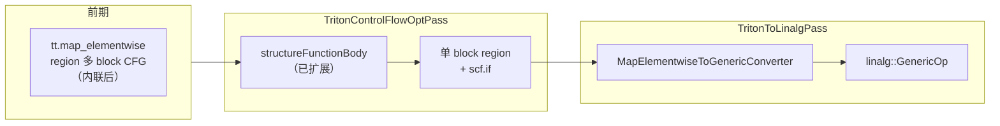
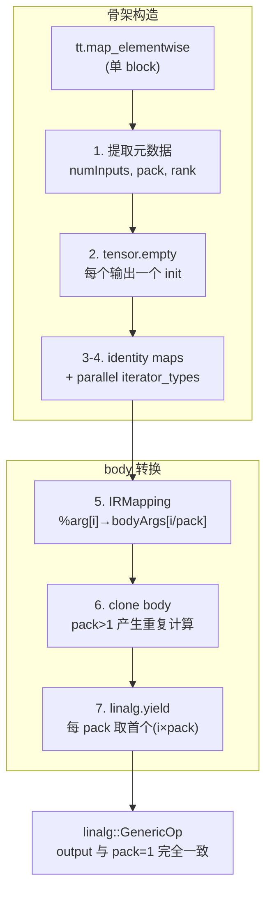

# Ascend 后端 `tt.map_elementwise` Lowering 方案（`linalg::GenericOp` 路径）

## 1. 背景

### 1.1 什么是 `tl.map_elementwise`

Triton 3.6 新增，commit `fdd694d48a`。它接收一个 `@triton.jit` 标量函数，将其映射到张量的每个元素上执行。

**核心动机**：让元素级计算具备真正的控制流。`tl.where(cond, a, b)` 两个分支都计算再二选一（`arith.select`），而 `tl.map_elementwise` 的 `if/else` 只执行走到的分支。

```python
@triton.jit
def selu_scalar(x, alpha):
    if x > 0:
        return x
    else:
        return alpha * (tl.exp(x) - 1)

def selu(x, alpha):
    return tl.map_elementwise(selu_scalar, x, alpha)
```

### 1.2 算子 IR 结构

**pack=1（含控制流 if/elif/else）**：2 输入 1 输出，region 的 block args 数量 = `2 × 1 = 2`：

```mlir
%z = "tt.map_elementwise"(%x, %y) <{pack = 1 : i32}> ({
^bb0(%a: i32, %b: i32):                         // 2 个标量参数
  %lt = arith.cmpi slt, %a, %b : i32
  cf.cond_br %lt, ^bb2(%c_neg1 : i32), ^bb1     // 多 block CFG 控制流
^bb1:
  %eq = arith.cmpi eq, %a, %b : i32
  cf.cond_br %eq, ^bb2(%c_zero : i32), ^bb2(%c_one : i32)
^bb2(%r: i32):
  tt.map_elementwise.return %r : i32
}) : (tensor<128xi32>, tensor<128xi32>) -> tensor<128xi32>
```

**pack=2（interleaved 语义）**：2 输入 2 输出，block args = `2 × 2 = 4`，排列为 `[A[0], A[1], B[0], B[1]]`：

```mlir
%q, %r = "tt.map_elementwise"(%a, %b) <{pack = 2 : i32}> ({
^bb0(%a0: i32, %a1: i32, %b0: i32, %b1: i32):  // 先 A 的两个，再 B 的两个
  %q0 = arith.divui %a0, %b0 : i32
  %q1 = arith.divui %a1, %b1 : i32
  %r0 = arith.remui %a0, %b0 : i32
  %r1 = arith.remui %a1, %b1 : i32
  tt.map_elementwise.return %q0, %q1, %r0, %r1 : i32, i32, i32, i32
}) : (tensor<512xi32>, tensor<512xi32>) -> (tensor<512xi32>, tensor<512xi32>)
```

### 1.3 算子约束

| 约束项 | 规则 | 谁保证 |
|--------|------|--------|
| 输入数 ≥ 1 | `MapElementwiseOp::verify()` | 上游 |
| pack 是 2 的幂 | `MapElementwiseOp::verify()` | 上游 |
| region 参数数 = numInputs × pack | `verifyRegions()` | 上游 |
| region 返回数 = numOutputs × pack | `verifyRegions()` | 上游 |
| region 内禁止 Write | `verifyRegions()` | 上游 |
| 同 shape | `SameOperandsAndResultShape` trait | 上游 |

---

## 2. 候选方案分析

### 2.1 问题抽象

去 pack 后（pack 在 converter 阶段处理，不影响最终 IR 结构），`tt.map_elementwise` 需要表达的核心语义：

> 多输入、多输出的逐元素计算，region 内为任意标量运算（含控制流 `scf.if`）。

### 2.2 分析原则

方案合理性从 triton-ascend 视角评估，只问 op 自身能力，不问 NPUIR 当前能否处理：
- **语义可行性**：op 定义上能否表达多输出、控制流
- **实现复杂度**：converter 编写成本
- **性能**：这种 IR 形态的运行效率，以及 NLPUIR 侧是否容易识别和优化

### 2.3 方案

#### A. `linalg::MapOp`

逐元素映射，region 内放标量计算 + `linalg.yield`。

- 语义：**单输出是硬伤**——MapOp 只 yield 一个值，多输出需拆成多个 MapOp 分别遍历，语义降级
- 实现：简单，IRMapping clone region body → mapper body
- 性能：结构化 op，后端易优化；但 LinalgToHFusion 仅识 `func::CallOp(__hmf_*)` 形态

#### B. `linalg::GenericOp`

`iterator_types = ["parallel"]` + identity `indexing_maps`，body 克隆自 region。

- 语义：**完美匹配**——"每个迭代点执行标量函数"即 GenericOp 定义本身
- 实现：简单，IRMapping clone，构造 identity maps 和 `tensor::EmptyOp` init
- 性能：`parallel` 声明了无依赖并行，后端可自由向量化/融合；模式固定（全 parallel + identity maps），NPUIR 易于识别

#### C. `scf.for` + `tensor.extract/insert`

循环遍历元素，extract 取标量、insert 写回。

- 语义：功能可表达，但 map 语义丢失——loop 是串行构造，后端看不出"元素独立可并行"
- 实现：较复杂，需构建嵌套循环，多维索引处理 extract/insert
- 性能：`tensor.insert` 引入虚假跨迭代依赖，阻碍向量化/融合；循环体分析比结构化 op 更难优化

#### D. `scf.for` + `memref.load/store`

类似 C，用 memref 替代 tensor。

- 语义：同 C
- 实现：需额外管理 memref 分配和 bufferization 转回，代码量大
- 性能：别名分析优于 C，但仍丢失并行度信息

### 2.4 综合对比

| 方案 | 方案合理性 | triton-ascend 任务 | npuir 任务 |
|------|-----------|-------------------|-----------|
| A. linalg::MapOp | 单输出硬伤，拆多 MapOp 语义降级 | 简单：IRMapping clone | 需支持非 `__hmf_*` 的 inline body |
| **B. linalg::GenericOp** | **语义完美，多输出+控制流原生支持，parallel 声明可并行** | 简单：构造 identity maps + `tensor::EmptyOp` init + clone body | 新增 element-wise GenericOp → hfusion pattern（模式固定，全 parallel + identity maps） |
| C. scf.for + tensor | 功能可表达，但丢失"元素独立"信息 | 较复杂：嵌套循环 + extract/insert 构建 | 无需特殊处理（scf/tensor 已是 legal），但难以做融合优化 |
| D. scf.for + memref | 同 C | 较复杂：memref 分配管理 + bufferization | 同 C |

### 2.5 结论

选择方案 B（`linalg::GenericOp`），原因：

1. **语义完美对齐**：GenericOp 的定义就是"对每个迭代点执行标量函数"，与 map_elementwise 的"对每个元素执行标量函数"完全一致。
2. **实现简单**：IRMapping clone + identity maps + parallel iterator_types，converter 约 80 行即可完成。
3. **性能信息完整**：`parallel` 属性直接声明元素间无依赖，后端可自由向量化、融合、重排。
4. **NPUIR 边界清晰**：产出的 IR 模式固定（全 parallel + identity maps + inline body），NPUIR 侧新增一个识别 pattern 即可。

---

## 3. `linalg::GenericOp` 基础（长期参考）

`linalg::GenericOp` 是 Linalg 方言的通用结构化算子，三个构成要素：

| 要素 | 含义 |
|------|------|
| `iterator_types` | 迭代空间：`"parallel"`（独立可并行）或 `"reduction"`（归约） |
| `indexing_maps` | 每个操作数的索引映射：迭代位置 → 操作数下标 |
| region body | 每次迭代执行的标量计算，以 `linalg.yield` 结尾 |

**示例 — 1D 逐元素加法**：

```mlir
%init = tensor.empty() : tensor<4xi32>
%result = linalg.generic {
  indexing_maps = [
    affine_map<(d0) -> (d0)>,     // A: 迭代 d0 → 读 A[d0]
    affine_map<(d0) -> (d0)>,     // B: 迭代 d0 → 读 B[d0]
    affine_map<(d0) -> (d0)>      // out: 迭代 d0 → 写 out[d0]
  ],
  iterator_types = ["parallel"]
} ins(%A, %B : tensor<4xi32>, tensor<4xi32>)
  outs(%init : tensor<4xi32>) {
^bb0(%a: i32, %b: i32, %init: i32):
  %sum = arith.addi %a, %b : i32
  linalg.yield %sum : i32
} -> tensor<4xi32>
```

等价于 `for i in 0..4: out[i] = A[i] + B[i]`。`iterator_types = ["parallel"]` 声明了所有元素独立、可并行，调度器可以自由向量化、融合、重排。

---

## 4. Lowering 设计

### 4.1 总体流程

CFG 规范化和 GenericOp lowering 分别在两个 pass 中完成：



- **Phase 1**（`TritonControlFlowOptPass`）：复用 `structureFunctionBody` 将 region 内多 block CFG（`cf.cond_br`、`cf.br`）转为单 block + 嵌套 `scf.if`
- **Phase 2**（`TritonToLinalgPass`）：`MapElementwiseToGenericConverter` 将单 block region 转为 `linalg::GenericOp`

### 4.2 Phase 1：CFG 规范化（复用 structureFunctionBody）

`map_elementwise` 的 `scalar_fn` 经内联后 region 内产生多 block CFG（`cf.cond_br` / `cf.br`）。`structureFunctionBody` 已有全套 CFG 结构化能力（`cf.br` 链内联、`cf.cond_br` → `scf.if`、循环检测报错、多 exit block 收敛等），只需将 `map_elementwise` region 纳入其处理范围。

改动仅涉及 `TritonControlFlowOptPass.cpp`，两处：

**1. `isSupportedReturn`**：追加 `MapElementwiseReturnOp`

```cpp
static bool isSupportedReturn(Operation *op) {
    return isa<triton::ReturnOp, func::ReturnOp,
               triton::MapElementwiseReturnOp>(op);
}
```

**2. `runOnOperation()`**：收集 `MapElementwiseOp` 并调用 `structureFunctionBody`

```cpp
// walk 收集：
if (isa<triton::FuncOp, func::FuncOp, triton::MapElementwiseOp>(op))
    funcs.push_back(op);

// 处理：
if (auto mapOp = dyn_cast<triton::MapElementwiseOp>(op)) {
    if (failed(structureFunctionBody(mapOp, mapOp.getRegion()))) { ... }
}
```

`createReturnLike` 不需要修改——它通过 `sampleReturn->getName()` 创建 op，对任意 return-like op 泛型工作。

### 4.3 MapElementwiseToGenericConverter

pack=1 和 pack>1 统一处理，差异只在 mapping 的 `i/pack` 和 yield 的 `i*pack`。



- **骨架构造**：按 rank 构建 identity maps 和 `parallel` iterator_types，每个输出分配 `tensor.empty`。
- **IRMapping**：`inputIdx = i / pack`。pack=2 时 `%a0, %a1` 都指向 `bodyArgs[0]`——同一输入的 pack 个 arg 映射到同个 body arg。
- **clone**：全量搬运 body，pack 份 arg 指向同一 body arg → 产生 pack 份相同计算代码。
- **yield**：只取 `terminator.operand(i * pack)`，多余 clone 产物留给 CSE。
- **pack=1 退化**：`i/1 = i`，`i*1 = i`，自然变为 1:1 映射。

### 4.4 代码修改清单

| 文件 | 修改内容 |
|------|---------|
| `TritonControlFlowOptPass.cpp` | `isSupportedReturn` 加 `MapElementwiseReturnOp`；`runOnOperation()` walk 加 `MapElementwiseOp` 并调用 `structureFunctionBody` |
| `TritonOpConverter.h` | 删除 `MapElementwiseCFGCanonicalizer`，保留 `MapElementwiseToGenericConverter` |
| `TritonOpConverter.cpp` | 删除 `MapElementwiseCFGCanonicalizer` 实现（~100 行），保留 `MapElementwiseToGenericConverter` |
| `TritonToLinalgPass.cpp` | 删除 `MapElementwiseCFGCanonicalizer` 注册行；`MapElementwiseToGenericConverter` 注册不变

---


## 5. NPUIR 下游依赖

本方案 lowering 产出的 IR 形态为 `linalg::GenericOp`（全 `parallel` + identity `indexing_maps`，body 内为 inline arith/math/`scf.if`）。`LinalgToHFusion` 目前将 `GenericOp` 标记为 illegal，需要 NPUIR 侧在 `LinalgToHFusion.cpp` 新增一个 `OpRewritePattern`：

1. **匹配**：`linalg::GenericOp`，`iterator_types` 全为 `parallel`，`indexing_maps` 全为 identity
2. **Body 转换**：将 body 内 `arith.addi/addf/subi/subf/muli/mulf/...` 等标量运算映射为对应的 `hfusion::ElemwiseBinaryOp` / `ElemwiseUnaryOp`，`func::CallOp` 按需 inline 或保留
3. **控制流**：body 内的 `scf.if` → `arith.select`（若条件为标量）或保留 `scf.if`（若 hfusion 支持结构化分支）——此项为必需，控制流是 `map_elementwise` 的核心价值
4. **多输出**：处理多个 `linalg.yield` 值，映射为多输出 hfusion 结构

---

## 6. 测试设计

### 6.1 端到端 Python 测试（5 个）

| 测试 | 场景 | 验证点 |
|------|------|--------|
| `test_map_elementwise[1]` | 控制流 if/elif/else | structureFunctionBody 折叠 CFG + GenericOp body 内保留 scf.if |
| `test_map_elementwise_multiple_outputs` | 2in 2out divmod，pack=1 | 多 output tensor，4 maps，linalg.yield 2 值 |
| `test_map_elementwise_pack` | 2in 2out divmod，**pack=2** | body 重写：adapter IR 与 multiple_outputs 完全一致 |
| `test_map_elementwise_2d` | 2D tensor，pack=1 | 2D maps，`iterator_types=["parallel","parallel"]` |
| `test_map_elementwise_multi_op` | 多算子表达式，pack=1 | body 内多 op 克隆正确 |

> 所有测试均通过 `TritonToLinalg` 阶段，在 `LinalgToHFusion` 阶段因 NPUIR 未就绪报错（`failed to legalize operation 'linalg.generic'`）。

---

## 附录 A：关键参考文件

| 内容 | 文件路径 |
|------|---------|
| Op TableGen 定义 | `triton/include/triton/Dialect/Triton/IR/TritonOps.td:786-805` |
| Verifier | `triton/lib/Dialect/Triton/IR/Ops.cpp:629-679` |
| `structureFunctionBody` | `ascend/lib/TritonControlFlowOpt/TritonControlFlowOptPass.cpp` |
| LinalgToHFusion | `ascend/AscendNPU-IR/bishengir/lib/Conversion/LinalgToHFusion/LinalgToHFusion.cpp` |
| `MapElementwiseToGenericConverter` | `ascend/include/TritonToLinalg/TritonOpConverter.h` 和 `.cpp` |

---

## 附录 B：端到端测试 TTIR 与 Adapter IR

> 以下为 7 个 Python 测试用例的真实编译输出。标 `#loc` 行已省略以节省篇幅。

### B.1 test_map_elementwise[1] — 控制流 (if/elif/else)

**TTIR**：
```mlir
module {
  tt.func public @kernel(%X: !tt.ptr<i32>, %Y: !tt.ptr<i32>, %Z: !tt.ptr<i32>) {
    %c-1_i32 = arith.constant -1 : i32
    %c0_i32 = arith.constant 0 : i32
    %c1_i32 = arith.constant 1 : i32
    %x = tt.make_range {end = 128 : i32, start = 0 : i32} : tensor<128xi32>
    %x_1 = tt.splat %X : !tt.ptr<i32> -> tensor<128x!tt.ptr<i32>>
    %x_2 = tt.addptr %x_1, %x : tensor<128x!tt.ptr<i32>>, tensor<128xi32>
    %x_3 = tt.load %x_2 : tensor<128x!tt.ptr<i32>>
    %y_1 = tt.splat %Y : !tt.ptr<i32> -> tensor<128x!tt.ptr<i32>>
    %y_2 = tt.addptr %y_1, %x : tensor<128x!tt.ptr<i32>>, tensor<128xi32>
    %y_3 = tt.load %y_2 : tensor<128x!tt.ptr<i32>>
    %z = "tt.map_elementwise"(%x_3, %y_3) <{pack = 1 : i32}> ({
    ^bb0(%a: i32, %b: i32):                    // ← 多 block CFG!
      %lt = arith.cmpi slt, %a, %b : i32
      cf.cond_br %lt, ^bb2(%c-1_i32 : i32), ^bb1
    ^bb1:
      %eq = arith.cmpi eq, %a, %b : i32
      cf.cond_br %eq, ^bb2(%c0_i32 : i32), ^bb2(%c1_i32 : i32)
    ^bb2(%r: i32):
      tt.map_elementwise.return %r : i32
    }) : (tensor<128xi32>, tensor<128xi32>) -> tensor<128xi32>
    %z_out = tt.splat %Z : !tt.ptr<i32> -> tensor<128x!tt.ptr<i32>>
    %z_ptr = tt.addptr %z_out, %x : tensor<128x!tt.ptr<i32>>, tensor<128xi32>
    tt.store %z_ptr, %z : tensor<128x!tt.ptr<i32>>
    tt.return
  }
}
```

**Adapter IR**：
```mlir
#map = affine_map<(d0) -> (d0)>
module {
  func.func @kernel(%X: memref<?xi32>, %Y: memref<?xi32>, %Z: memref<?xi32>, ...) {
    // ... memref copy + bufferization ...
    %x_t = bufferization.to_tensor ... : tensor<128xi32>
    %y_t = bufferization.to_tensor ... : tensor<128xi32>
    %init = tensor.empty() : tensor<128xi32>
    %result = linalg.generic {
      indexing_maps = [#map, #map, #map], iterator_types = ["parallel"]
    } ins(%x_t, %y_t : tensor<128xi32>, tensor<128xi32>)
      outs(%init : tensor<128xi32>) {
    ^bb0(%a: i32, %b: i32, %out: i32):
      %lt = arith.cmpi slt, %a, %b : i32
      %r = scf.if %lt -> (i32) {              // ← CFG → scf.if 正确折叠
        %c_neg1 = arith.constant -1 : i32
        scf.yield %c_neg1 : i32
      } else {
        %neq = arith.cmpi ne, %a, %b : i32     // ← eq → ne + extui canonicalize
        %r2 = arith.extui %neq : i1 to i32
        scf.yield %r2 : i32
      }
      linalg.yield %r : i32
    } -> tensor<128xi32>
    bufferization.materialize_in_destination %result in writable %Z_buf
    return
  }
}
```

### B.2 test_map_elementwise_multiple_outputs — 多输出 (divmod)

**TTIR**：
```mlir
    %0:2 = "tt.map_elementwise"(%a, %b) <{pack = 1 : i32}> ({
    ^bb0(%a: i32, %b: i32):
      %q = arith.divui %a, %b : i32
      %r = arith.remui %a, %b : i32
      tt.map_elementwise.return %q, %r : i32, i32
    }) : (tensor<512xi32>, tensor<512xi32>) -> (tensor<512xi32>, tensor<512xi32>)
```

**Adapter IR**：
```mlir
#map = affine_map<(d0) -> (d0)>
    %0 = tensor.empty() : tensor<512xi32>
    %1:2 = linalg.generic {
      indexing_maps = [#map, #map, #map, #map], iterator_types = ["parallel"]
    } ins(%a_t, %b_t : tensor<512xi32>, tensor<512xi32>)
      outs(%0, %0 : tensor<512xi32>, tensor<512xi32>) {
    ^bb0(%a: i32, %b: i32, %out1: i32, %out2: i32):
      %q = arith.divui %a, %b : i32
      %r = arith.remui %a, %b : i32
      linalg.yield %q, %r : i32, i32
    } -> (tensor<512xi32>, tensor<512xi32>)
```

### B.3 test_map_elementwise_pack — pack=2

**TTIR**：
```mlir
    %0:2 = "tt.map_elementwise"(%a, %b) <{pack = 2 : i32}> ({
    ^bb0(%a0: i32, %a1: i32, %b0: i32, %b1: i32):  // ← 2 inputs × pack=2 = 4 args
      %q0 = arith.divui %a0, %b0 : i32
      %q1 = arith.divui %a1, %b1 : i32
      %r0 = arith.remui %a0, %b0 : i32
      %r1 = arith.remui %a1, %b1 : i32
      tt.map_elementwise.return %q0, %q1, %r0, %r1 : i32, i32, i32, i32
    }) : (tensor<512xi32>, tensor<512xi32>) -> (tensor<512xi32>, tensor<512xi32>)
```

**Adapter IR**（与 B.2 pack=1 版本完全一致）：
```mlir
#map = affine_map<(d0) -> (d0)>
    %0 = tensor.empty() : tensor<512xi32>
    %1:2 = linalg.generic {
      indexing_maps = [#map, #map, #map, #map], iterator_types = ["parallel"]
    } ins(%a_t, %b_t : tensor<512xi32>, tensor<512xi32>)
      outs(%0, %0 : tensor<512xi32>, tensor<512xi32>) {
    ^bb0(%a: i32, %b: i32, %out1: i32, %out2: i32):
      %q = arith.divui %a, %b : i32
      %r = arith.remui %a, %b : i32
      linalg.yield %q, %r : i32, i32
    } -> (tensor<512xi32>, tensor<512xi32>)
```

### B.4 test_map_elementwise_2d — 多维 (4x8)

**TTIR**：
```mlir
    %z = "tt.map_elementwise"(%x, %y) <{pack = 1 : i32}> ({
    ^bb0(%x: i32, %y: i32):
      %sum = arith.addi %x, %y : i32
      tt.map_elementwise.return %sum : i32
    }) : (tensor<4x8xi32>, tensor<4x8xi32>) -> tensor<4x8xi32>
```

**Adapter IR**：
```mlir
#map = affine_map<(d0, d1) -> (d0, d1)>
    %z = tensor.empty() : tensor<4x8xi32>
    %result = linalg.generic {
      indexing_maps = [#map, #map, #map], iterator_types = ["parallel", "parallel"]
    } ins(%x_t, %y_t : tensor<4x8xi32>, tensor<4x8xi32>)
      outs(%z : tensor<4x8xi32>) {
    ^bb0(%x: i32, %y: i32, %out: i32):
      %sum = arith.addi %x, %y : i32
      linalg.yield %sum : i32
    } -> tensor<4x8xi32>
```

### B.5 test_map_elementwise_multi_op — 多算子表达式

**TTIR**：
```mlir
    %z = "tt.map_elementwise"(%x, %y) <{pack = 1 : i32}> ({
    ^bb0(%x: i32, %y: i32):
      %s = arith.addi %x, %y : i32
      %d = arith.addi %s, %s : i32
      tt.map_elementwise.return %d : i32
    }) : (tensor<128xi32>, tensor<128xi32>) -> tensor<128xi32>
```

**Adapter IR**：
```mlir
    %z = tensor.empty() : tensor<128xi32>
    %result = linalg.generic {
      indexing_maps = [#map, #map, #map], iterator_types = ["parallel"]
    } ins(%x_t, %y_t : tensor<128xi32>, tensor<128xi32>)
      outs(%z : tensor<128xi32>) {
    ^bb0(%x: i32, %y: i32, %out: i32):
      %s = arith.addi %x, %y : i32
      %d = arith.addi %s, %s : i32
      linalg.yield %d : i32
    } -> tensor<128xi32>
```
