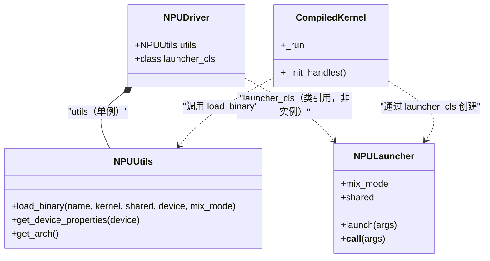
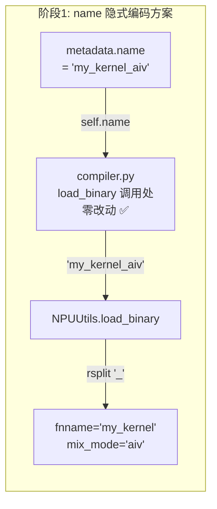
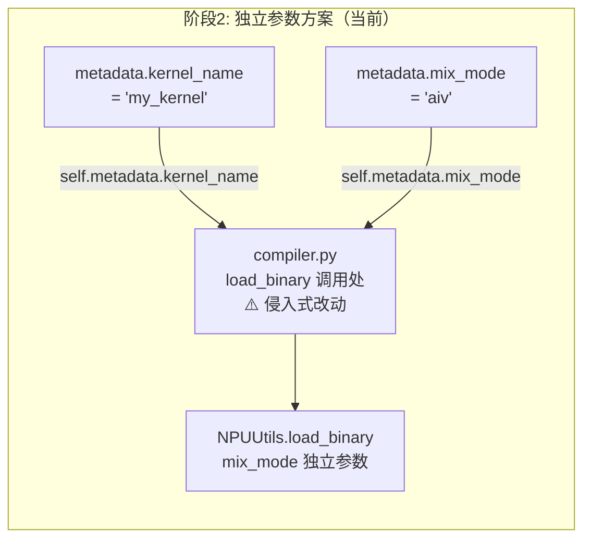
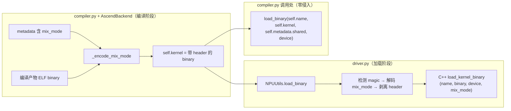
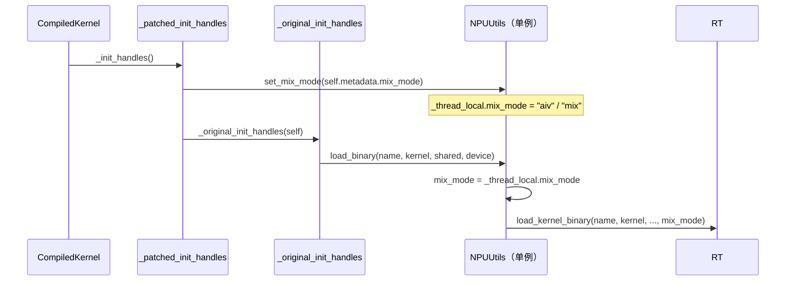
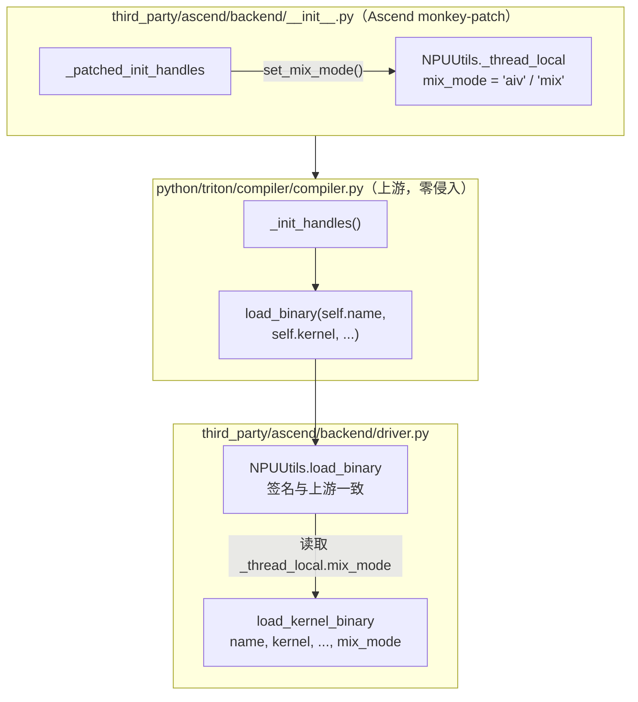

# 消除 `mix_mode` 在 `compiler.py` 中的侵入式修改

## 背景

Ascend NPU 有两种不同类型的物理计算核心：

| 核心类型 | 说明 | 适用场景 |
|------|------|------|
| AI Core（Cube 核） | 矩阵乘加速单元 | 含 `tl.dot` 的 kernel |
| AI Vector Core（向量核） | 通用向量计算单元 | 纯 vector 算子 |

`mix_mode` 用于标记当前 kernel 应该运行在哪类核心上：

| 值 | 含义 |
|------|------|
| `"aiv"` | 纯向量核 |
| `"aic"` | 纯 Cube 核 |
| `"mix"` | 混合模式（既有 dot 又有 vector 运算） |

该值在 C++ 编译 pass 中根据 IR 是否包含 `DotOp` 自动判定（[TritonToLinalgPass.cpp:395-398](third_party/ascend/lib/TritonToLinalg/TritonToLinalgPass.cpp#L395-L398)），写入 MLIR func 属性，经 `compiler.py` 正则提取到 `metadata["mix_mode"]`。

`mix_mode` 最终必须传递到 Ascend Runtime 的 `rtDevBinaryRegister`，用于设置 `devbin.magic`——这个 magic number 决定 kernel 二进制被加载到哪类物理核心上执行（[npu_utils.cpp:50-53](third_party/ascend/backend/npu_utils.cpp#L50-L53)）。传错 magic 会导致 kernel 加载到错误的核心类型，直接执行失败。

---

## 关键类的关系

在讲侵入式修改之前，先理清涉及到的几个类。

### 类图



### 各司其职

**`NPUUtils`（单例）**：对 Ascend Runtime C++ API（`npu_utils.cpp`）的 Python 封装。负责底层操作——加载 kernel 二进制到设备、查询设备属性、获取架构信息等。通过 `__new__` 实现单例模式（[driver.py:42-45](third_party/ascend/backend/driver.py#L42-L45)），整个进程生命周期只有一个实例。

```python
class NPUUtils(object):
    def __new__(cls):
        if not hasattr(cls, 'instance'):
            cls.instance = super(NPUUtils, cls).__new__(cls)
        return cls.instance

    def load_binary(self, name, kernel, shared, device, mix_mode):
        # 调用 C++ load_kernel_binary → registerKernel → rtDevBinaryRegister
        return self.npu_utils_mod.load_kernel_binary(name, kernel, shared, device, mix_mode)
```

**`NPULauncher`（per-kernel 实例）**：每次编译 kernel 时创建一个新实例。负责生成 C++ host wrapper 代码、编译成 `.so`、并暴露 `launch()` 函数供 `CompiledKernel` 调用。它不直接操作硬件，而是通过生成的 host wrapper 间接调用。

```python
class NPULauncher(object):
    def __init__(self, src, metadata):
        # 生成 host wrapper → 编译 → 拿到 launch 函数
        wrapper_src = make_launcher(constants, signature, metadata)
        so_launcher_path = make_npu_launcher_stub(header_src, wrapper_src, metadata.debug)
        mod = importlib.util.module_from_spec(spec)
        spec.loader.exec_module(mod)
        self.launch = getattr(mod, "launch")
        self.mix_mode = metadata.mix_mode
        self.shared = metadata.shared

    def __call__(self, *args, **kwargs):
        # CompiledKernel.run() 最终调用这里
        self.launch(*args, **kwargs)
```

**`NPUDriver`**：Ascend 后端的入口。持有 `NPUUtils` 单例和 `NPULauncher` 类引用。`driver.active` 即指向 NPUDriver 实例。

```python
class NPUDriver(DriverBase):
    def __init__(self):
        self.utils = NPUUtils()          # 创建单例
        self.launcher_cls = NPULauncher  # 类引用，不是实例
```

### `_init_handles` 中的执行顺序

搞清楚执行顺序是理解方案可行性的关键：

```python
# compiler.py CompiledKernel._init_handles()
def _init_handles(self):
    device = driver.active.get_current_device()

    # ① L488: 创建一个 NPULauncher 实例
    #    driver.active.launcher_cls = NPULauncher（类）
    #    driver.active.launcher_cls(self.src, self.metadata) = NPULauncher(src, metadata)
    #    此时 metadata 中包含 mix_mode，NPULauncher.__init__ 可以读取它
    self._run = driver.active.launcher_cls(self.src, self.metadata)

    # ... shared memory 校验 ...

    # ② L501: 调用 NPUUtils.load_binary 加载 kernel 二进制到设备
    #    driver.active.utils = NPUUtils 单例
    #    此时 NPULauncher 已经创建完毕（步骤①），mix_mode 信息已知
    self.module, self.function, ... = driver.active.utils.load_binary(
        self.metadata.kernel_name, self.kernel, self.metadata.shared,
        device, self.metadata.mix_mode)     # ← 侵入式参数
```

关键时间线：**NPULauncher 创建（①）→ `load_binary` 调用（②）**。步骤①在步骤②之前，且步骤①持有的 `metadata` 包含 `mix_mode`。

---

## 侵入式修改的演进

### 阶段 0：上游社区

上游 Triton 没有 `mix_mode` 概念，`compiler.py` 调用 `load_binary` 只传基本参数：

```python
# compiler.py（上游社区，无侵入）
self.module, self.function, self.n_regs, self.n_spills, self.n_max_threads = \
    driver.active.utils.load_binary(self.name, self.kernel, self.metadata.shared, device)
```

---

### 阶段 1：Ascend 最初方案 —— name 编码（compiler.py 调用处零侵入）

**思路**：不改 `compiler.py:502` 的调用签名，而是把 `mix_mode` 编码进 `self.name` 字符串内部，在 `NPUUtils.load_binary` 里拆解出来。

```python
# compiler.py（Ascend）_parse_linalg_metadata —— 设置 metadata["name"]
metadata["name"] = metadata["kernel_name"] + "_" + metadata["mix_mode"]
# 例如：self.name = "my_kernel_aiv"

# compiler.py（Ascend）调用处 —— 和上游完全一样，无需改动！
driver.active.utils.load_binary(self.name, self.kernel, self.metadata.shared, device)

# driver.py（Ascend）NPUUtils.load_binary —— 内部拆解 name
def load_binary(self, name, kernel, shared, device):
    fnname, mix_mode = name.rsplit("_", 1)   # "my_kernel_aiv" → ("my_kernel", "aiv")
    return self.npu_utils_mod.load_kernel_binary(fnname, kernel, shared, device, mix_mode)
```



**优点**：`compiler.py:502` 调用处和上游完全一致，零侵入。

**致命问题**：`self.name` 被污染了。tritonparse 的 kernel reproducer 用 `self.name` 做 kernel import，结果尝试 import 一个叫 `my_kernel_aiv` 的 kernel（实际 kernel 叫 `my_kernel`），直接报错。

---

### 阶段 2：tritonparse 修复（commit `33eff2d37`，当前方案）—— 侵入 compiler.py

**思路**：把 `mix_mode` 从 name 中分离出来，作为 `load_binary` 的独立参数，还 `self.name` 一个清白。

```diff
# compiler.py（Ascend）metadata 设置
- metadata["name"] = metadata["kernel_name"] + "_" + metadata["mix_mode"]
+ metadata["name"] = metadata["kernel_name"]  # 纯 kernel name，干净了

# compiler.py（Ascend）调用处 —— 侵入式改动
- driver.active.utils.load_binary(self.name, self.kernel, self.metadata.shared, device)
+ driver.active.utils.load_binary(self.metadata.kernel_name, self.kernel,
+                                  self.metadata.shared, device, self.metadata.mix_mode)
+ #                               ^^^^^^^^^^^^^^^^^^^^^^^^        ^^^^^^^^^^^^^^^^^^^^^^^^
+ #                               不直接用 self.name                新增 mix_mode 参数

# driver.py（Ascend）NPUUtils.load_binary
- def load_binary(self, name, kernel, shared, device):
-     fnname, mix_mode = name.rsplit("_", 1)
+ def load_binary(self, name, kernel, shared, device, mix_mode):
```



**优点**：`self.name` 是纯 kernel name，tritonparse 正常工作。

**问题**：`compiler.py:502` 多了两个侵入点——(1) `self.name` 被换成了 `self.metadata.kernel_name`，(2) 新增了 `self.metadata.mix_mode` 参数。每次合并上游都要手动解决这行冲突。

---

## 可选方案

目标是消除 `compiler.py:502` 的侵入式修改，同时保证 autotune 多线程并行编译场景下的正确性。

### 方案对比

| 方案 | 数据传递方式 | 线程安全 | 编译器/缓存改动 | compiler.py 改动 |
|------|------|:---:|:---:|:---:|
| A：二进制编码 | 编码进 `self.kernel` 尾部 | ✅ | 需改 | 0 行 |
| B：threading.local（Launcher 注入） | `NPULauncher` → `NPUUtils` | ✅ | 无 | 0 行 |
| **D：monkey-patch `_init_handles`（推荐）** | patch `_init_handles` 注入 | ✅ | 无 | 0 行 |
| C：类属性（不推荐） | NPUUtils 类属性 | ❌ | 无 | 0 行 |

> 注意：autotune 使用 Triton 的多线程并行编译能力，方案 C（类属性）在并发场景下存在竞态条件，不推荐。

---

### 方案 A：将 mix_mode 编码进二进制数据

**思路**：`mix_mode` 本身是编译产物（C++ pass 根据 IR 判定并写入 MLIR 属性），二进制也是编译产物。把 `mix_mode` 编码进二进制数据头部，让它跟着二进制走。`NPUUtils.load_binary` 收到二进制后先解码提取 `mix_mode`，再剥离头部传给 C++ 层。

**为什么可行**：
- `self.kernel` 在 `compiler.py` 中**只被 `load_binary` 消费**（L464 设置，L502 使用），中间没有其他消费方
- AscendBackend 的编译 stage 函数签名是 `lambda src, metadata: binary`，`metadata` 中含 `mix_mode`，可在返回 binary 前编码进去
- 在二进制头部加自定义 header，不影响下游 Runtime——解码时剥离，Runtime 看到的是原始 ELF

**具体修改**：

在 AscendBackend 的 stage pipeline 中包装 `npubin` stage，在二进制头部编码 `mix_mode`：

```python
# third_party/ascend/backend/compiler.py

import struct

_MIX_MODE_MAGIC = b'\x89MIX'

def _encode_mix_mode(binary: bytes, mix_mode: str) -> bytes:
    """在二进制头部编码 mix_mode。[magic:4][payload_len:4][payload:N][原始二进制]"""
    payload = mix_mode.encode('utf-8')
    return _MIX_MODE_MAGIC + struct.pack('I', len(payload)) + payload + binary


# 在 AscendBackend.add_stages 中包装 npubin stage
class AscendBackend(BaseBackend):
    def add_stages(self, stages, options, language):
        # ... 现有逻辑设置 stages["npubin"] ...
        original_npubin = stages["npubin"]
        stages["npubin"] = lambda src, metadata: _encode_mix_mode(
            original_npubin(src, metadata),
            metadata.get("mix_mode", "aiv"))
```

在 `NPUUtils.load_binary` 中解码：

```python
# third_party/ascend/backend/driver.py

_MIX_MODE_MAGIC = b'\x89MIX'

class NPUUtils(object):
    def load_binary(self, name, kernel, shared, device):
        # 签名和上游完全一致，不需要 mix_mode 参数
        if kernel[:4] == _MIX_MODE_MAGIC:
            payload_len = struct.unpack('I', kernel[4:8])[0]
            mix_mode = kernel[8:8 + payload_len].decode('utf-8')
            kernel = kernel[8 + payload_len:]  # 剥离 header
        else:
            mix_mode = "aiv"  # 旧格式二进制（无 header），fallback
        return self.npu_utils_mod.load_kernel_binary(
            name, kernel, shared, device, mix_mode)
```

`compiler.py:502` 完全还原为上游：

```python
# python/triton/compiler/compiler.py —— 零改动，和上游一模一样
self.module, self.function, self.n_regs, self.n_spills, self.n_max_threads = \
    driver.active.utils.load_binary(self.name, self.kernel, self.metadata.shared, device)
```



**优点**：
- **数据流显式**：`mix_mode` 跟着二进制走，不是藏在对象的属性里。编码在编译阶段，解码在加载阶段，中间只有 `self.kernel` 一条数据链路
- **天然线程安全**：每个 kernel 有自己独立的二进制数据，不存在多线程共享变量被覆盖的问题。后续即使改为多进程编译也不受影响
- **零侵入**：`compiler.py` 完全不动，上游 `load_binary` 签名不变
- **向后兼容**：通过 magic number 检测 header，旧格式二进制（无 header）自动 fallback 到 `"aiv"`
- **Runtime 透明**：header 在 `NPUUtils.load_binary` 中剥离，下游 C++ Runtime 看到的始终是原始 ELF 二进制

**缺点**：
- 编码逻辑分散在两处（编译时编码、加载时解码），但都在 `third_party/ascend/` 下，不影响上游
- `cpu_driver.load_binary` 签名也需要同步还原

---

### 方案 B：`threading.local()` 线程局部存储

**思路**：`NPULauncher.__init__` 仍作为注入点，但用 `threading.local()` 代替类属性，确保多线程并行编译时互不干扰。

```python
# third_party/ascend/backend/driver.py
import threading

class NPUUtils(object):
    _thread_local = threading.local()

    @classmethod
    def set_mix_mode(cls, mix_mode):
        cls._thread_local.mix_mode = mix_mode

    def load_binary(self, name, kernel, shared, device):
        mix_mode = getattr(self._thread_local, 'mix_mode', 'aiv')
        return self.npu_utils_mod.load_kernel_binary(
            name, kernel, shared, device, mix_mode)

class NPULauncher(object):
    def __init__(self, src, metadata):
        ...
        NPUUtils.set_mix_mode(metadata.mix_mode)  # ← 注入点，线程安全
```

**优点**：
- 改动量极小（3-4 行）
- 线程安全，autotune 并行编译正确

**缺点**：
- 仍然是**隐式状态传递**——NPULauncher 和 NPUUtils 之间通过不可见的 side channel 通信
- 如果未来改为多进程编译（`multiprocessing`），`threading.local` 无效
- 调试困难——值的流向不直观，出问题时难以追踪
- 依赖 NPULauncher 创建一定在 load_binary 之前执行这个隐含约定

---

### 方案 C：类属性（不推荐）

即之前提出的方案。用 `NPUUtils._mix_mode` 类属性传递值。**autotune 多线程编译时存在竞态条件，不可用。**

```
Thread A: NPULauncher.__init__ → NPUUtils._mix_mode = "aiv"    (kernel A)
Thread B: NPULauncher.__init__ → NPUUtils._mix_mode = "mix"    (kernel B，覆盖了 A！)
Thread A: load_binary → 读到 "mix"                              (应该是 "aiv"，错了！)
```

仅在单线程编译场景可用，不推荐。

---

### 方案 D（推荐）：monkey-patch `CompiledKernel._init_handles`

**思路**：不修改编译产物、不修改 `NPUUtils` 的后端逻辑。在 `backend/__init__.py` 中 monkey-patch `_init_handles`，在原始 `_init_handles` 被执行**之前**，把 `self.metadata.mix_mode` 注入 `NPUUtils`（通过 `threading.local`）。然后原始 `_init_handles` 照常执行，里面的 `load_binary` 已经是上游签名，`NPUUtils.load_binary` 从自身拿到 `mix_mode`。

**为什么可行**：
- `self.metadata` 在 `CompiledKernel.__init__`（L448）就设置好了，`_init_handles` 是唯一消费 `self.metadata.mix_mode` 的入口
- patch 跑在原始逻辑之前，有完整的时间窗口注入状态
- 和 dot 的 HF32 守卫使用了同一种消减模式（monkey-patch），架构一致

**具体修改**：

`python/triton/compiler/compiler.py` —— 还原为上游：

```python
# compiler.py L502，零侵入
self.module, self.function, self.n_regs, self.n_spills, self.n_max_threads = \
    driver.active.utils.load_binary(self.name, self.kernel, self.metadata.shared, device)
```

`third_party/ascend/backend/__init__.py` —— monkey-patch `_init_handles`：

```python
def _apply_ascend_patch():
    # ... 现有 patch（CodeGenerator、compiler.parse、TritonSemantic.dot）...

    from triton.compiler.compiler import CompiledKernel
    from triton.backends.ascend.backend.driver import NPUUtils

    if not getattr(CompiledKernel, "_ascend_init_handles_patched", False):
        _original_init_handles = CompiledKernel._init_handles

        def _patched_init_handles(self):
            if self.module is not None:
                return
            # ← 在原始 load_binary 之前，注入 mix_mode
            NPUUtils.set_mix_mode(self.metadata.mix_mode)
            _original_init_handles(self)

        CompiledKernel._init_handles = _patched_init_handles
        CompiledKernel._ascend_init_handles_patched = True
```

`third_party/ascend/backend/driver.py` —— `NPUUtils` 用 `threading.local` 承载：

```python
import threading

class NPUUtils(object):
    _thread_local = threading.local()

    @classmethod
    def set_mix_mode(cls, mix_mode):
        cls._thread_local.mix_mode = mix_mode

    def load_binary(self, name, kernel, shared, device):
        # 签名与上游一致！
        mix_mode = getattr(self._thread_local, 'mix_mode', 'aiv')
        return self.npu_utils_mod.load_kernel_binary(name, kernel, shared, device, mix_mode)
```

**数据流**：



**优点**：
- `compiler.py` **零行改动**，和上游完全一致
- **不修改编译产物**：缓存的二进制保持 `bishengir-compile` 原始输出，不会出现格式兼容问题
- **后端实现不变**：`NPUUtils.load_binary` 只改签名和取值方式，下游逻辑完全不动
- **线程安全**：`threading.local()` 保证 autotune 并行编译正确
- 与 dot 的 HF32 守卫 monkey-patch 架构一致，易于理解和维护

**缺点**：
- 仍是隐式状态传递（`_init_handles` → `NPUUtils` side channel），但通过 `set_mix_mode` 类方法封装，接口清晰
- monkey-patch `_init_handles` 是比 patch `dot` 更粗粒度的 hook——如果上游 `_init_handles` 大改，需要同步适配

---

## 推荐：方案 D（monkey-patch `_init_handles`）

理由：
1. `compiler.py` **零行改动**，和上游社区完全一致
2. 不修改编译产物格式，缓存完全兼容，无格式风险
3. 后端实现基本不动，改动集中在 driver 模块和 monkey-patch
4. 和 dot HF32 守卫使用了同一套 monkey-patch 消减模式，架构统一
5. 改动量最小，风险最低

---

## 最终架构（方案 D）



**关键点**：`mix_mode` 只在 Ascend 的 monkey-patch → `NPUUtils` 这条 side channel 上传递。`compiler.py` 完全不知道它的存在。编译产物、缓存、后端 C++ 逻辑均不受影响。
