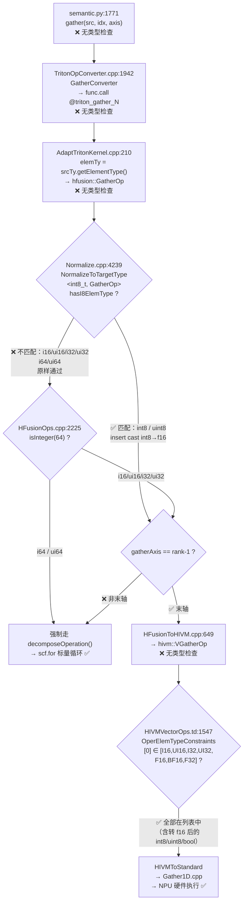

# [API](fix) Remove overly restrictive dtype check in `tl.gather`

## 背景

`python/triton/language/semantic.py:1773-1774` 对 `tl.gather` 的 `src` 参数加入了一条上游社区不存在的 dtype 检查：

```python
if not (src.dtype.is_floating() or src.dtype.is_int8()):
    raise ValueError(...)
```

此检查最初在 commit `65e7027a3`（2025-07）引入至 `triton_patch/`，后经 fork 大合并 `313dccecf`（2025-12）正式进入主线。当时编译器 pipeline 尚未完善，部分整数类型的 gather lowering 不支持。如今编译器已完整支持，该检查由"必要的保护"退化为"过时的限制"。

## 当前现状

该检查**放行**的类型：`float16/bf16/float32/float64/fp8*/int8`

被**拦截**的类型：

| 被拦截类型 | 后端实际能力 | 结论 |
|-----------|-------------|------|
| `i16, ui16, i32, ui32` | 硬件 VGatherOp 原生支持（`HIVMVectorOps.td:1547`，`Gather1D.cpp:107-118`） | 前端误拦 |
| `i64, ui64` | `HFusionOps.cpp:2225` 的 `isInteger(64)` 强制走标量循环分解 | 前端误拦 |
| `uint8, bool` | uint8 经 `NormalizeToTargetType` 匹配 → cast int8→f16；bool 经 Triton 前端 `tt.bitcast i1→i8` + `tt.load {was_bool_to_int8=true}` 转为 int8 → Normalize pass 再转 f16 | 前端误拦 |

**社区上游的行为**：对 `src` 不作任何 dtype 限制，所有 Triton 支持的标量类型均可传入 `tl.gather`。

## 为什么可以删

### 全链路验证

被拦截的类型去掉检查后，经过的编译器链路**没有任何环节进行类型拦截**：



> \* bool 在 Triton 前端 `semantic.py` 即被转换为 int8：Triton IR 插入 `tt.bitcast !tt.ptr<i1> → !tt.ptr<i8>` + `tt.load {was_bool_to_int8 = true}`，下游 `NormalizeToTargetType<int8_t, GatherOp>` 见到的已是 i8，正常匹配 → cast 到 f16。

### 硬件指令级证据

**末轴 gather（原支持类型 + i16/ui16/i32/ui32）→ VGatherOp 硬件原生**：

```tablegen
// HIVMVectorOps.td:1547 — VGatherOp 硬件指令类型约束
def VGatherOp : HIVM_VectorOp<"vgather", [
    OperElemTypeConstraints<[0], [I16, UI16, I32, UI32, F16, BF16, F32]>,
    //                         ↑   ↑    ↑    ↑
    //                 被前端误拦的四种整数类型，硬件原生支持
]>

// Gather1D.cpp:107-118 — NPU 模板运行时注册，与 HIVM 完全对应
REGISTE_GATHER(1, int16_t);
REGISTE_GATHER(1, uint16_t);
REGISTE_GATHER(1, int32_t);
REGISTE_GATHER(1, uint32_t);
```

**非末轴 gather（任意类型）→ decomposeOperation 标量循环分解**；**i64/ui64（无论末轴与否）→ 强制走分解**：

```cpp
// HFusionOps.cpp:2224-2226 — i64 或非末轴走分解，分解后是纯标量 extract/insert
if (gatherAxis == rank - 1 && !srcElmTy.isInteger(64))
    return failure();  // failure = 不分解 → 走 VGatherOp 硬件
//                               ^^^^^^^^^^^^^^^^^^^^
//                非末轴（gatherAxis != rank-1）/ i64（isInteger(64)）不满足此条件
//                → 继续往下 → scf.for 循环 + tensor.extract + tensor.insert
// 标量 extract/insert 不检查数据类型，任何 MLIR 合法类型均可
```

## 验证

基于现有 `generalization_cases/test_general_gather.py`，扩展 dtype 参数化覆盖到全部被拦截类型：

| src dtype | 测试 shape 数 | 结果 |
|-----------|:---:|------|
| `float32, float16, bfloat16` | 6 | ✅ 全通过（原本支持） |
| `int8` | 6 | ✅ 全通过（原本支持，normalize→f16） |
| **`int32, int16, int64`** | 6 | ✅ **全通过（新放行，含末轴/非末轴）** |
| **`uint8, bool`** | 6 | ✅ **全通过（新放行，含末轴/非末轴）** |

> 注：`[128,64]×[128,128]` 大 shape 场景因 UB 内存不足跳过，所有 dtype 表现一致，非本次修改引入。

## 修改内容

```diff
-        if not (src.dtype.is_floating() or src.dtype.is_int8()):
-            raise ValueError(f"Expected dtype fp16/fp32/bf16/f8E5M2/f8E4M3FN/int8, but got {src.dtype}")
-
```

仅删除两行，无其他改动。行为与上游社区一致：对所有 Triton 支持的标量类型放行。
