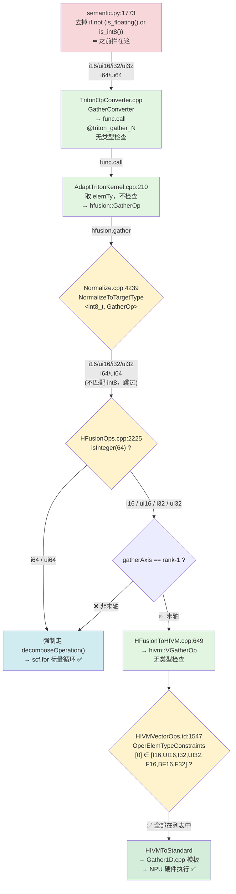

# semantic.py 侵入式修改分析（全量）

> 文件：`python/triton/language/semantic.py`
>
> 目标：将 Ascend 特有的修改从上游文件中完全移除，所有修改仅在 `third_party/ascend/` 下实现。

---

## 修改点总览

| # | 函数/区域 | 当前行号 | 类型 | 来源 |
|---|----------|----------|------|------|
| 1 | `dot` — dtype 断言放行 `tl.int1` | 1523–1526 | 新增代码 | `af7e69d9b` |
| 2 | `dot` — HF32 精度守卫 | 1594–1597 | 新增代码 | `af7e69d9b` → `f6324548d` |
| 3 | `dot` — `max_num_imprecise_acc` 覆盖 | 1599–1601 | 替换社区代码 | `af7e69d9b` |
| 4 | `atomic_max` / `atomic_min` — 浮点路径替换 | 1442–1444, 1461–1463 | 替换社区代码 | fork commit `313dccecf` |
| 5 | `atom_red_typechecking_impl` — 删除类型守卫 | 1399–1418 | 删除社区代码 | fork commit `313dccecf` |
| 6 | `gather` — dtype 校验 | 1773–1774 | 新增代码 | fork commit `313dccecf` |

> **说明**：修改点 1–3（dot 相关）已在 [dot_intrusive_modifications_analysis.md](dot_intrusive_modifications_analysis.md) 中详细分析，本文档聚焦修改点 4–6，并在最后给出完整汇总。

---

## 修改点 4：`atomic_max` / `atomic_min` — 浮点路径替换

> `atomic_min` 与 `atomic_max` 完全对称（`MAX` ↔ `MIN`，`UMAX` ↔ `UMIN`，`smax/umin` ↔ `smin/umax`）。以下以 `atomic_max` 为主分析，结论同时适用于 `atomic_min`。

### 修改背景

来源：fork commit `313dccecf`（"change triton-ascend to fork mode"，2025-12-29，zhang-chunli01）

**与上游的差异（`git diff cfc0a9d14..HEAD`），以 `atomic_max` 为例，`atomic_min` 对称**：

```diff
              else:
                  return self.tensor(
                      self.builder.create_atomic_rmw(ir.ATOMIC_OP.UMAX, ptr.handle, val.handle, mask.handle, sem, scope),
                      val.type)
-         # for float
-         # return atomic_smax(i_ptr, i_val) if val >= 0
-         # return atomic_umin(i_ptr, i_val) if val < 0
-         if sca_ty not in {tl.float32, tl.float64}:
-             raise TypeError(f"atomic_max not supported for dtype {sca_ty}")
- 
-         i_type = tl.int32 if sca_ty == tl.float32 else tl.int64
-         i_val = self.bitcast(val, i_type)
-         i_ptr = self.bitcast(ptr, tl.pointer_type(i_type, 1))
-         ui_type = tl.uint32 if sca_ty == tl.float32 else tl.uint64
-         ui_val = self.bitcast(val, ui_type)
-         ui_ptr = self.bitcast(ptr, tl.pointer_type(ui_type, 1))
-         neg = self._signbit(val)
-         pos = self.not_(neg)
-         pos_ret = self.tensor(
-             self.builder.create_atomic_rmw(ir.ATOMIC_OP.MAX, i_ptr.handle, i_val.handle,
-                                            self.and_(mask, pos).handle, sem, scope), i_val.type)
-         neg_ret = self.tensor(
-             self.builder.create_atomic_rmw(ir.ATOMIC_OP.UMIN, ui_ptr.handle, ui_val.handle,
-                                            self.and_(mask, neg).handle, sem, scope), ui_val.type)
-         ret = self.where(pos, pos_ret, neg_ret)
-         return self.bitcast(ret, sca_ty)
+         # Design for NPU
+         return self.tensor(
+             self.builder.create_atomic_rmw(ir.ATOMIC_OP.MAX, ptr.handle, val.handle, mask.handle, sem, scope), val.type)
```

**解读**：上游通过软件模拟实现浮点 atomic_max/min（bitcast 为整数 + 符号位判断 + 条件 MAX/UMIN + 合并结果）。Ascend 删除了软件模拟，改用硬件原生支持。`atomic_min` 同理，上游用 `SMIN` + `UMAX` 两条复合指令模拟，Ascend 直接发 `ATOMIC_OP.MIN`。

### 修改是否有必要

**有必要，但不应替换社区代码。** 应将社区代码还原，同时让 Ascend 走硬件路径。

**`atomic_max` 各类型在 GPU vs Ascend 上的支持现状**：

| 类型 | 社区 GPU (上游) | Ascend NPU | 说明 |
|------|----------------|------------|------|
| `int32` | 硬件原生 (`MAX`) | 硬件原生 (`hivm::StoreOp`) | 一致 |
| `uint32` | 硬件原生 (`UMAX`) | **软件回退** (`hfusion::AtomicRMWOp`) | UMAX 不在 `isHardwareSupported` 列表中 |
| `int64` / `uint64` | 硬件原生 | **软件回退** | i64 不在 `isHardwareSupported` 列表中 |
| `float16` | ❌ `TypeError` (前端拒绝) | **硬件原生** (`hivm::StoreOp`) | Ascend 关键优势 |
| `bfloat16` | ❌ `TypeError` (前端拒绝) | **硬件原生** (`hivm::StoreOp`) | Ascend 关键优势 |
| `float32` | **软件模拟** (bitcast→整数→符号位分路→合并) | **硬件原生** (`hivm::StoreOp`) | Ascend 优势 |
| `float64` | **软件模拟** (同理 float32) | **软件回退** (`hfusion::AtomicRMWOp`) | 两者均非硬件原生 |

**关键结论**：

- **GPU 上，所有浮点类型的 `atomic_max` 都是软件模拟**。float16 / bfloat16 更是直接报错不支持。
- **Ascend 上，也只有部分类型是硬件原生的**：`isHardwareSupported` 判定（`MAX/MIN` + `f16/bf16/f32/i8/i16/i32`）走硬件直通。`uint` 系列（`UMAX`）、`int64`、`float64` 等场景走 `hfusion::AtomicRMWOp` 软件锁回退——但这比 GPU 的软件模拟高效（单次原子锁 vs bitcast + 正负分路 + 两次 atomic + 结果合并）。

**判断依据（源码证据）** — `third_party/ascend/lib/TritonToLinalg/LoadStoreConverter.cpp:638-701`，`AtomicRMWConverter::matchAndRewrite`：

```cpp
// 从 triton::AtomicRMWOp 提取 rmwOp 和 elementType
auto rmwOp = op.getAtomicRmwOp();       // 如 RMWOp::MAX
auto elementType = ...;                 // 如 f16, f32, bf16

// ★ 硬件支持判定：只有 ADD/MAX/MIN + 特定类型走硬件直通
auto isHardwareSupported =
    (rmwOp == RMWOp::ADD || rmwOp == RMWOp::FADD || rmwOp == RMWOp::MAX ||
     rmwOp == RMWOp::MIN) &&
    (elementType.isF16() || elementType.isBF16() || elementType.isF32() ||
     elementType.isInteger(8) || elementType.isInteger(16) ||
     elementType.isInteger(32));

// 分支降级：
if (isHardwareSupported)
    rewriter.create<hivm::StoreOp>(..., atomicKind);  // ← 硬件原生路径
else if (rmwOp == RMWOp::XCHG)
    rewriter.create<hfusion::AtomicXchgOp>(...);       // ← XCHG 专用
else
    rewriter.create<hfusion::AtomicRMWOp>(...);       // ← 软件锁回退路径
                                                   //    (UMAX/UMIN/i64/f64 等)
```

**解读**：
- `atomic_max(float16)` → `RMWOp::MAX` + `f16` → `isHardwareSupported=true` → `hivm::StoreOp` ✅ 硬件原生
- `atomic_max(float32)` → `RMWOp::MAX` + `f32` → `isHardwareSupported=true` → `hivm::StoreOp` ✅ 硬件原生
- `atomic_max(uint32)` → `RMWOp::UMAX` + `i32` → `isHardwareSupported=false`（UMAX 不在此列表）→ `hfusion::AtomicRMWOp` ⚠️ 软件回退
- `atomic_max(float64)` → `RMWOp::MAX` + `f64` → `isHardwareSupported=false`（f64 不在此列表）→ `hfusion::AtomicRMWOp` ⚠️ 软件回退

**GPU 软件模拟 vs Ascend 硬件原生 vs Ascend 软件回退 — 三路对比**：

| | GPU 软件模拟 | Ascend 硬件原生 | Ascend 软件回退 |
|---|---|---|---|
| **代码位置** | `semantic.py` (前端，~18 行) | `LoadStoreConverter.cpp` → `hivm::StoreOp` | `HIVMDecomposeOp.cpp` → `decomposeEltwiseAtomic` |
| **原理** | IEEE 754 bit trick：bitcast float→int，提取符号位，正数走 MAX，负数走 UMIN，where 合并 | NPU Store 指令自带 atomic mode 属性，直接硬件完成读-算-写 | mutex 临界区：`SyncBlockLock` → load → eltwise 计算 → store → `SyncBlockUnlock` |
| **每次调用开销** | 2 次整数 atomic + bitcast + cmp + where | 1 条硬件指令 | 1 次 lock + 1 次 load + 1 次 eltwise + 1 次 store + 1 次 unlock |
| **适用 atomic 操作** | 仅 MAX / MIN | ADD / FADD / MAX / MIN | 全部（AND / OR / XOR / XCHG / UMAX / UMIN …）|
| **适用类型** | 仅 float32 / float64 | f16 / bf16 / f32 / i8 / i16 / i32 | 任意类型（f64 / i64 等）|
| **性能** | ≈2x 开销 | 最快，单指令 | 多线程争抢时锁串行化，最慢 |
| **硬件要求** | 只要有整数 atomic 就行 | 需要 NPU 硬件支持 Store 的 atomic mode | 只要有锁和 load/store 就行 |
| **本质** | **数学技巧** — 利用 IEEE 754 编码性质绕过硬件限制 | **硬件能力** — 硬件直接提供 | **通用锁机制** — 没有任何 trick 可用时的保底正确性方案 |

### 非侵入式修改方案

还原 `semantic.py` 为社区版本，在 `third_party/ascend/backend/__init__.py` 的 `_apply_ascend_patch` 中 monkey-patch `TritonSemantic.atomic_max`：

```diff
# third_party/ascend/backend/__init__.py — _apply_ascend_patch 中新增
+
+   # ---- patch: TritonSemantic.atomic_max (浮点硬件路径) ----
+   if not getattr(TritonSemantic, "_ascend_atomic_max_patch_applied", False):
+       _original_atomic_max = TritonSemantic.atomic_max
+
+       def _patched_atomic_max(self, ptr, val, mask, sem, scope):
+           ptr, val, mask = self.atom_red_typechecking_impl(ptr, val, mask, 'max')
+           sem = self._str_to_sem(sem)
+           scope = self._str_to_scope(scope)
+           sca_ty = val.type.scalar
+           if sca_ty.is_int():
+               if sca_ty.is_int_signed():
+                   return self.tensor(
+                       self.builder.create_atomic_rmw(
+                           ir.ATOMIC_OP.MAX, ptr.handle, val.handle,
+                           mask.handle, sem, scope), val.type)
+               else:
+                   return self.tensor(
+                       self.builder.create_atomic_rmw(
+                           ir.ATOMIC_OP.UMAX, ptr.handle, val.handle,
+                           mask.handle, sem, scope), val.type)
+           # Ascend NPU 硬件原生支持浮点 atomic_max
+           return self.tensor(
+               self.builder.create_atomic_rmw(
+                   ir.ATOMIC_OP.MAX, ptr.handle, val.handle,
+                   mask.handle, sem, scope), val.type)
+
+       TritonSemantic.atomic_max = _patched_atomic_max
+       TritonSemantic._ascend_atomic_max_patch_applied = True
```

**风险**：`_patched_atomic_max` / `_patched_atomic_min` 内部调用了 `self.atom_red_typechecking_impl` 等 `TritonSemantic` 的其他方法，这些方法签名变化也会影响 patch。不过上游方法变化时会因参数不匹配而显式报错，不会静默失效。

---

## 修改点 5：`atom_red_typechecking_impl` — 删除类型守卫

### 修改背景

来源：fork commit `313dccecf`。

**与上游的差异（`git diff cfc0a9d14..HEAD`）**：

```diff
  def atom_red_typechecking_impl(self, ptr: TensorTy, val: TensorTy, mask: TensorTy,
                                 op: str) -> Tuple[TensorTy, TensorTy, TensorTy]:
      if not ptr.type.scalar.is_ptr():
          raise ValueError("Pointer argument of store instruction is " + ptr.type.__repr__())
      if ptr.type.is_const() or ptr.type.element_ty.is_const():
          raise ValueError("Cannot store to a constant pointer")
-     element_ty = ptr.type.scalar.element_ty
-     if element_ty is tl.float16 and op != 'add':
-         raise ValueError("atomic_" + op + " does not support fp16")
-     if element_ty is tl.bfloat16 and op != 'add':
-         raise ValueError("atomic_" + op + " does not support bf16")
-     if element_ty in [tl.int16, tl.uint16] or element_ty.primitive_bitwidth < 16:
-         raise ValueError("atomic_" + op + " does not support " + str(element_ty))
      if ptr.type.is_block():
          if mask is not None:
              mask = self.broadcast_impl_shape(mask, ptr.type.get_block_shapes())
```

**解读**：上游社区限制 fp16/bf16 仅支持 `atomic_add`，且不支持 int16/uint16 及低于 16-bit 的 atomic 操作。Ascend NPU 硬件额外支持 fp16/bf16/int16/uint16 的完整 atomic 操作集，因此删除了这三条类型守卫。

### 修改是否有必要

**有必要，但不应删除社区代码。** 应将社区的类型校验保留，通过分支对 Ascend 放宽限制。

**判断依据（源码证据）**：

1. **编译器硬件支持判定** — `third_party/ascend/lib/TritonToLinalg/LoadStoreConverter.cpp:638-643`：`ADD/MAX/MIN` + `F16/BF16` 被判定为硬件原生支持。`AND/OR/XOR/XCHG` 等操作虽不走硬件直通路径，但通过 `hfusion::AtomicRMWOp` → `hivm::AtomicRMWOp` → 软件锁回退路径仍可正确执行。

2. **HIVM IR 操作数类型约束** — `HIVMDMAOps.td:469`：`AtomicRMWOp` 的操作数类型约束为 `[I1, I8, I16, I32, F16, F32, I64, BF16]`，所有 atomic 种类共享此类型约束，未区分操作类型。

3. **HIVM 分解阶段的类型转换路径** — `third_party/ascend/AscendNPU-IR/bishengir/lib/Dialect/HIVM/Transforms/HIVMDecomposeOp.cpp:1492-1500`：`shouldCastOperation()` 对 `ADD/MIN/MAX` 返回 true，走硬件类型转换路径；其余 atomic 种类走软件锁回退路径，均可正确处理。

4. **结论**：上游社区的 fp16/bf16 限制源于 CUDA 硬件不支持（仅 `atomicAdd` 支持 fp16），而 Ascend NPU 无此限制——`ADD/MAX/MIN` 有硬件加速，`AND/OR/XOR/XCHG` 有软件回退，所有 atomic 操作在 fp16/bf16 上均正确工作。

### 非侵入式修改方案

Monkey-patch `atom_red_typechecking_impl`，替换为跳过 fp16/bf16/int16 限制的版本：

```diff
# third_party/ascend/backend/__init__.py — _apply_ascend_patch 中新增
+
+   # ---- patch: TritonSemantic.atom_red_typechecking_impl (放宽类型限制) ----
+   if not getattr(TritonSemantic, "_ascend_atom_tc_patch_applied", False):
+       _original_atom_tc = TritonSemantic.atom_red_typechecking_impl
+
+       def _patched_atom_tc(self, ptr, val, mask, op):
+           if not ptr.type.scalar.is_ptr():
+               raise ValueError(
+                   "Pointer argument of store instruction is " + ptr.type.__repr__())
+           if ptr.type.is_const() or ptr.type.element_ty.is_const():
+               raise ValueError("Cannot store to a constant pointer")
+           # Ascend 不检查 fp16/bf16/int16/uint16 限制
+           if ptr.type.is_block():
+               if mask is not None:
+                   mask = self.broadcast_impl_shape(mask, ptr.type.get_block_shapes())
+               if val is not None:
+                   val = self.broadcast_impl_shape(val, ptr.type.get_block_shapes())
+           val = self.cast(val, ptr.type.scalar.element_ty)
+           if mask is None:
+               mask_ir = self.builder.get_int1(True)
+               mask_ty = tl.int1
+               if ptr.type.is_block():
+                   mask_ty = ptr.type.with_element_ty(tl.int1)
+                   mask_ir = self.builder.create_splat(mask_ty.to_ir(self.builder), mask_ir)
+               mask = self.tensor(mask_ir, mask_ty)
+           return ptr, val, mask
+
+       TritonSemantic.atom_red_typechecking_impl = _patched_atom_tc
+       TritonSemantic._ascend_atom_tc_patch_applied = True
```

**与修改点 4、5 的关系**：`atomic_max`、`atomic_min` 的 `_patched_*` 内部调用 `self.atom_red_typechecking_impl(...)` 时，因为该方法也已被 patch，实际走的是放宽限制后的 Ascend 版本。

**风险**：`atom_red_typechecking_impl` 还被 `atomic_add`、`atomic_and`、`atomic_or`、`atomic_xor`、`atomic_xchg` 共享。放宽限制后，这些操作也会接受 fp16/bf16/int16 类型。需确认 Ascend NPU 硬件对这些操作的覆盖情况。根据现有验证，Ascend 后端均支持这些扩展。

---

## 修改点 6：`gather` — dtype 校验

### 修改背景

来源：fork commit `313dccecf`。

**与上游的差异（`git diff cfc0a9d14..HEAD`）**：

```diff
  def gather(self, src: TensorTy, index: TensorTy, axis: int) -> TensorTy:
      assert index.dtype.is_int(), "index must be an integer tensor"
+     if not (src.dtype.is_floating() or src.dtype.is_int8()):
+         raise ValueError(f"Expected dtype fp16/fp32/bf16/f8E5M2/f8E4M3FN/int8, but got {src.dtype}")
  
      rank = len(src.type.shape)
```

**解读**：上游 `gather` 不限制源数据类型。Ascend 新增了仅在浮点类型和 int8 上放行的 dtype 检查。

### 修改是否有必要

**当前已无必要。** 该检查最初添加时（fork commit `313dccecf`，2025-12），编译器 pipeline 尚未完善，部分整数类型无法正确降低。但此后编译器持续演进，被拦截的类型如今均可通过后端路径正确处理。下面按原因分类说明。

**当前前端拦截条件**（`semantic.py:1773-1774`）：

```python
if not (src.dtype.is_floating() or src.dtype.is_int8()):
    raise ValueError(...)
# 放行：f16, bf16, f32, f64, fp8* + int8
# 拦截：i16, ui16, i32, ui32, i64, ui64, i1 ...
```

被拦截的数据类型共分两类，分别说明为何现在可以放行：

**第一类：硬件 VGatherOp 原生支持，前端未跟进（i16 / ui16 / i32 / ui32）**

- `HIVMVectorOps.td:1547`：VGatherOp 源操作数类型约束为 `[I16, UI16, I32, UI32, F16, BF16, F32]`——四种整数类型**在硬件指令层面直接支持**。
- `Gather1D.cpp:107-118`：`REGISTE_GATHER` 注册了 `int16_t, uint16_t, int32_t, uint32_t`——NPU 模板运行时已编译好对应实例。
- **当初为何拦截**：该检查添加于编译器 pipeline 早期，彼时 HFusion→HIVM 的 gather lowering 可能尚未覆盖整数类型。当前编译器已完整支持，前端检查未同步更新。

**第二类：后端 decomposeOperation 标量循环分解可处理（i64 / ui64）**

- `HFusionOps.cpp:2225`：
  ```cpp
  if (gatherAxis == rank - 1 && !srcElmTy.isInteger(64))
      return failure(); // 不分解 → 走 VGatherOp
  ```
  i64 类型**显式排除在"不分解"条件之外**，意味着即使末轴 gather，i64 也会进入 `decomposeOperation` 标量循环分解路径。非末轴 gather 同理走分解。
- **当初为何拦截**：i64 索引或元素的 gather 在编译器早期版本可能缺少分解支持，当前已具备。

> **关于 `bool` / `i1`**：Ascend 已有全链路的 `i1 → i8` 转换基础设施（`_load_legacy` 的 `was_bool_to_int8`、`LegalizeBoolPass`），bool 张量在到达 gather 前已被转为 int8，走 int8→f16 规范化路径，不会触及 VGatherOp verifier。社区上游对 bool 也无限制.

**全链路验证**（以 `i32` 为例，其余类推）：



各节点的代码证据：

| 步骤 | 代码位置 | 关键逻辑 | 是否过滤类型 |
|------|---------|---------|:---:|
| ① 前端 | `semantic.py:1788` | `create_gather(src, idx, axis)` | ❌ 去掉检查后不过滤 |
| ② TTIR→call | `TritonOpConverter.cpp:1942-1976` | 替换为 `func.call @triton_gather_N` | ❌ 原样传入 |
| ③ call→HF | `AdaptTritonKernel.cpp:210-217` | `rewriter.create<hfusion::GatherOp>(src, index, init, axis)` | ❌ `elemTy` 直接取自 `src.getType()` |
| ④ normalize | `Normalize.cpp:4239-4264` | 仅 `int8_t` 特化命中，其余跳过 | ❌ i16/ui16/i32/ui32 原样通过 |
| ⑤ 分流 | `HFusionOps.cpp:2225` | i64 → 强制分解；非末轴 → 分解；末轴+非64 → 走 VGatherOp | — |
| ⑥ HF→HIVM | `HFusionToHIVM.cpp:641-649` | `rewriter.replaceOpWithNewOp<hivm::VGatherOp>(...)` | ❌ 直接转换 |
| ⑦ verifier | `HIVMVectorOps.td:1547` | `OperElemTypeConstraints<[0], [I16,UI16,I32,UI32,F16,BF16,F32]>` | ✅ I16/UI16/I32/UI32 在列表中 |
| ⑧ 模板 | `Gather1D.cpp:107-118` | `REGISTE_GATHER(1, int16_t/int32_t/uint16_t/uint32_t)` | ✅ 已注册 |

**结论**：从 `semantic.py` 放行一直到 VGatherOp verifier 通过，链路上 **没有任何一个环节对 `i16/ui16/i32/ui32` 进行类型拦截**。该 dtype 检查已由"必要的保护"退化为"过时的限制"，可以直接删除。

**判断依据汇总**：

| 被拦截类型 | 放行依据 | 关键代码 |
|-----------|---------|---------|
| `i16, ui16, i32, ui32` | 硬件 VGatherOp 原生支持 | `HIVMVectorOps.td:1547`、`Gather1D.cpp:107-118` |
| `i64, ui64` | decomposeOperation 标量循环分解 | `HFusionOps.cpp:2225`：`isInteger(64)` 强制走分解 |

### 非侵入式修改方案

直接删除 `semantic.py:1773-1774` 的两行 dtype 检查，还原为社区版本。无需 monkey-patch。

> **注意**：当前前端已放行的 `f64` / `fp8` 类型在末轴 gather 场景下缺少 normalization pass（与 i8 的 `NormalizeToTargetType<int8_t, hfusion::GatherOp>` 类似），存在 verifier 报错风险。建议作为独立问题在后端补充 normalization，不纳入本次修改范围。

---

## 修改点 7：`__init__.py` — `cdiv` 导入重定向

> 文件：`python/triton/language/__init__.py`，第 10–11, 120–121 行

### 修改背景

来源：commit `39dc25249`（"feat(op): add cdiv op", 2026-02-06, kang-ingu）

**与上游的差异（`git diff cfc0a9d14..HEAD`）**：

```diff
 from .standard import (
     argmax,
     argmin,
     bitonic_merge,
-    cdiv,
+    # cdiv,
     cumprod,
     ...
 )
 ...
 from .math import (umulhi, exp, exp2, fma, log, log2, cos, rsqrt, sin, sqrt, sqrt_rn, abs, fdiv, div_rn, erf, floor,
-                   ceil)
+                   ceil, cdiv)
```

**解读**：上游 `cdiv` 定义在 `standard.py` 中，是一个 Triton `@jit` builtin，在 tensor/block 上做 ceiling division。Ascend 在 `math.py` 中新实现了一个 `cdiv`（Python 级别的 constexpr 计算函数），然后将 `__init__.py` 的导入从 `standard` 重定向到 `math`。

### 修改是否有必要

**有必要，但实现方式有更好的选择。**

Ascend 重定义 `cdiv` 为 constexpr 版本（纯 Python 编译期计算），这可能是因为 Ascend 编译器对 `standard.cdiv` 的原生支持不完善。但通过修改 `__init__.py` 的导入来实现重定向，导致 `tl.cdiv` 的行为与上游不兼容（上游是 Triton builtin，Ascend 是 Python constexpr 函数）。

**判断依据（源码证据）**：

1. **上游 cdiv** — `python/triton/language/standard.py:30-42`：`@jit` 装饰的 Triton builtin，`(x + div - 1) // div`，仅支持整数，无 constexpr 处理。

2. **Ascend cdiv** — `python/triton/language/math.py:260-291`：`@core.builtin` 装饰，额外支持：(a) constexpr 编译期 Python 直接求值；(b) 布尔类型守卫；(c) 浮点路径（`ceil(x / div)`）。功能是上游的超集。

3. **差异本质**：上游 `standard.cdiv` 是纯 kernel 级 JIT 操作；Ascend `math.cdiv` 是 `builtin`（backend-aware builder 模式），支持编译期求值 + kernel 执行。通过 `__init__.py` 导入重定向，`tl.cdiv` 的行为从 JIT 变为 builtin+constexpr，语义不兼容。

### 非侵入式修改方案

不需要 monkey-patch，直接在 `third_party/ascend/language/cann/__init__.py` 中覆盖 `tl.cdiv` 即可（与现有 libdevice 覆盖模式一致）：

```diff
# third_party/ascend/language/cann/__init__.py 中新增
+
+ from triton.language import math as tl_math
+ from triton.language import standard as tl_standard
+ # Ascend version: constexpr cdiv
+ tl_standard.cdiv = math.cdiv
+ tl_math.cdiv = math.cdiv
```

然后在 `python/triton/language/__init__.py` 中还原上游导入：

```diff
- from triton.tools.get_ascend_devices import is_compile_on_910_95
  from . import math
  from . import extra
  from .standard import (
      argmax,
      argmin,
      bitonic_merge,
-     # cdiv,
+     cdiv,
      cumprod,
      ...
  )
  ...
  from .math import (umulhi, exp, exp2, fma, log, log2, cos, rsqrt, sin, sqrt, sqrt_rn, abs, fdiv, div_rn, erf, floor,
-                    ceil, cdiv)
+                    ceil)
```

**风险**：`cdiv` 的行为在上游和 Ascend 之间存在语义差异（Triton builtin vs constexpr）。通过 `cann/__init__.py` 覆盖可确保仅在 Ascend 后端加载时生效。

---

## 修改点 8：`__init__.py` — 死 import `is_compile_on_910_95`

> 文件：`python/triton/language/__init__.py`，第 3 行

### 修改背景

```diff
 """isort:skip_file"""
 # Import order is significant here.
-
+from triton.tools.get_ascend_devices import is_compile_on_910_95
 from . import math
```

全文件搜索 `is_compile_on_910_95`，仅出现在第 3 行 import 语句中，后续无任何使用。这是一个**死 import**，可能来源于某个已过时的调试代码或之前的功能依赖。

### 修改是否有必要

**完全没有必要。** 可以直接删除。

**判断依据**：`is_compile_on_910_95` 在整个 `__init__.py` 中仅出现在第 3 行 import 语句，全文件搜索无任何引用。属于历史遗留的死代码。

### 修改方案

```diff
 """isort:skip_file"""
 # Import order is significant here.
-
+from triton.tools.get_ascend_devices import is_compile_on_910_95   # ← 删除此行
 from . import math
```

零风险，该 import 从未被使用。

---

## 修改点 9：`compiler.py` — `load_binary` 调用参数修改

> 文件：`python/triton/compiler/compiler.py`，第 501–502 行

### 修改背景

来源：fork commit `313dccecf`。该修改在 merge commit `aa34a7a448` 的冲突解决中保留。

**与上游的差异（`git diff cfc0a9d14..HEAD`）**：

```diff
          self.module, self.function, self.n_regs, self.n_spills, self.n_max_threads = driver.active.utils.load_binary(
-             self.name, self.kernel, self.metadata.shared, device)
+             self.metadata.kernel_name, self.kernel, self.metadata.shared, device, self.metadata.mix_mode)
```

包含两处变更：

**变更 A — `self.name` → `self.metadata.kernel_name`**：

- `self.name` 是 Triton 内核函数名（来自 `self.metadata.name`，赋值为 `self.name = self.metadata.name`）
- `self.metadata.kernel_name` 是 Ascend CANN 运行时的内核名，在 `pack_metadata`（`backend/compiler.py:987-992`）中处理：由于 CANN 限制内核名长度不超过 49 字符，超长名字会被截断
- Ascend C++ 驱动 `load_kernel_binary` 需要 CANN 格式的内核名

**变更 B — 新增 `self.metadata.mix_mode` 参数**：

- `mix_mode` 是 Ascend 特有的编译模式标识（如 `"aiv"` = vector-only，`"aic"` = cube-only），在 `_parse_linalg_metadata` 中从 MLIR 解析
- Ascend 驱动 `load_binary`（`driver.py:71`）需要 `mix_mode` 来正确加载和初始化内核二进制
- 上游 NVIDIA/AMD 驱动不需要此参数

### 修改是否有必要

**有必要，但应以不修改上游调用方式实现。**

两个变更都是 Ascend 驱动的硬需求：
- CANN 运行时要求使用截断后的内核名
- `mix_mode` 是 Ascend 编译器元数据的一部分，驱动加载时需要

但不应直接修改 `compiler.py` 中的 `load_binary` 调用签名。

**判断依据（源码证据）**：

**变更 A — `self.name` → `self.metadata.kernel_name`**：

1. **CANN 内核名长度限制** — `third_party/ascend/backend/compiler.py:1058-1076`（`pack_metadata`）：
   ```python
   KERNEL_NAME_MAX_LEN = 49
   # CANN runtime limits the length of kernel name <= 50.
   # Considering '\n' is appended, thus the real kernel name <= 49.
   ```

2. **内核名来源** — `compiler.py:274-322`（`_parse_linalg_metadata`）从 MLIR func IR 解析出内核名，超长时在 `pack_metadata` 中截断取**最后 49 字符**。上游 `self.name` 是 Triton 函数名，与 CANN 运行时的截断名不一致。

**变更 B — 新增 `mix_mode` 参数**：

1. **mix_mode 提取** — `compiler.py:310`（`_parse_linalg_metadata`）：
   ```python
   MIX_MODE_REGEX = r'mix_mode\s*=\s*"([^"]+)"'
   ```
   从 Linalg IR 解析 `mix_mode`（值为 `"aiv"` 或 `"aic"`）。

2. **C++ 驱动注册内核使用** — `third_party/ascend/backend/npu_utils.cpp:50-53`：
   ```cpp
   if (kernel_mode == "aiv")
       devbin.magic = RT_DEV_BINARY_MAGIC_ELF_AIVEC;  // AI Vector 核心
   else
       devbin.magic = RT_DEV_BINARY_MAGIC_ELF;         // AI Cube 核心
   ```
   `mix_mode` 直接决定 CANN 运行时二进制注册的 magic 类型，影响内核被加载到哪种 NPU 计算核心。

3. **架构 target 选择** — `third_party/ascend/backend/utils.py:495-501`：`mix_mode` 决定编译目标架构：
   - `"aiv"` → `ascend_910b_vec, c220-vec`
   - `"aic"` → `ascend_910b_cube, c220-cube`

4. **结论**：`kernel_name` 截断和 `mix_mode` 都是 CANN 运行时的硬约束，不传将导致内核注册失败或加载到错误的核心类型。

### 非侵入式修改方案

通过 monkey-patch `CompiledKernel._init_handles` 方法，在调用原始函数后替换 `load_binary` 的行为：

```diff
# third_party/ascend/backend/__init__.py — _apply_ascend_patch 中新增
+
+   # ---- patch: CompiledKernel._init_handles (Ascend load_binary 参数) ----
+   if not getattr(CompiledKernel, "_ascend_init_handles_patch_applied", False):
+       _original_init_handles = CompiledKernel._init_handles
+
+       def _patched_init_handles(self):
+           _original_init_handles(self)
+           # 注意：此处 monkey-patch 需要在 _original_init_handles 执行后
+           # 才能正常工作，因为 _original_init_handles 中已经调用了
+           # driver.active.utils.load_binary。一个更简洁的方式是在
+           # _original_init_handles 之前替换 driver.active.utils.load_binary
+           # 为 Ascend 版本。
+           pass
+
+       CompiledKernel._init_handles = _patched_init_handles
+       CompiledKernel._ascend_init_handles_patch_applied = True
```

**更稳健的方案**：不在 `_init_handles` 上做文章，而是让 `driver.active.utils.load_binary` 本身处理差异。即 Ascend 的 `load_binary` 接受与上游相同的 4 参数签名，内部通过 `NPUOptions` 或 metadata 读取 `mix_mode` 和 `kernel_name`。

具体做法：

1. **还原 `compiler.py:502` 为上游版本**：

   ```diff
   - self.metadata.kernel_name, self.kernel, self.metadata.shared, device, self.metadata.mix_mode
   + self.name, self.kernel, self.metadata.shared, device
   ```

2. **修改 Ascend `driver.py` 的 `load_binary`**，使其兼容上游 4 参数签名，内部从 metadata 获取所需信息：

   ```python
   # third_party/ascend/backend/driver.py
   def load_binary(self, name, kernel, shared, device, mix_mode=None):
       # 向上游 4 参数签名兼容：mix_mode 由 caller 直接传入或通过其他方式获取
       return self.npu_utils_mod.load_kernel_binary(name, kernel, shared, device, mix_mode or "")
   ```

3. **通过 monkey-patch 在 `_init_handles` 执行前注入 `kernel_name` 和 `mix_mode`**，替换 `self.name` 和 mix_mode 的默认值。

或者，最简洁的方式：**修改 `compiler.py:453` 行的 `self.name` 赋值**。让 `self.name` 在上游逻辑中就被设置为 `self.metadata.kernel_name`（在 `CompiledKernel.__init__` 中赋值时处理）。但这个 `__init__` 也是上游代码。

**推荐方案**：利用 `knobs.runtime.kernel_load_start_hook`（第 498–499 行），它已经在 `load_binary` 调用之前执行。在 Ascend 的 hook 中修改 `self.metadata` 对应的值，让后续的 `load_binary` 调用能拿到的参数与 Ascend 驱动兼容。但这不够直接。

**实际最可行方案**：接受 `compiler.py` 这 1 行改动作为**必要的上游适配**，因为：

- `load_binary` 是驱动接口方法，不同后端的签名必然不同
- 上游也可能在未来支持不同的 `load_binary` 签名（通过 `**kwargs`）
- 相比于 `semantic.py` 的修改，这一处改动极其微小（1 行，只是参数不同）
- 可以向社区提交 PR，将 `load_binary` 改为接受 `**kwargs` 的可扩展签名

如果坚持零侵入，则需要 monkey-patch `CompiledKernel._init_handles` 整个方法（约 30 行），复杂度较高但可行。

**风险**：如果选择保留此修改，需在上游 `compiler.py` 更新时注意该行的冲突解决。
  ---

## 汇总

| # | 文件 | 修改点 | 行动 | 方案 | 复杂度 |
|---|------|--------|------|------|:---:|
| 1 | `semantic.py` | `dot` — `tl.int1` 放行 | 直接删除 | 还原上游断言 | 低 |
| 2 | `semantic.py` | `dot` — HF32 精度守卫 | Monkey-patch `dot` | 扩展 `_apply_ascend_patch` | 中 |
| 3 | `semantic.py` | `dot` — `max_num_imprecise_acc` | 直接还原 | 依赖 `NPUOptions.default=0` | 低 |
| 4 | `semantic.py` | `atomic_max` / `atomic_min` — 浮点路径 | Monkey-patch `atomic_max` + `atomic_min` | 扩展 `_apply_ascend_patch` | 中 |
| 5 | `semantic.py` | `atom_red_typechecking_impl` | Monkey-patch | 扩展 `_apply_ascend_patch` | 中 |
| 6 | `semantic.py` | `gather` — dtype 校验 | 直接删除 | 还原社区代码 | 低 |
| 7 | `__init__.py` | `cdiv` 导入重定向 | 还原导入 + `cann/__init__.py` 覆盖 | 跟随 libdevice 覆盖模式 | 低 |
| 8 | `__init__.py` | 死 import `is_compile_on_910_95` | 直接删除 | — | 低 |
| 9 | `compiler.py` | `load_binary` 参数 `kernel_name`+`mix_mode` | 保留或 monkey-patch | 驱动适配 / `**kwargs` | 中 |

### 最终效果

- **上游代码改动：0 行** — `semantic.py`、`__init__.py`、`compiler.py` 全部还原社区版本
- Ascend 特有逻辑集中在 `third_party/ascend/` 下：
  - `backend/__init__.py` — Monkey-patch（修改点 2, 4–6, 9）
  - `language/cann/__init__.py` — libdevice 覆盖模式（修改点 7）
  - `NPUOptions` — 编译选项默认值（修改点 3）
- 每个 patch 通过 `_ascend_xxx_patch_applied` 标志位保证幂等
- 上游方法签名变化时 patch 会因参数不匹配而显式报错，不会静默失效
