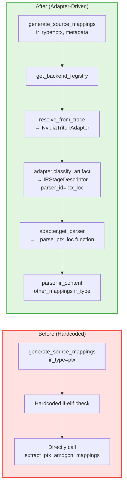

# PR: Parser Distribution System Refactoring - From Hardcoded to Adapter-Driven Parser Registration and Selection

## Context

- **RFC**: https://github.com/meta-pytorch/tritonparse/issues/367
- **Previous PR**: https://github.com/meta-pytorch/tritonparse/pull/387 (Reader-side Infrastructure and Generic Parsing Flow Refactoring)

## Summary

This is the **second PR in Flexible Backend Support RFC Phase 1** (Phase 1 is split into 3 PRs).

**What this PR does**: Refactor the hardcoded parser selection logic in `generate_source_mappings()` into an adapter-driven parser registration and selection mechanism. This enables layered parser registration (common parsers + backend-specific parsers) and dynamic parser dispatch.

---

## Core Changes

### 1. Parser Registry (`tritonparse/parse/ir_parser.py` - New)

**New ParserRegistry class**:

```python
class ParserRegistry:
    """
    Registry for managing IR parser functions.
    
    Allows adapters to register and retrieve parser functions by parser_id.
    Supports both common parsers (shared across backends) and backend-specific parsers.
    """

    @classmethod
    def register(cls, parser_id: str, parser_func: Callable) -> None: ...

    @classmethod
    def get_parser(cls, parser_id: str) -> Optional[Callable]: ...

    @classmethod
    def list_parsers(cls) -> List[str]: ...
```

**Key design**:
- **Layered registration**:
  - Common parsers (`generic_loc`, `none`) pre-registered at module initialization
  - Backend-specific parsers (`ptx_loc`, `sass_loc`, `amdgcn_loc`) registered by respective adapters during initialization
- **Unified interface**: All parsers follow the same signature `(ir_content, other_mappings, ir_type) -> Dict`

### 2. Parser Wrapper Functions (`tritonparse/parse/ir_parser.py` - New)

**5 standardized parser functions**:

```python
def _parse_generic_loc(ir_content, other_mappings, ir_type):
    """Common IR format parser (TTIR/TTGIR/LLIR)"""

def _parse_ptx_loc(ir_content, other_mappings, ir_type):
    """PTX IR format parser"""

def _parse_amdgcn_loc(ir_content, other_mappings, ir_type):
    """AMDGCN assembly format parser"""

def _parse_sass_loc(ir_content, other_mappings, ir_type):
    """NVIDIA SASS assembly format parser"""

def _parse_none(ir_content, other_mappings, ir_type):
    """Placeholder parser for stages without source mapping (e.g., CUBIN)"""
```

**Design points**:
- **Preserve existing logic**: Wrappers call existing functions like `extract_loc_definitions`, `extract_ptx_amdgcn_mappings`
- **Unified signature**: All parsers follow `(ir_content, other_mappings, ir_type) -> Dict` interface
- **Backward compatible**: Don't break existing function calls, unify at registry level

### 3. Adapter Extension (`tritonparse/backend.py` - Refactor)

**New CompilationPipelineAdapter methods**:

```python
class CompilationPipelineAdapter(ABC):
    def get_parser(self, parser_id: str):
        """
        Get parser function by parser_id from the parser registry.
        
        Generic implementation that works for most backends.
        Subclasses can override if needed.
        
        Raises:
            ValueError: If parser_id is not found in registry
        """

    def register_backend_parser(self, parser_id: str, parser_func) -> None:
        """
        Register a backend-specific parser to the parser registry.
        
        Allows adapters to register custom parsers for backend-specific
        IR formats not in the common parser registry.
        """
```

**Adapter implementation**:

```python
class NvidiaTritonAdapter(CompilationPipelineAdapter):
    def __init__(self):
        """Initialize and register backend-specific parsers."""
        # Register NVIDIA-specific parsers
        self.register_backend_parser("ptx_loc", _parse_ptx_loc)
        self.register_backend_parser("sass_loc", _parse_sass_loc)
        
        # Pre-initialize stage descriptors (immutable objects, reusable)
        self._stages = [
            IRStageDescriptor("ttir", ".ttir", "TTIR", 10, True, True, "generic_loc", "mlir"),
            IRStageDescriptor("ttgir", ".ttgir", "TTGIR", 20, True, True, "generic_loc", "mlir"),
            IRStageDescriptor("llir", ".llir", "LLIR", 30, True, True, "generic_loc", "llvm"),
            IRStageDescriptor("ptx", ".ptx", "PTX", 40, True, True, "ptx_loc", "ptx"),
            IRStageDescriptor("cubin", ".cubin", "CUBIN", 50, False, False, "none", "plaintext"),
            IRStageDescriptor("sass", ".sass", "SASS", 60, True, True, "sass_loc", "asm"),
            IRStageDescriptor("json", ".json", "JSON", 100, True, False, "none", "json"),
        ]
```

**Key improvements**:
- **Adapter as parser registration entry point**: Each adapter registers its backend-specific parsers
- **Decoupled stage descriptors from parsers**: `parser_id` field specifies which parser to use
- **Object reuse optimization**: `_stages` pre-initialized in `__init__`, `get_ir_stages()` returns cached instance

### 4. generate_source_mappings Refactor (`tritonparse/parse/trace_processor.py` - Refactor)

**Before (hardcoded parser selection)**:

```python
def generate_source_mappings(ir_content, ir_type, other_mappings):
    # Hardcoded parser selection
    if ir_type == "ptx" or ir_type == "amdgcn":
        return extract_ptx_amdgcn_mappings(ir_content, other_mappings, ir_type)
    elif ir_type == "sass":
        return extract_sass_mappings(ir_content)
    else:
        # TTIR/TTGIR/LLIR: complex hardcoded logic
        loc_defs = extract_loc_definitions(ir_content)
        loc_refs = extract_code_locations(ir_content)
        # ... manual mapping construction
```

**After (adapter-driven parser selection)**:

```python
def generate_source_mappings(ir_content, ir_type, other_mappings, metadata=None):
    # Step 1: Try adapter-based parser selection (new path)
    if metadata is not None:
        try:
            from tritonparse.backend import get_backend_registry
            
            registry = get_backend_registry()
            adapter = registry.resolve_from_trace(metadata)
            
            # Find stage descriptor for this ir_type
            stage_descriptor = adapter.classify_artifact(f"kernel.{ir_type}")
            if stage_descriptor is not None and stage_descriptor.parser_id != "none":
                parser_id = stage_descriptor.parser_id
                parser = adapter.get_parser(parser_id)
                
                # Call parser with standardized signature
                return parser(ir_content, other_mappings, ir_type)
        except Exception as e:
            # Fallback to old hardcoded logic if adapter resolution fails
            logger.debug(f"Adapter-based parser resolution failed for ir_type={ir_type}: {e}. "
                        f"Falling back to hardcoded parser selection.")
    
    # Step 2: Fallback to hardcoded parser selection (backward compatibility)
    if ir_type == "ptx" or ir_type == "amdgcn":
        return extract_ptx_amdgcn_mappings(ir_content, other_mappings, ir_type)
    elif ir_type == "sass":
        return extract_sass_mappings(ir_content)
    else:
        # ... original hardcoded logic for TTIR/TTGIR/LLIR
```

**Key improvements**:
- **Two-level dispatch mechanism**:
  1. Priority: Adapter-driven parser selection (from stage descriptor's parser_id)
  2. Fallback: Hardcoded parser selection (backward compatibility)
- **Metadata-driven**: New traces trigger adapter-based parser selection via `metadata`
- **Backward compatible**: Old traces (without metadata) continue using hardcoded logic

### 5. process_ir Signature Extension (`tritonparse/parse/trace_processor.py` - Refactor)

```python
def process_ir(
    key: str,
    file_content: Dict[str, str],
    file_path: Dict[str, str],
    other_mappings: List[Any] | None = None,
    metadata: Dict[str, Any] | None = None,  # ← New parameter
):
    ir_content = load_ir_contents(key, file_content, file_path)
    if not ir_content:
        return {}
    ir_type = key.split(".")[1]
    mapping = generate_source_mappings(ir_content, ir_type, other_mappings, metadata)
    return mapping
```

**Data flow**: `metadata` → `process_ir()` → `generate_source_mappings()`

---

## Architecture Improvements

### Parser Dispatch Flow Comparison



**Key improvements**:
- ✅ **Dynamic dispatch**: Parser selection driven by adapter + stage descriptor
- ✅ **Extensible**: Add new parsers by registering in adapter.__init__
- ✅ **Decoupled**: Parser logic in `ir_parser.py`, adapters only handle registration
- ✅ **Backward compatible**: Fallback strategy ensures old traces still work

---

## Testing

### Compatibility Testing
Verified that the current parse path works for both new and old traces. Built the trace adaptation logic and generated new trace files for validation. Both new and old traces can be parsed correctly.

- old trace
image
- new trace
image

### Format Checking
The result of `make format-check`:
image

### Functional Testing
The result of `make test-cuda`:
image

The result of `make test`:
image

### Multi-Backend Testing
The parse function also works properly in the Ascend backend.

---

## Summary

This PR completes **Parser Distribution System Refactoring** for Flexible Backend Support RFC Phase 1, refactoring hardcoded parser selection into an adapter-driven dynamic dispatch mechanism.

**Core implementation**: Added `ParserRegistry` for unified parser management and query; implemented layered registration for common parsers and backend-specific parsers; provided 5 standardized parser wrapper functions for IR formats (TTIR/TTGIR/LLIR, PTX, AMDGCN, SASS, CUBIN); extended `CompilationPipelineAdapter` with `get_parser()` and `register_backend_parser()` methods, where adapters register backend-specific parsers during initialization; refactored `generate_source_mappings()` to implement two-level dispatch (priority: adapter-driven, fallback: hardcoded) ensuring full compatibility with both new and old traces.

**Key improvements**:
- **Layered registration**: Common parsers pre-registered, backend parsers lazy-registered
- **Unified interface**: All parsers follow same signature for easy dispatch
- **Fallback strategy**: Compatible with both new and old traces
- **Object reuse**: `get_ir_stages()` returns pre-initialized object, avoids repeated instantiation

---

## RFC Phase 1 Status & Next Steps

### ✅ PR 1 (Completed): Reader-side Infrastructure and Generic Parsing Flow Refactor
- Adapter infrastructure + generic parse scheduling refactor in `trace_processor.py`
- Added `tritonparse/backend.py`: IRStageDescriptor, CompilationPipelineAdapter, NvidiaTritonAdapter, AmdTritonAdapter, PipelineAdapterRegistry
- Refactored `trace_processor.py`: dynamic stage discovery (with fallback), dynamic stage processing loop, dynamic mapping construction

### ✅ PR 2 (This PR): Parser Distribution System Refactoring
- ParserRegistry infrastructure + 5 standardized parser wrapper functions
- Adapter extension: `get_parser()`, `register_backend_parser()`
- Refactored `generate_source_mappings()`: adapter-driven + hardcoded fallback
- Comprehensive test coverage

### 🔜 PR 3: Analysis and Reproducer
- Migration of `ir_analysis.py` and `reproducer/` modules to adapter architecture
