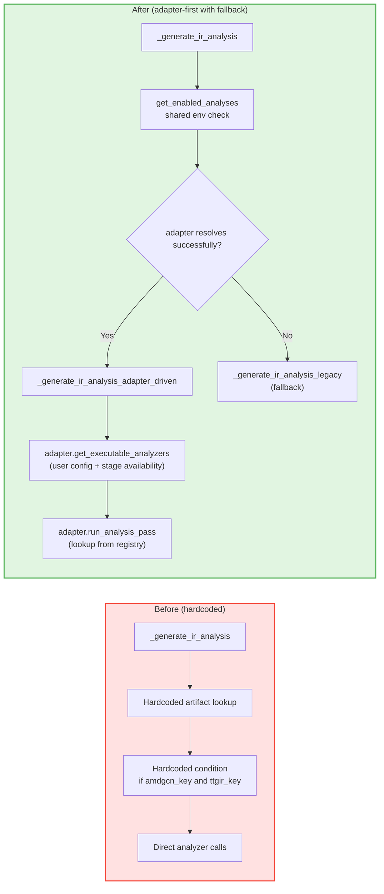

# PR: Analysis Dispatch Refactor — From Hardcoded Logic to Adapter-Driven Registration and Scheduling

## Context

- RFC: https://github.com/meta-pytorch/tritonparse/issues/367
- Prerequisite PRs:
  - https://github.com/meta-pytorch/tritonparse/pull/387 (reader-side infrastructure and generic parse refactor)
  - https://github.com/meta-pytorch/tritonparse/pull/394 (parser dispatch refactor)

## Summary

This is the third PR in Phase 1 of the Flexible Backend Support RFC. Phase 1 was originally planned as 3 PRs, but during implementation it was split into 4 to keep each PR more focused and easier to review.

This PR refactors analysis dispatch. The hardcoded scheduling logic in `_generate_ir_analysis()` is replaced with an adapter-driven analysis registration and scheduling mechanism. The PR introduces layered analyzer registration for common and backend-specific analyzers, centralizes the `TRITONPARSE_ANALYSIS` entry point, and preserves a legacy fallback path when adapter resolution fails.

---

## Key Changes

### 1. Analysis registry (`tritonparse/parse/ir_analysis.py`)

New `AnalyzerInfo` dataclass:

```python
@dataclass
class AnalyzerInfo:
    """Metadata for a registered analyzer."""
    name: str                           # e.g. "amd_buffer_ops"
    func: Callable                      # (entry, procedure_checks) -> dict | None
    required_stages: tuple[str, ...]    # e.g. ("ttgir", "amdgcn")
    adapter_affinity: str | None = None # backend owner; None means common
```

New `AnalysisRegistry` class:

```python
class AnalysisRegistry:
    """
    Registry for analyzer registration, lookup, and metadata.
    Supports layered registration for common and backend-specific analyzers.
    """

    @classmethod
    def register(cls, analyzer_id, analyzer_func, required_stages, adapter_affinity=None) -> None: ...

    @classmethod
    def get_analyzer_info(cls, analyzer_id: str) -> AnalyzerInfo | None: ...

    @classmethod
    def get_analyzer(cls, analyzer_id: str) -> Callable | None: ...

    @classmethod
    def list_analyzers(cls) -> list[str]: ...

    @classmethod
    def list_analyzer_infos(cls) -> list[tuple[str, AnalyzerInfo]]: ...
```

Core design:

- Layered registration:
  - Common analyzers such as `loop_schedules` and `procedure_checks` are registered at module initialization with `adapter_affinity=None`
  - Backend-specific analyzers such as `amd_buffer_ops` are registered by the corresponding adapter with `adapter_affinity="hip_triton"`
- Unified analyzer metadata:
  - Each analyzer carries both its stage dependencies and backend affinity in `AnalyzerInfo`

### 2. Standardized analyzer wrappers (`tritonparse/parse/ir_analysis.py`)

Three standardized analyzer wrapper functions were added:

```python
def _analyze_loop_schedules_generic(entry, procedure_checks=None):
    """Generic loop schedule analyzer wrapping _analyze_loop_schedules."""

def _analyze_procedures_generic(entry, procedure_checks=None):
    """Generic FileCheck-based procedure analyzer wrapping find_procedures_with_patterns."""

def _analyze_amd_buffer_ops(entry, procedure_checks=None):
    """AMD buffer-ops analyzer wrapping _analyze_buffer_ops."""
```

Design points:

- All analyzers follow the same `(entry, procedure_checks) -> dict | None` signature
- Existing analysis logic is preserved; the wrappers only standardize registration and dispatch
- `_validate_required_stages()` is used as a defensive check before execution

### 3. Adapter extensions (`tritonparse/backend.py`)

Removal of `AnalysisPassDescriptor` / API break:

The responsibility previously carried by `AnalysisPassDescriptor` has been replaced by `AnalyzerInfo`. Analyzer metadata is now managed centrally by `AnalysisRegistry`, so a separate adapter-side public data structure is no longer needed.

`AnalysisPassDescriptor` has been removed from the public Python API. There are no callers in the current repository, so this removal does not affect current production usage, but it is still called out explicitly here because it changes the public API surface.

New and updated methods on `CompilationPipelineAdapter`:

```python
class CompilationPipelineAdapter(ABC):
    def get_analysis_passes(self) -> list[str]:
        """Return analyzer names available for this adapter, filtered by affinity."""

    def get_executable_analyzers(self, file_content, enabled_analyses=None) -> list[str]:
        """
        Determine which analyzers can run based on:
        1. User configuration via TRITONPARSE_ANALYSIS
        2. Stage availability in file_content
        """

    def run_analysis_pass(self, pass_name, entry, procedure_checks=None) -> dict[str, Any]:
        """Run a named analyzer and raise ValueError if it is not found."""

    def register_backend_analyzer(self, analyzer_id, analyzer_func, required_stages) -> None:
        """Register a backend-specific analyzer using adapter_name as affinity."""
```

Concrete adapter change:

```python
class AmdTritonAdapter(CompilationPipelineAdapter):
    def __init__(self):
        self.register_backend_analyzer(
            "amd_buffer_ops",
            _analyze_amd_buffer_ops,
            required_stages=("ttgir", "amdgcn"),
        )
```

Key improvements:

- Each adapter becomes the registration entry point for its backend-specific analyzers
- `get_analysis_passes()` filters available analyzers automatically based on `adapter_affinity`
- `get_executable_analyzers()` combines user configuration and stage availability before execution

### 4. `_generate_ir_analysis()` refactor (`tritonparse/parse/ir_analysis.py`)

Before the refactor, analysis dispatch was hardcoded:

```python
def _generate_ir_analysis(entry, procedure_checks=None):
    ttir_key = next((k for k in file_content if k.endswith(".ttir")), None)
    ttgir_key = next((k for k in file_content if k.endswith(".ttgir")), None)
    amdgcn_key = next((k for k in file_content if k.endswith(".amdgcn")), None)

    if amdgcn_key and ttgir_key:
        io_counts = _analyze_buffer_ops(ttgir_key, amdgcn_key, ...)

    if ttir_key and ttgir_key:
        loop_schedule = _analyze_loop_schedules(ttir_key, ttgir_key, ...)
```

After the refactor, the dispatcher performs a shared env check, tries the adapter-driven path first, and falls back to legacy logic only when adapter resolution fails:

```python
def _generate_ir_analysis(entry, procedure_checks=None):
    enabled_analyses = get_enabled_analyses()
    if enabled_analyses is not None and len(enabled_analyses) == 0:
        return {}

    try:
        return _generate_ir_analysis_adapter_driven(
            entry, procedure_checks, enabled_analyses
        )
    except ValueError as e:
        logger.warning(f"Adapter-driven analysis failed: {e}. Falling back to legacy.")

    return _generate_ir_analysis_legacy(
        entry, procedure_checks, enabled_analyses
    )
```

Adapter-driven path:

```python
def _generate_ir_analysis_adapter_driven(
    entry, procedure_checks=None, enabled_analyses=None
):
    adapter = get_backend_registry().resolve_from_trace(metadata)
    executable = adapter.get_executable_analyzers(file_content, enabled_analyses)

    for analyzer_name in executable:
        result = adapter.run_analysis_pass(analyzer_name, entry, procedure_checks)
```

Key improvements:

- Two-level dispatch:
  1. Try adapter-driven dispatch first
  2. Fall back to the legacy hardcoded path only if adapter resolution fails
- Backend-specific checks such as `if amdgcn_key and ttgir_key` are replaced by `adapter.get_executable_analyzers()`
- `TRITONPARSE_ANALYSIS` is now read once at the dispatcher entry point and shared by both the adapter-driven and legacy paths

### 5. Environment variable control (`tritonparse/shared_vars.py`)

`TRITONPARSE_ANALYSIS` handling was moved into `shared_vars.py` as `get_enabled_analyses()`:

```python
def get_enabled_analyses() -> set[str] | None:
    """
    Get the user-enabled analysis set from the environment.

    Returns:
        None: enable all analyses (default)
        set: enabled analysis names
        empty set: disable all analyses
    """
    env_value = os.environ.get("TRITONPARSE_ANALYSIS", "all").strip()
    if not env_value or env_value.lower() == "none":
        return set()
    elif env_value.lower() == "all":
        return None

    raw_names = [n.strip().lower() for n in env_value.split(",") if n.strip()]
    if "all" in raw_names:
        logger.warning("TRITONPARSE_ANALYSIS contains 'all' mixed with other names")
        return None
    if "none" in raw_names:
        logger.warning("TRITONPARSE_ANALYSIS contains 'none' mixed with other names")
        return set()

    known = {name.lower() for name in AnalysisRegistry.list_analyzers()}
    unknown = {n for n in raw_names if n not in known}
    if unknown:
        logger.warning(f"TRITONPARSE_ANALYSIS contains unknown analyzer names: {unknown}")

    return set(raw_names) & known if known else set(raw_names)
```

Usage examples:

```bash
# Enable all analyses (default)
export TRITONPARSE_ANALYSIS="all"

# Disable all analyses
export TRITONPARSE_ANALYSIS="none"

# Run only specific analyses
export TRITONPARSE_ANALYSIS="loop_schedules"
export TRITONPARSE_ANALYSIS="loop_schedules,procedure_checks"
```

This helper now also normalizes case, warns on invalid combinations such as `all,foo` or `none,foo`, and filters unknown analyzer names.

---

## Architecture

### Analysis dispatch flow comparison



### Component responsibilities

| Component | Responsibility |
|-----------|----------------|
| `AnalysisRegistry` | Analyzer registration, lookup, and metadata |
| `AnalyzerInfo` | Analyzer metadata: function, dependencies, and ownership |
| `_validate_required_stages()` | Defensive check for required stages |
| `get_enabled_analyses()` | Parse and validate `TRITONPARSE_ANALYSIS` in `shared_vars.py` |
| `adapter.get_executable_analyzers()` | Determine which analyzers are executable |
| `adapter.run_analysis_pass()` | Execute a named analyzer |
| `adapter.register_backend_analyzer()` | Register a backend-specific analyzer |
| `AnalysisRegistry.list_analyzer_infos()` | Public enumeration API for adapter-side analyzer metadata lookup |

---

## Documentation

This PR also documents `TRITONPARSE_ANALYSIS` in `docs/07.-Environment-Variables-Reference.md`, including both the quick-reference table and the detailed section.

---

## Testing

Validation performed for this PR includes:

- `make format-check`
- `make test-cuda`
- `make test`
- Multi-backend sanity validation confirming that the parse path still works on Ascend as well

Focused tests for the new analysis dispatch behavior cover:

- adapter-driven analysis dispatch
- legacy fallback when adapter resolution fails
- `TRITONPARSE_ANALYSIS` parsing and disable-all behavior
- registry visibility for common and backend-specific analyzers

---

## Summary

This PR completes the analysis dispatch refactor for Phase 1 of the Flexible Backend Support RFC. It replaces the hardcoded scheduling logic in `_generate_ir_analysis()` with an adapter-driven dispatch model while preserving a compatibility fallback path for legacy behavior.

The main deliverables are:

- `AnalysisRegistry` and `AnalyzerInfo` for unified analyzer registration, lookup, and metadata
- layered analyzer registration for common and backend-specific analyzers
- three standardized analyzer wrappers: `loop_schedules`, `procedure_checks`, and `amd_buffer_ops`
- adapter extensions for `get_executable_analyzers()`, `run_analysis_pass()`, and `register_backend_analyzer()`
- a shared dispatcher entry point for `TRITONPARSE_ANALYSIS`
- centralized env parsing in `shared_vars.py` with validation, normalization, and warnings

---

## RFC Phase 1 Status and Next Steps

### Phase 1 overview

The goal of RFC Phase 1 is reader-side backend convergence: move reader-side backend semantics from scattered hardcoded rules into a unified adapter contract.

The original RFC planned 3 PRs for Phase 1. During implementation, the original PR 2 and PR 3 each carried enough scope to justify splitting the phase into 4 PRs.

### PR 1 (completed): Reader-side infrastructure and generic parse refactor

- Adapter infrastructure plus generic parse scheduling in `trace_processor.py`
- New `tritonparse/backend.py`: `IRStageDescriptor`, `CompilationPipelineAdapter`, `NvidiaTritonAdapter`, `AmdTritonAdapter`, `PipelineAdapterRegistry`
- Dynamic stage discovery with fallback, dynamic stage processing, and dynamic mapping construction in `trace_processor.py`

### PR 2 (completed): Parser dispatch refactor

- `ParserRegistry` plus five standardized parser wrappers
- Adapter extensions: `get_parser()` and `register_backend_parser()`
- `generate_source_mappings()` refactored to adapter-driven dispatch with hardcoded fallback

### PR 3 (this PR): Analysis dispatch refactor

- `AnalysisRegistry` plus three standardized analyzer wrappers
- Adapter extensions: `get_executable_analyzers()`, `run_analysis_pass()`, and `register_backend_analyzer()`
- `_generate_ir_analysis()` refactored to shared env check plus adapter-first, fallback-aware dispatch
- `TRITONPARSE_ANALYSIS` centralized in `shared_vars.py`

### PR 4 (upcoming): Derived artifacts and reproducer migration

- Derived artifacts: implement `get_derived_artifacts()` and `collect_derived_artifact_contents()` in `NvidiaTritonAdapter`, and move the existing SASS dump logic (`TRITONPARSE_DUMP_SASS`) into the adapter-based derived-artifact framework
- Reproducer migration: move device normalization in `reproducer/` into `adapter.normalize_device_string()` and remove backend-specific checks from the reproducer path
- Main outcome: backend-specific derivation logic and reproducer device handling move out of shared code and into adapters

Next step: complete PR 4. Once that is done, Phase 1 is complete and the work can move on to Phase 2, the reader-side frontend migration.
