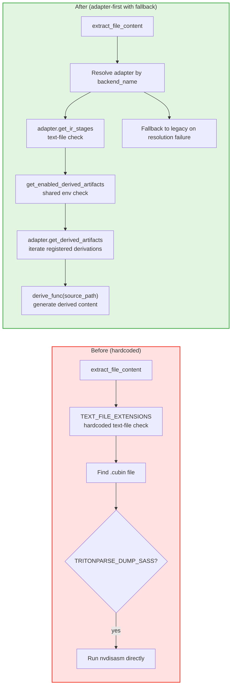

# PR: Derived Artifact Refactor - From Hardcoded SASS Dump to an Adapter-Driven Derived Artifact Mechanism

## Context

- RFC: https://github.com/meta-pytorch/tritonparse/issues/367
- Prerequisite PRs:
  - https://github.com/meta-pytorch/tritonparse/pull/387 (reader-side infrastructure and generic parse refactor)
  - https://github.com/meta-pytorch/tritonparse/pull/394 (parser dispatch refactor)
  - https://github.com/meta-pytorch/tritonparse/pull/401 (analysis dispatch refactor)

## Summary

This PR focuses on the derived artifact portion of Phase 1 of the Flexible Backend Support RFC.

This PR refactors derived artifact handling. The old hardcoded CUBIN -> SASS dump logic in `structured_logging.extract_file_content()` is replaced with an adapter-driven registration and dispatch mechanism. This PR adds a new `TRITONPARSE_DERIVED_ARTIFACTS` entry point, keeps backward compatibility with `TRITONPARSE_DUMP_SASS`, and preserves a legacy fallback path when adapter resolution fails.

This PR does not include the `reproducer/` device normalization migration. That work will go into a follow-up PR so this one stays focused on reader-side derived artifacts.

---

## Key Changes

### 1. Derived artifact registry (`tritonparse/backend.py`)

`DerivedArtifactDescriptor` is replaced by `DerivedArtifactInfo` / API break:

The old `DerivedArtifactDescriptor` was a static description object. It only stored metadata such as `source_extension` and `output_extension`. It could not describe how to run the derivation.

This PR replaces it with `DerivedArtifactInfo`. The new type adds `source_stage_name`, `target_stage_name`, `adapter_affinity`, and `derive_func`. This makes derived artifacts executable runtime objects instead of static declarations.

`DerivedArtifactDescriptor` did not have a real production use before this PR. In this repository, it only appeared in design docs and abstract interface drafts. The real reader-side execution path did not dispatch through it. So this type change updates the public abstraction, but it does not affect current production code.

New `DerivedArtifactInfo` dataclass:

```python
@dataclass
class DerivedArtifactInfo:
    """Metadata for a registered derived artifact."""
    source_stage_name: str
    target_stage_name: str
    tool_name: str
    adapter_affinity: str
    derive_func: Callable[[str], str | None]
```

New `DerivedArtifactRegistry` class:

```python
class DerivedArtifactRegistry:
    """
    Registry for derived artifact registration, lookup, and enumeration.
    Adapters register their backend-specific derivations here.
    """

    @classmethod
    def register(cls, info: DerivedArtifactInfo) -> None: ...

    @classmethod
    def get_by_target(cls, target_stage_name: str) -> DerivedArtifactInfo | None: ...

    @classmethod
    def list_for_adapter(cls, adapter_name: str) -> list[DerivedArtifactInfo]: ...

    @classmethod
    def list_target_stage_names(cls) -> list[str]: ...
```

Core design:

- Move from a static description object to an executable registration object.
- Let each backend adapter register its own derived artifacts.
- Use `list_target_stage_names()` as the single source of truth for env-var validation.

### 2. Adapter extensions (`tritonparse/backend.py`)

New and updated methods on `CompilationPipelineAdapter`:

```python
class CompilationPipelineAdapter(ABC):
    def get_derived_artifacts(self) -> list[DerivedArtifactInfo]:
        """Return derived artifacts registered for this adapter."""

    def register_backend_derived_artifact(
        self,
        source_stage_name: str,
        target_stage_name: str,
        tool_name: str,
        derive_func: Callable[[str], str | None],
    ) -> None:
        """Register a backend-specific derived artifact."""

    def collect_derived_artifact_contents(
        self, source_path: str, info: DerivedArtifactInfo
    ) -> str | None:
        """Run the derivation and return the derived content."""
```

Concrete adapter change:

```python
class NvidiaTritonAdapter(CompilationPipelineAdapter):
    def __init__(self):
        from tritonparse.tools.disasm import extract as derive_sass

        self.register_backend_derived_artifact(
            "cubin",
            "sass",
            "nvdisasm",
            derive_sass,
        )
```

Key improvements:

- The adapter is now the registration entry point for backend-specific derivations.
- The derivation path uses stage names instead of hardcoded extension checks.
- New backends can add derivations without changing shared extraction logic.

### 3. `extract_file_content()` refactor (`tritonparse/structured_logging.py`)

Before this PR, file extraction and SASS dumping were hardcoded:

```python
def extract_file_content(trace_data, metadata_group):
    for ir_filename, file_path in metadata_group.items():
        if any(ir_filename.endswith(ext) for ext in TEXT_FILE_EXTENSIONS):
            ...

    cubin_keys = [key for key in metadata_group.keys() if key.endswith(".cubin")]
    cubin_path = metadata_group[cubin_keys[0]] if cubin_keys else None

    if TRITONPARSE_DUMP_SASS and cubin_path:
        sass_content = tritonparse.tools.disasm.extract(cubin_path)
        trace_data["file_content"][sass_filename] = sass_content
```

After this PR, the function uses adapter-first dispatch and falls back to legacy logic only on adapter resolution failure:

```python
def extract_file_content(trace_data, metadata_group, backend_name):
    try:
        return _extract_file_content_adapter_driven(
            trace_data, metadata_group, backend_name
        )
    except ValueError as e:
        log.warning(
            f"Adapter-driven file extraction failed: {e}. Falling back to legacy."
        )

    _extract_file_content_legacy(trace_data, metadata_group)
```

Adapter-driven path:

```python
def _extract_file_content_adapter_driven(trace_data, metadata_group, backend_name):
    adapter = get_backend_registry().resolve(adapter_name=f"{backend_name}_triton")

    text_extensions = {
        stage.extension for stage in adapter.get_ir_stages() if stage.is_text
    }

    enabled = get_enabled_derived_artifacts()

    for info in adapter.get_derived_artifacts():
        ...
```

Key improvements:

- Two-level dispatch:
  1. Try the adapter-driven path first.
  2. Fall back to legacy hardcoded logic only if adapter resolution fails.
- Shared code no longer hardcodes “if there is a `.cubin`, dump `.sass`”.
- Text file detection also goes through adapter stage metadata.

### 4. Environment variable control (`tritonparse/shared_vars.py`)

New `TRITONPARSE_DERIVED_ARTIFACTS` environment variable:

```python
def get_enabled_derived_artifacts() -> set[str] | None:
    """
    Get the user-enabled derived artifact set from the environment.

    Returns:
        None: enable all derived artifacts
        set: enabled target stage names
        empty set: disable all derived artifacts
    """
    env_value = os.environ.get("TRITONPARSE_DERIVED_ARTIFACTS", "none").strip()

    # Empty or whitespace-only input behaves like "none".
    raw_names = [n.strip().lower() for n in env_value.split(",") if n.strip()]

    if not raw_names:
        if is_sass_dump_enabled():
            return {"sass"}
        return set()

    if "all" in raw_names:
        if len(raw_names) > 1:
            ...
        return None

    if "none" in raw_names:
        if len(raw_names) > 1:
            ...
        if is_sass_dump_enabled():
            return {"sass"}
        return set()

    if is_sass_dump_enabled():
        raw_names.append("sass")

    # Validate against registered derived artifacts and filter unknown names.
    ...
```

Usage examples:

```bash
# Disable all derived artifacts (default)
export TRITONPARSE_DERIVED_ARTIFACTS="none"

# Enable all derived artifacts supported by the active backend
export TRITONPARSE_DERIVED_ARTIFACTS="all"

# Enable only SASS
export TRITONPARSE_DERIVED_ARTIFACTS="sass"
```

Compatibility behavior:

- Keep the old `TRITONPARSE_DUMP_SASS=1` entry point.
- `TRITONPARSE_DUMP_SASS=1` adds `sass` to the currently enabled derived artifacts.
- If a comma-separated list mixes `all` or `none` with other names, TritonParse logs a warning and uses the global keyword behavior.

### 5. Backward compatibility and failure handling (`tritonparse/structured_logging.py` + `tritonparse/shared_vars.py`)

Backward compatibility:

- The legacy path keeps `TRITONPARSE_DUMP_SASS`, so adapter resolution failure does not break existing behavior.
- `TRITONPARSE_DERIVED_ARTIFACTS` and `TRITONPARSE_DUMP_SASS` can coexist and together determine the final enabled derived artifacts.
- `maybe_trace_triton()` only adds `backend_name`; the main trace collection flow stays the same.

Failure handling:

- If adapter resolution fails, `extract_file_content()` falls back to `_extract_file_content_legacy()`.
- If the derivation tool fails, the trace records an error string instead of aborting the whole trace flow.
- If the env var contains unknown target stage names, TritonParse logs a warning and keeps only valid registered names.

---

## Architecture

### Derived artifact extraction flow comparison



### Responsibilities of the new pieces

| Component | Responsibility |
|------|------|
| `DerivedArtifactInfo` | Metadata for one derived artifact: source stage, target stage, tool, affinity, and execution function |
| `DerivedArtifactRegistry` | Registration, lookup, and target-stage enumeration for derived artifacts |
| `adapter.register_backend_derived_artifact()` | Register a backend-specific derivation |
| `adapter.get_derived_artifacts()` | Return derived artifacts available for the current adapter |
| `adapter.collect_derived_artifact_contents()` | Run the derivation and return its content |
| `get_enabled_derived_artifacts()` | Parse `TRITONPARSE_DERIVED_ARTIFACTS`, validate names, normalize case, and handle compatibility |
| `_extract_file_content_adapter_driven()` | Use the adapter to drive text-file extraction and derived artifact generation |
| `_extract_file_content_legacy()` | Legacy compatibility path when adapter resolution fails |

---

## Documentation

This PR also updates the official documentation in `docs/07.-Environment-Variables-Reference.md`.

The documentation update includes:

- Add `TRITONPARSE_DERIVED_ARTIFACTS` to the quick reference table.
- Add a detailed section for `TRITONPARSE_DERIVED_ARTIFACTS`, including `none`, `all`, and comma-separated target stage names.
- Clarify the compatibility relationship between `TRITONPARSE_DUMP_SASS` and `TRITONPARSE_DERIVED_ARTIFACTS="sass"`.

---

## Testing

Validated with the following focused tests:

- `python -m pytest tests/cpu/test_multi_backend_stage.py -k test_get_enabled_derived_artifacts_env_parsing -q`
- `python -m pytest tests/cpu/test_multi_backend_stage.py -k test_get_enabled_derived_artifacts_runtime_override -q`
- `python -m pytest tests/cpu/test_multi_backend_stage.py -k legacy_fallback_honors_derived_artifacts_env -q`
- `python -m pytest tests/cpu/test_multi_backend_stage.py -k test_adapter_driven_missing_target_stage_is_skipped -q`

---

## Conclusion

This PR covers the reader-side refactor for derived artifact handling in Phase 1 of the Flexible Backend Support RFC. It replaces the old hardcoded SASS dump path in shared code with a generic adapter-driven derived artifact framework.

The main changes are: add `DerivedArtifactInfo` and `DerivedArtifactRegistry`, extend `CompilationPipelineAdapter` with derived artifact registration and execution interfaces, register the `cubin -> sass` derivation in `NvidiaTritonAdapter`, refactor `extract_file_content()` into an adapter-first flow with a legacy fallback, add the shared `TRITONPARSE_DERIVED_ARTIFACTS` entry point, and keep backward compatibility with `TRITONPARSE_DUMP_SASS`.

---

## Phase 1 Status and Next Steps

### Phase 1 overview

The goal of Phase 1 is reader-side backend convergence. Backend-specific reader logic should move out of scattered hardcoded paths and into a unified adapter contract.

In the original plan, the last Phase 1 PR included both derived artifact work and reproducer migration. To keep review scope clear, this PR only includes the derived artifact part. Reproducer migration will be done in a follow-up PR.

### PR 1 (done): Reader-side infrastructure and generic parse refactor

- Adapter infrastructure and generic parse dispatch refactor in `trace_processor.py`
- Add `tritonparse/backend.py`: `IRStageDescriptor`, `CompilationPipelineAdapter`, `NvidiaTritonAdapter`, `AmdTritonAdapter`, and `PipelineAdapterRegistry`
- Refactor `trace_processor.py`: dynamic stage discovery, dynamic stage processing loop, and dynamic mapping construction

### PR 2 (done): Parser dispatch refactor

- ParserRegistry infrastructure and 5 standardized parser wrappers
- Adapter extensions: `get_parser()` and `register_backend_parser()`
- `generate_source_mappings()` refactor: adapter-driven path with hardcoded fallback

### PR 3 (done): Analysis dispatch refactor

- AnalysisRegistry infrastructure and 3 standardized analyzer wrappers
- Adapter extensions: `get_executable_analyzers()`, `run_analysis_pass()`, and `register_backend_analyzer()`
- `_generate_ir_analysis()` refactor: adapter-driven path with legacy fallback
- Add `TRITONPARSE_ANALYSIS`

### PR 4 (this PR): Derived artifact refactor

- DerivedArtifactRegistry infrastructure and `DerivedArtifactInfo`
- Adapter extensions: `get_derived_artifacts()`, `register_backend_derived_artifact()`, and `collect_derived_artifact_contents()`
- `extract_file_content()` refactor: adapter-driven path with legacy fallback
- Add `TRITONPARSE_DERIVED_ARTIFACTS` and keep compatibility with `TRITONPARSE_DUMP_SASS`

### Next: Reproducer migration

- Move device normalization in `reproducer/` into `adapter.normalize_device_string()`
- Remove backend-specific hardcoded paths from shared reproducer logic
- Make reproducer backend differences follow the same adapter contract

Next step: finish reproducer migration. After that, Phase 1 will be complete.