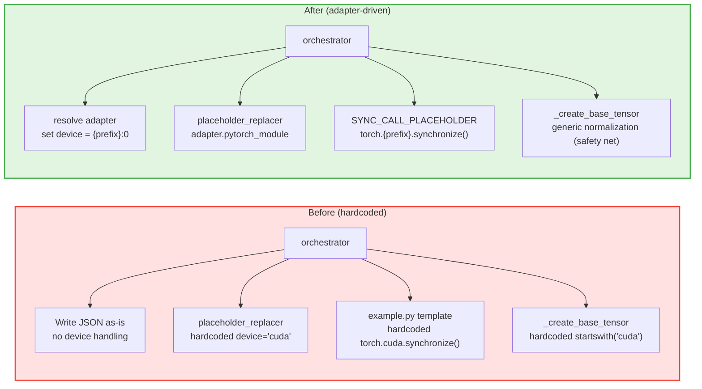

# PR: Reproducer Migration — Move Backend Hardcodes to Adapter-Driven Logic

## Background

- **RFC**: https://github.com/meta-pytorch/tritonparse/issues/367
- **Prior PRs**:
  - https://github.com/meta-pytorch/tritonparse/pull/387 (Reader-side infrastructure & generic parse logic)
  - https://github.com/meta-pytorch/tritonparse/pull/394 (Parser dispatch refactoring)
  - https://github.com/meta-pytorch/tritonparse/pull/401 (Analysis dispatch refactoring)
  - https://github.com/meta-pytorch/tritonparse/pull/403 (Derived artifact refactoring)

## Summary

This PR closes the **last gap in Flexible Backend Support RFC Phase 1** by migrating all backend hardcodes in the `reproducer/` module to adapter-driven logic.

The reproducer module had three CUDA hardcodes (device normalization, scratch allocator device, sync call) and zero references to the adapter system. `context_bundle.compile["backend"]` already captured backend info but was never consumed. This PR wires up the `backend → resolve adapter → device/sync` path so that all reproducer backend decisions go through the adapter contract.

---

## Key Changes

### 1. `pytorch_module` semantics update (`tritonparse/backend.py`)

`pytorch_module` now returns the device prefix (`"cuda"`) instead of the full module path (`"torch.cuda"`).

All PyTorch in-tree accelerator backends follow the same pattern:

| Backend | Device string | Sync call | Prefix |
|---------|--------------|-----------|--------|
| NVIDIA CUDA | `cuda:0` | `torch.cuda.synchronize()` | cuda |
| AMD ROCm | `cuda:0` | `torch.cuda.synchronize()` | cuda |
| Apple MPS | `mps:0` | `torch.mps.synchronize()` | mps |
| Intel XPU | `xpu:0` | `torch.xpu.synchronize()` | xpu |

Note: ROCm is not a separate PyTorch backend — it uses the CUDA compatibility layer (`torch.cuda` / `device="cuda:0"`), so the prefix is the same as NVIDIA.

Device prefix = the word between `torch.` and `.synchronize()` = `pytorch_module` value. One field drives both scenarios:

- Device string: `f"{adapter.pytorch_module}:0"` → `"cuda:0"`
- Sync call: `f"torch.{adapter.pytorch_module}.synchronize()"` → `"torch.cuda.synchronize()"`

### 2. Adapter-driven device normalization (`tritonparse/reproducer/orchestrator.py`)

Added adapter-driven device normalization in `orchestrator.py::reproduce()`, after `build_context_bundle` and before JSON is written:

```python
_adapter = get_backend_registry().resolve(adapter_name=f"{_backend}_triton")
_normalized_device = f"{_adapter.pytorch_module}:0"
for _arg in context_bundle.raw_launch_event.get("extracted_args", {}).values():
    if isinstance(_arg, dict) and _arg.get("device", "cpu") != "cpu":
        _arg["device"] = _normalized_device
```

- Uses the adapter's `pytorch_module` to set device strings rather than normalizing whatever the trace contains
- Covers both file mode (external JSON) and embed mode (inline JSON)
- GPU args are set to `{prefix}:0`; CPU args are left unchanged

### 3. `normalize_device_string()` default implementation (`tritonparse/backend.py`)

Changed from no-op to generic normalization:

```python
def normalize_device_string(self, device: str) -> str:
    if not isinstance(device, str) or not device or device == "cpu":
        return "cpu"
    prefix = device.split(":")[0]
    return f"{prefix}:0"
```

No override needed in `NvidiaTritonAdapter` or `AmdTritonAdapter` — the default handles both.

### 4. Scratch allocator device parameterization (`tritonparse/reproducer/placeholder_replacer.py`)

The hardcoded `device='cuda'` in `_replace_launch_kernel_body()` is now adapter-driven:

```python
_adapter = get_backend_registry().resolve(adapter_name=f"{_backend}_triton")
_device_prefix = _adapter.pytorch_module
f"    return torch.empty(size, dtype=torch.int8, device='{_device_prefix}')"
```

### 5. Sync call parameterization (`tritonparse/reproducer/placeholder_replacer.py` + `templates/example.py`)

Replaced the hardcoded `torch.cuda.synchronize()` in the template with a placeholder:

```python
# {{SYNC_CALL_PLACEHOLDER}}
```

Added `SYNC_CALL_PLACEHOLDER` constant and `_replace_sync_call` handler that resolves the adapter at generation time and emits the correct sync call.

### 6. `_create_base_tensor` runtime normalization generalized (`tritonparse/reproducer/utils.py`)

Changed from CUDA-specific check to generic logic:

```python
# Before
if isinstance(device, str) and device.startswith("cuda"):
    device = "cuda:0"

# After
if isinstance(device, str) and device != "cpu":
    prefix = device.split(":")[0]
    device = f"{prefix}:0"
```

This function is AST-extracted and embedded into the generated script, running at reproducer runtime where no adapter is available. This serves as a safety net — primary normalization is done by the orchestrator at generation time.

---

## Architecture

### Reproducer backend decision flow comparison



---

## Testing

New tests verify that the adapter-driven logic actually works (not just that hardcodes happen to pass):

- `TestNormalizeDeviceString`: validates `normalize_device_string()` behavior across various inputs
- `TestReproducerAdapterDriven`: mocks `pytorch_module` to return a non-`"cuda"` value, verifying that sync call and scratch allocator output follows the adapter

```bash
python -m pytest tests/cpu/test_multi_backend_stage.py -k "TestNormalizeDeviceString" -v
python -m pytest tests/cpu/test_placeholder_replacer.py -k "TestReproducerAdapterDriven" -v
```

Full CPU test suite passes with no regressions: 411 passed.

---

## Files Changed

| File | Change |
|------|--------|
| `tritonparse/backend.py` | `normalize_device_string()` from no-op to generic normalization; `pytorch_module` from `"torch.cuda"` to `"cuda"` |
| `tritonparse/reproducer/orchestrator.py` | Adapter-driven device normalization before JSON write |
| `tritonparse/reproducer/placeholder_replacer.py` | Scratch allocator device parameterized; added `SYNC_CALL_PLACEHOLDER` + `_replace_sync_call` handler |
| `tritonparse/reproducer/templates/example.py` | `torch.cuda.synchronize()` → `# {{SYNC_CALL_PLACEHOLDER}}` |
| `tritonparse/reproducer/utils.py` | `_create_base_tensor` normalization from CUDA-specific to generic |
| `tests/cpu/test_multi_backend_stage.py` | Added `TestNormalizeDeviceString` |
| `tests/cpu/test_placeholder_replacer.py` | Added `TestReproducerAdapterDriven` |

---

## Summary

This PR completes the **final step of Flexible Backend Support RFC Phase 1**. All reader-side backend convergence work is now done:

- PR 1: Adapter infrastructure + `trace_processor.py` refactoring
- PR 2: Parser dispatch refactoring
- PR 3: Analysis dispatch refactoring
- PR 4: Derived artifact refactoring
- **PR 5 (this PR): Reproducer migration**

All backend hardcodes in the `reproducer/` module have been moved to the adapter contract. Device strings and sync calls are both derived from `adapter.pytorch_module`. Adding a new backend only requires implementing the corresponding adapter and defining `pytorch_module` — the reproducer adapts automatically with no changes to shared code.
