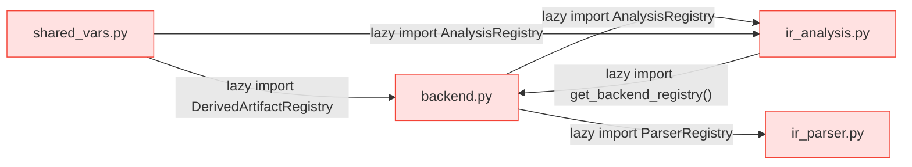
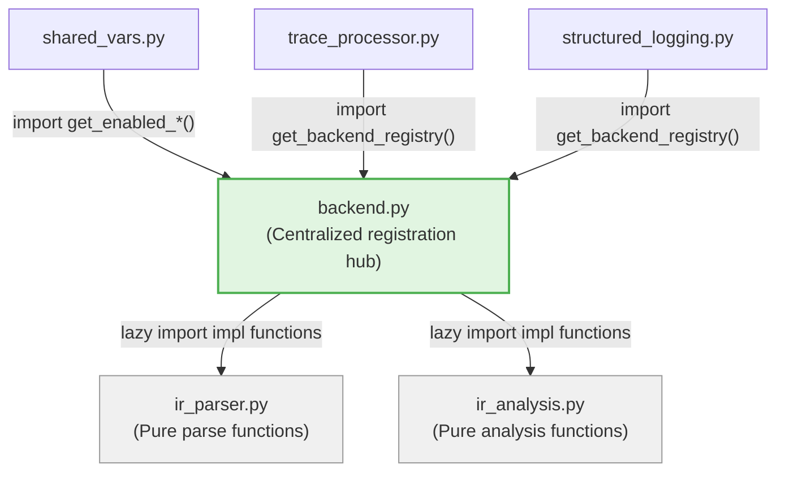
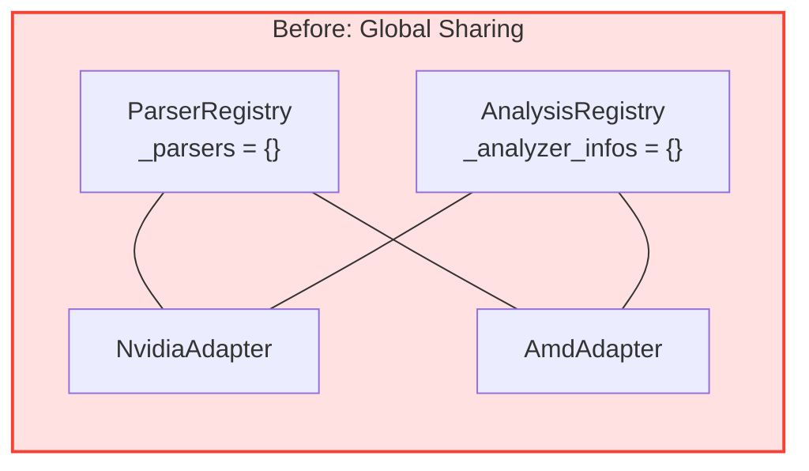
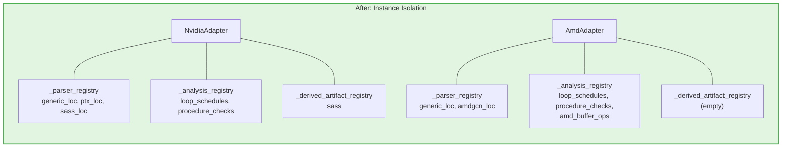
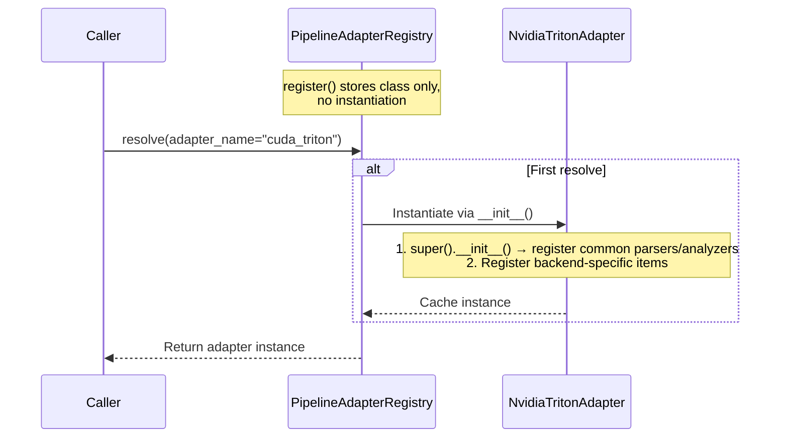

# PR: Registry Architecture Refactor — Eliminate Circular Dependencies & Introduce Instance-Level Isolation

## Summary

This PR contains two core refactors that completely resolve the circular dependency between `backend.py`, `ir_analysis.py`, `ir_parser.py`, and `shared_vars.py`, and transitions all three Registries (Parser / Analysis / DerivedArtifact) from global class-level sharing to per-adapter instance isolation, along with a lazy adapter initialization mechanism.

---

## Task 1: Migrate Core Classes to `backend.py` to Eliminate Circular Dependencies

### Problem

Before this refactor, the three core registry classes were scattered across different modules, forming a fragile three-way circular dependency:



All four modules relied heavily on lazy imports (i.e., `from ... import` inside function bodies) to avoid circular imports at module load time — a fragile pattern that was easy to break.

### Solution

Migrate `ParserRegistry`, `AnalyzerInfo`, and `AnalysisRegistry` from `ir_parser.py` / `ir_analysis.py` into `backend.py`, aligning with the existing `DerivedArtifactRegistry`:



The dependency direction is now unified: `backend.py` serves as the centralized registration hub, while `ir_parser.py` and `ir_analysis.py` are responsible only for specific implementation functions and no longer hold registry definitions.

### Migration Details

| Class | Before | After |
|---|---|---|
| `ParserRegistry` | `ir_parser.py` | `backend.py` |
| `AnalyzerInfo` | `ir_analysis.py` | `backend.py` |
| `AnalysisRegistry` | `ir_analysis.py` | `backend.py` |
| `DerivedArtifactRegistry` | `backend.py` (unchanged) | `backend.py` |
| `_initialize_common_parsers()` | `ir_parser.py` (executed at module load) | `backend.py` |
| `_initialize_common_analyzers()` | `ir_analysis.py` (executed at module load) | `backend.py` |

---

## Task 2: Instance-Level Registry Isolation + Lazy Adapter Initialization

### Problem

Before this refactor, all three Registries used class-level storage (`_parsers: Dict = {}`), meaning every adapter instance shared the same underlying dict:



NVIDIA and AMD parser/analyzer registrations were coupled together, making independent management impossible.

### Change 1: Per-Adapter Registry Instances

All three Registries are converted to instance-level storage. Each adapter holds its own independent Registry instances:



### Change 2: Lazy Adapter Initialization

`PipelineAdapterRegistry` now stores adapter classes and lazily instantiates them on first `resolve()`, caching the result for subsequent calls:



### Change 3: Adapter Properties → Class Attributes

`adapter_name`, `runtime_backend`, and `pytorch_module` are converted from `@property` to class attributes, providing a consistent style and enabling the registry to access the adapter name without instantiation:

```python
# Before
class NvidiaTritonAdapter(CompilationPipelineAdapter):
    @property
    def adapter_name(self) -> str:
        return "cuda_triton"

# After
class NvidiaTritonAdapter(CompilationPipelineAdapter):
    adapter_name: str = "cuda_triton"
```

### Change 4: Hoist `get_ir_stages` into Base Class

Both subclasses had identical `get_ir_stages()` implementations (`return self._stages`). The method is now defined once in the base class — subclasses simply set `self._stages` in `__init__`.

### Change 5: Deferred Validation in Adapter Layer

The early validation logic in `get_enabled_analyses()` and `get_enabled_derived_artifacts()` (which required lazy imports of Registry classes) has been removed from `shared_vars.py`. Validation now happens at the adapter layer, where the instance registry is available:

| Validation | Before | After |
|---|---|---|
| Analyzer name validation | `shared_vars.py` (lazy import Registry) | `adapter.get_executable_analyzers()` |
| Derived artifact name validation | `shared_vars.py` (lazy import Registry) | `adapter.get_applicable_derived_artifacts()` |

Both methods follow a symmetric design, implementing validation + filtering in the adapter base class:

```python
# Analyzer validation
def get_executable_analyzers(self, file_content, enabled_analyses=None) -> list[str]

# Derived artifact validation
def get_applicable_derived_artifacts(self, enabled_derived_artifacts=None) -> list[DerivedArtifactInfo]
```

### Change 6: Dead Code Removal

Four methods with no callers have been removed:

- `PipelineAdapterRegistry.create_all()` — no external callers
- `CompilationPipelineAdapter.collect_derived_artifact_contents()` — no external callers
- `CompilationPipelineAdapter.get_stage_by_artifact()` — no external callers
- `CompilationPipelineAdapter.known_stage_extensions` — no external callers

---

## Files Changed

| File | Change |
|------|--------|
| `tritonparse/backend.py` | Registry classes migrated here + converted to instance-level + adapter class attributes + lazy initialization + dead code cleanup |
| `tritonparse/parse/ir_parser.py` | Removed `ParserRegistry` and `_initialize_common_parsers()` |
| `tritonparse/parse/ir_analysis.py` | Removed `AnalyzerInfo`, `AnalysisRegistry`, and `_initialize_common_analyzers()` |
| `tritonparse/shared_vars.py` | Removed early validation; `get_enabled_analyses()` / `get_enabled_derived_artifacts()` now parse env vars only |
| `tritonparse/structured_logging.py` | Use `adapter.get_applicable_derived_artifacts()` instead of manual filtering |
| `tests/cpu/test_multi_backend_stage.py` | Updated tests to reflect instance isolation semantics |

---

## Testing

- `make format-check`


- `make test-cuda`


- `make test`


---

## Conclusion

This PR delivers two architectural improvements:

1. **Circular dependency elimination**: All three core Registries and common initialization logic are consolidated into `backend.py`; `ir_parser.py` and `ir_analysis.py` are now pure implementation modules.
2. **Instance-level isolation + lazy initialization**: Each adapter holds independent Registry instances. `PipelineAdapterRegistry` defers adapter instantiation until first use.

Both changes are fully backward-compatible at the API level — no caller modifications are required. To add a new backend, simply subclass `CompilationPipelineAdapter`, set class attributes, and register backend-specific parsers/analyzers in `__init__` to get complete isolation automatically.
