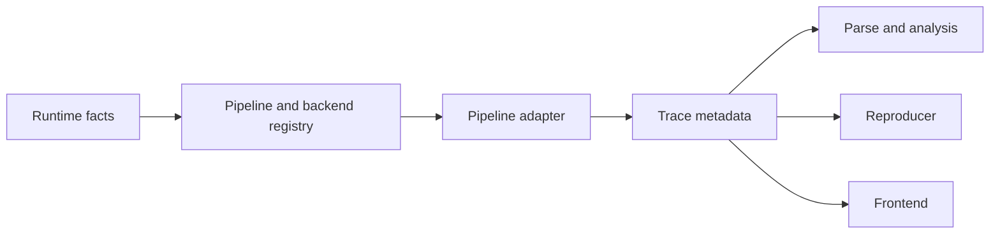
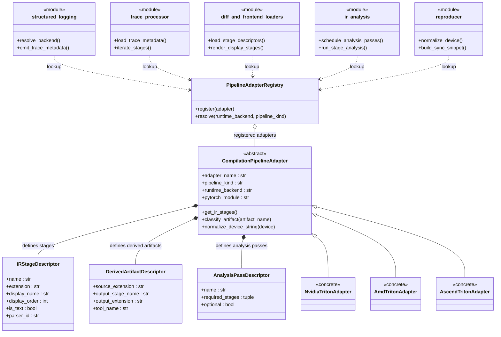

# TritonParse Flexible Backend Support RFC

**Author:** @zhudada0120

## Abstract

This RFC proposes a unified extension architecture for TritonParse. It is intended to support multiple backends, and eventually multiple DSL/compiler pipelines, without repeated changes to shared core code.

The focus is not on any single feature. It is on consolidating backend-related rules into a clear, stable layer. The core goals are:

1. Enable TritonParse to reliably support the backends that Triton already supports, or is likely to support next, while preserving clear layering for future multi-DSL and multi-pipeline scenarios.
2. Extract backend-specific conditional code from shared core code into individual backend adapters.
3. Enable trace, parse, reproducer, and frontend to work together around the same backend interface.
4. Provide a reusable extension path for adding new built-in backends.

## Motivation

Triton is gradually moving from a single-backend execution model toward multi-backend support. As a companion tool in the Triton upstream ecosystem, TritonParse needs to evolve in the same direction.

At the same time, TritonParse should not evolve only around "the same DSL with different backends." As DSLs such as CuteDSL enter the discussion, stage graphs, artifact types, and source-mapping rules may all be shaped by both backend and pipeline.

If TritonParse continues to organize runtime, parse, diff, reproducer, and frontend logic with a single backend mindset, each new backend will require new backend-specific conditional code in shared code. This approach is not only hard to extend but also increases maintenance costs.

To give TritonParse stable multi-backend support, backend-related semantics need a single point of ownership rather than being scattered across shared logic.

## Proposal Overview

### Target Architecture



### Component Design

If further expanded, the key object relationships in this proposal can be represented as:



The key classes in this diagram have the following responsibilities:

1. `PipelineAdapterRegistry`: Registers and resolves adapters. Initially supports built-in mappings, resolving to specific implementation classes based on `pipeline_kind + runtime_backend`.
2. `CompilationPipelineAdapter`: Abstract base class for compilation pipelines. The main focus is multi-backend convergence under Triton pipeline, but the abstraction is not limited to "backend adapter only."
3. `IRStageDescriptor`: Describes basic information for a single stage, such as stage type, display order, text/binary, source mapping support, and parser selection.
4. `DerivedArtifactDescriptor`: Describes artifact generation relationships, such as whether a runtime artifact can generate additional stages.
5. `AnalysisPassDescriptor`: Describes optional analysis passes for a backend and which stages they depend on.

The core idea is to use a single adapter as the unified entry point for compilation-pipeline semantics.

More plainly, questions like "how should this backend be handled" should be answered by the adapter rather than scattered across shared code in the TritonParse main flow.

**Responsibility division:**

1. Triton runtime provides runtime facts such as the target backend, device information, and artifact list.
2. The adapter translates those facts into metadata or reader-side descriptor views that TritonParse needs.
3. The runtime writer incrementally writes new metadata into the trace while maintaining compatibility.
4. Parse, reproducer, diff, and frontend consume that metadata first; when it is missing, they fall back to the existing filename- and extension-based inference path.

Shared code in the TritonParse main flow orchestrates the pipeline, while adapters define backend-specific rules.

### Pipeline Adapter Interface Design

To make this boundary clearer, use a concise adapter contract and unified stage descriptor to carry main semantics:

```python
class CompilationPipelineAdapter(ABC):
    @property
    @abstractmethod
    def adapter_name(self) -> str: ...

    @property
    @abstractmethod
    def pipeline_kind(self) -> str: ...

    @property
    @abstractmethod
    def runtime_backend(self) -> str: ...

    @property
    @abstractmethod
    def pytorch_module(self) -> str: ...

    @abstractmethod
    def get_ir_stages(self) -> list[IRStageDescriptor]: ...

    @abstractmethod
    def classify_artifact(self, artifact_name: str) -> IRStageDescriptor | None: ...

    @abstractmethod
    def normalize_device_string(self, device: str) -> str: ...
```

`CompilationPipelineAdapter` in this CUDA example expresses "who this compilation chain is and its stage semantics":

```python
cuda_adapter = {
    "adapter_name": "triton_nvidia",
    "pipeline_kind": "triton",
    "runtime_backend": "cuda",
    "pytorch_module": "torch.cuda",
    "stages": [
        "ttir",
        "ttgir",
        "llir",
        "ptx",
        "cubin",
        "sass",
    ],
}
```

### IRStageDescriptor Field Description

```python
@dataclass(frozen=True)
class IRStageDescriptor:
    name: str
    extension: str
    display_name: str
    display_order: int
    is_text: bool
    supports_source_mapping: bool
    parser_id: str
    syntax_id: str
```

`IRStageDescriptor` is the key object. It gives a uniform description of stage identity, display order, text attributes, source-mapping capability, and parser selection, so these rules no longer need to be scattered across shared modules.

**Field responsibilities:**

1. Core stage semantics: `name`, `extension`, `supports_source_mapping`, `parser_id`
2. Display-related: `display_name`, `display_order`, `is_text`, `syntax_id`

- `name` and `extension` define the basic identity of a stage and are used on both the frontend and backend sides.
- `supports_source_mapping` and `parser_id` are more parse-oriented: `supports_source_mapping` determines whether a stage can participate in source mapping, and `parser_id` is a stable key for resolving the parser implementation for that IR stage.
- `display_name`, `display_order`, `is_text`, and `syntax_id` are more frontend-oriented: they determine stage order, presentation, and syntax highlighting.

For CUDA, the PTX stage can be written as:

```python
ptx_stage = {
    "name": "ptx",
    "extension": ".ptx",
    "display_name": "PTX",
    "display_order": 40,
    "is_text": True,
    "supports_source_mapping": True,
    "parser_id": "ptx_loc",
    "syntax_id": "ptx",
}
```

Similarly, the CUBIN stage under CUDA can be written as:

```python
cubin_stage = {
    "name": "cubin",
    "extension": ".cubin",
    "display_name": "CUBIN",
    "display_order": 50,
    "is_text": False,
    "supports_source_mapping": False,
    "parser_id": "none",
    "syntax_id": "plaintext",
}
```

The adapter answers which stages a backend exposes, while `IRStageDescriptor` defines the basic information for each stage and how it should be handled.

### Derived Artifacts

Some backend runtime artifacts can derive additional stages. For example, on the CUDA backend, `.cubin` files can be disassembled into `.sass` code by the `nvdisasm` tool.

#### Derived Artifact Declaration

Adapter declares supported derivation capabilities through `DerivedArtifactDescriptor`:

```python
cuda_derived_artifact = {
    "source_extension": ".cubin",
    "output_stage_name": "sass",
    "output_extension": ".sass",
    "tool_name": "nvdisasm",
}
```

This example means that, on CUDA, a `.sass` stage can be derived from a `.cubin` runtime artifact.

#### Derivation Control Mechanism

Derivation control is divided into two layers:

**1. User Configuration Layer**

Users control whether to enable derivation capabilities through:

- **Environment variable** (for CUDA SASS):
  ```bash
  export TRITONPARSE_DUMP_SASS=1
  ```

- **init function parameters**:
  ```python
  # Backward compatible: CUDA SASS specific parameter
  tritonparse.structured_logging.init(log_folder, enable_sass_dump=True)

  # General derivation capability control (new)
  tritonparse.structured_logging.init(
      log_folder,
      enable_derived_artifacts=True  # Enable all available derivations
  )

  # Specify specific derivation capabilities
  tritonparse.structured_logging.init(
      log_folder,
      enable_derived_artifacts=["sass", "amdgcn_disasm"]
  )
  ```

**2. Adapter Capability Layer**

Adapter provides derivation capability declaration and availability check:

```python
class NvidiaBackendAdapter:
    def get_derived_artifacts(self):
        """Declare supported derivation capabilities"""
        return [
            DerivedArtifactDescriptor(
                source_extension=".cubin",
                output_stage_name="sass",
                output_extension=".sass",
                tool_name="nvdisasm",
            )
        ]

    def is_derivation_tool_available(self, desc: DerivedArtifactDescriptor):
        """Check if derivation tool is available"""
        if desc.output_stage_name == "sass":
            return self._check_nvdisasm()
        return False

    def collect_derived_artifact_contents(self, metadata_group: dict[str, str]):
        """Execute derivation operation, return derived content"""
        # Find cubin file
        cubin_path = None
        for artifact_name, artifact_path in metadata_group.items():
            if artifact_name.endswith(".cubin"):
                cubin_path = artifact_path
                break

        if not cubin_path:
            return {}

        # Call nvdisasm to perform conversion
        from tritonparse.tools.disasm import extract

        sass_content = extract(cubin_path)
        if not isinstance(sass_content, str):
            return {}

        # Return derivation result
        sass_filename = f"{Path(cubin_path).stem}.sass"
        return {sass_filename: sass_content}
```

#### Responsibilities

Derivation execution follows a simple split of responsibilities:

- **Shared layer**: Determines which derivation capabilities are needed based on user configuration, checks tool availability, and calls the adapter to execute the derivation.
- **Adapter**: Declares derivation capabilities, checks tool availability, executes the derivation operation, and handles errors.

For example, when user sets `enable_derived_artifacts=["sass"]`:
1. Shared layer parses config, knows user enabled "sass" derivation
2. Shared layer asks adapter: "Do you have sass derivation capability? Is tool available?"
3. Adapter checks if nvdisasm is available, returns result
4. If available, shared layer calls adapter to execute derivation
5. Adapter handles calling nvdisasm, error details, etc.

**Design benefits:**
- **Backward compatible**: Keeps the existing `enable_sass_dump` parameter.
- **Extensible**: Adding a new derivation capability only requires declaring it in the adapter, with no shared-layer changes.
- **Flexible control**: Lets users precisely control which derivation capabilities to enable.

### Analysis Passes

Some backends may provide additional analysis passes for deeper IR inspection, specific pattern detection, or performance-related data extraction.

#### Analysis Pass Declaration

Adapter declares supported analysis capabilities through `AnalysisPassDescriptor`:

```python
class AmdBackendAdapter:
    def get_analysis_passes(self):
        return [
            AnalysisPassDescriptor(
                name="amd_blockpingpong_detection",
                required_stages=("ttgir",),
            ),
            AnalysisPassDescriptor(
                name="amd_bufferops_analysis",
                required_stages=("ttgir", "amdgcn"),
            ),
        ]
```

#### Analysis Control Mechanism

**User Configuration Layer**: Control through init parameters
```python
# Enable all analyses
init(log_folder, enable_analysis_passes=True)

# Enable specific analyses
init(log_folder, enable_analysis_passes=["amd_blockpingpong_detection"])

# Disable all analyses
init(log_folder, enable_analysis_passes=False)
```

**Adapter Capability Layer**: Provide declaration and execution interfaces
```python
class AmdBackendAdapter:
    def get_analysis_passes(self):
        """Declare supported analysis capabilities"""
        return [...]
    
    def run_analysis_pass(self, pass_name, payload):
        """Execute specified analysis pass"""
        if pass_name == "amd_blockpingpong_detection":
            return self._detect_blockpingpong(payload)
        return {}
```

#### Existing Capability Migration

**Current problem**: AMD-specific analysis hardcoded in shared code
```python
# Shared code has AMD-specific logic
if amdgcn_key and ttgir_key:
    io_counts = _analyze_buffer_ops(...)
```

**After migration**: AMD adapter manages AMD-specific analysis
```python
class AmdBackendAdapter:
    def _detect_blockpingpong(self, payload):
        # AMD adapter loads its own config file
        config_path = "adapters/amd_procedure_checks.json"
        procedure_checks = load_procedure_checks_from_file(config_path)
        return find_procedures_with_patterns(procedure_checks, ...)
```

#### Responsibilities

Analysis execution follows a simple split of responsibilities:

- **Shared layer**: Determines which analyses are needed, checks stage availability, and calls the adapter to execute them.
- **Adapter**: Declares analysis capabilities, executes the backend-specific analysis logic, and returns the results.

Execution flow:
1. User config enables which analysis capabilities (e.g., `enable_analysis_passes=["amd_blockpingpong_detection"]`)
2. Shared layer asks adapter: "Which analyses do you support? What stages do they depend on?"
3. Adapter returns analysis capability list and dependencies
4. Shared layer checks if dependent stages exist, matches user config
5. Shared layer calls adapter to execute available analysis operations
6. Adapter returns analysis results (detected BlockPingpong patterns, buffer operation stats, etc.)

### Summary of Adapter Responsibilities

At this boundary, an adapter should at least answer the following questions:

1. What is the basic information for this backend?
2. Which artifacts constitute formal stages?
3. What are the types, order, display names, and basic capabilities of each stage?
4. Which stages support source mapping and which parser should handle them?
5. Does this backend have derived artifacts or additional analysis capabilities?
6. How should device be normalized in reproducer path and how to execute synchronization?
7. How should frontend render and sort these stages?

Backend-related semantics are no longer defined separately by each shared module. Instead, they are exposed uniformly through the adapter interface.

## Design Principles and Migration Boundaries

This proposal follows these boundaries in both design and implementation order:

1. Shared code should not contain hardcoded logic keyed on backend names or stage names.
2. Backend capabilities should be exposed uniformly through the adapter interface rather than scattered across helpers and local rules.
3. Trace schema evolution follows an additive-only compatibility strategy: new metadata can only be attached as optional fields and must not replace existing fields.
4. The existing trace schema remains compatible; fields already relied on by consumers, such as `payload.file_content`, `payload.file_path`, and `payload.metadata`, will not be replaced.
5. Old traces must remain readable when new metadata is absent; reader-side code must keep the fallback path based on existing filenames, suffixes, and conventions.
6. Before reader-side migration is complete, the old and new paths will coexist. New descriptor-driven logic should consume metadata first and fall back to suffix- or extension-based inference when metadata is missing.
7. Writing new metadata is a writer-side enhancement, not a prerequisite for reader-side refactoring.
8. This proposal does not require changes to the Triton compilation-hook input interface; writer-side code can only consume facts already provided by the hook, such as `src`, `metadata`, `metadata_group`, and `times`.
9. The frontend should prefer descriptors from the trace, but this is an explicit migration cost rather than a zero-cost replacement.
10. The registry initially only needs to cover built-in mappings; an external registration model can be added later.

Compatibility is most sensitive in the trace-collection path, so items 3 through 8 should be treated as explicit migration commitments of this RFC.

This means the benefits of this RFC can land first on TritonParse's fully controllable reader side. Writer-side enrichment can then be added later as a compatible enhancement.

## Implementation Plan

The implementation should stay incremental and focused rather than attempting to transform every layer at once.

### Phase 1. Reader-side Backend Convergence

The first phase prioritizes TritonParse's fully controllable reader side, where the hardcoded logic is currently most concentrated.

This means:

1. **Define multi-layer adapter architecture**:
    - Pipeline layer: describes different DSL or compiler pipelines, such as Triton and future CuteDSL variants.
    - Backend layer: describes different backends under the same pipeline, such as CUDA, ROCm, and Ascend.
    - Support resolving `pipeline_kind + runtime_backend` as a two-dimensional key from the start.

2. **Define adapter/stage descriptor contract**:
    - Provide unified entry points for parser binding, derived artifacts, and analysis passes.
    - Gradually migrate consumers such as `trace_processor.py`, `ir_parser.py`, `ir_analysis.py`, and diff/reproducer flows to work from descriptors.

3. **Preserve fallback path**:
    - Keep the suffix-based fallback path on the reader side when new metadata is absent.
    - Ensure old traces remain readable.

**Goal of this phase**: Move stage interpretation out of scattered hardcoded logic and into a unified contract, while preserving clear extension layers for multi-DSL support.

### Phase 2. Reader-side Frontend Migration

**Frontend migration work**:

1. **Data layer transformation**:
    - Change hardcoded stage lists (`ttir`, `ttgir`, `llir`, `ptx`, `amdgcn`, `sass`, etc.) to read dynamically from stage descriptors in trace metadata.
    - Adjust frontend data type definitions so they can carry dynamic stage information for different backends.

2. **Logic layer transformation**:
    - Update source-mapping logic from hardcoded stage names to the `IRStageDescriptor.supports_source_mapping` field.
    - Modify UI rendering logic to sort and display stages dynamically based on `display_order`.
    - Update syntax-highlighting binding from a static mapping to `syntax_id`-based dynamic selection.

3. **Compatibility guarantee**:
    - Ensure old traces without metadata still work through the filename- and extension-based fallback logic.
    - Thoroughly test both new and old trace formats to ensure that migration does not degrade the user experience.

### Phase 3. Backend-Specific Capability Convergence

The third phase moves the remaining backend-specific capabilities into the adapter model, using the interfaces already reserved in the Phase 1 architecture.

This includes:

1. **Derivation capabilities**: derived artifacts (e.g., CUBIN → SASS)
2. **Analysis capabilities**: analysis passes (e.g., AMD BlockPingpong detection)
3. **Reproducer capabilities**: device normalization, synchronization snippets
4. **Extension capabilities**: reserve integration boundaries for future CuteDSL and other pipelines

**Key design principles**:

- The adapter is pipeline-aware from the start.
- One layer describes the pipeline or compiler graph, while another describes backend-specific stage semantics and tool behavior.
- Even if CuteDSL or another pipeline is introduced later, the design should not force all differences into Triton-only naming boundaries.

**Goal of this phase**: Validate the available backend-specific capabilities on the reader side and lay the groundwork for the next phase of writer-side enhancement.

### Phase 4. Writer-side Metadata Enhancement

The fourth phase addresses the runtime writer. The key requirement is to enrich metadata without breaking compatibility.

This means:

1. The writer continues to support the existing trace schema and only attaches new optional metadata fields.
2. Backend and stage metadata remain limited to the input facts already provided by the Triton hook; no change to the hook shape is required.
3. Newly written traces can directly carry backend, pipeline, and stage-descriptor information, reducing the amount of inference required on the reader side.
4. When new metadata is absent, the reader still follows the fallback path established in Phase 1.

**Value of this phase**: After Phase 3 validates backend capabilities on the reader side, writer-side enhancement can provide richer metadata. That reduces reader-side inference and improves both performance and user experience.

## Expected Results

If this direction is fully implemented, adding a new backend should mainly require:

1. Implement an adapter for the corresponding pipeline/backend.
2. Define its stage descriptors and parser selection.
3. Define its derived artifacts and analysis passes as needed.

It should no longer require repeated invasive modifications to shared runtime, parse, reproducer, diff, and frontend modules.

For new backends in the Triton ecosystem, this reduces the required work to a clear and enumerable adaptation surface. For future DSLs or compiler pipelines, this layering avoids mixing pipeline-level and backend-level differences into the same conditional logic.