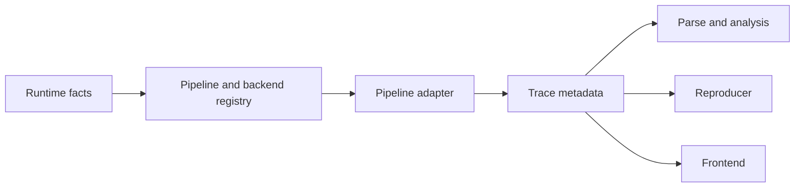
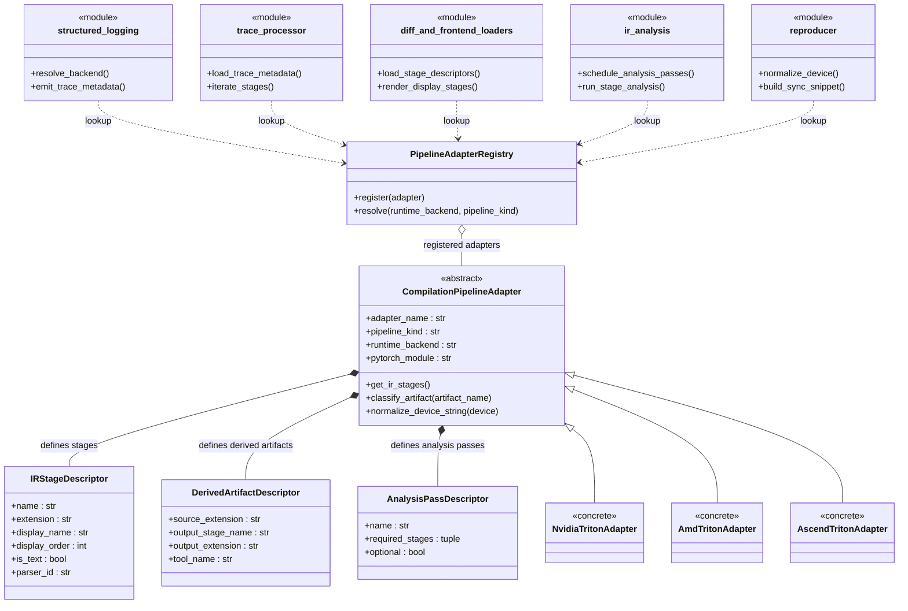

# TritonParse Flexible Backend Support RFC

**作者：** @zhudada0120

## 摘要

本 RFC 提议为 TritonParse 建立一套面向多后端、并可进一步扩展到多 DSL / compiler pipeline 的统一扩展架构，使其能够在不反复侵入共享核心代码的前提下支持不同编译链路。

重点不在某个单点功能，而在于把后端相关规则收拢到清晰、稳定的一层里。核心目标是：

1. 让 TritonParse 能够稳定支持 Triton 已支持或即将支持的多后端形态，并为未来的多 DSL / pipeline 场景预留清晰分层。
2. 将针对特定后端的特判代码从共享核心代码中摘出，成为各后端 adapter 的一部分。
3. 让 trace、parse、reproducer 和前端围绕同一份后端接口协作。
4. 为后续新增内建后端提供可复用的扩展路径。

## 动机

Triton 正在逐步从单一后端运行形态走向多后端支持。作为 Triton 上游生态中的配套工具，TritonParse 也需要具备同样的演进能力。

同时，TritonParse 的演进方向也不应被限定在“同一个 DSL 只是换后端”这一层。随着 CuteDSL 等其他 DSL / compiler pipeline 进入讨论范围，stage 图谱、artifact 类型以及 source mapping 规则都可能同时受到“backend”和“pipeline”两个维度影响。

如果 TritonParse 仍然默认以单一后端视角组织 runtime、parse、diff、reproducer 和前端逻辑，那么每增加一个后端，都需要在公共代码中引入新的后端类型特判代码。这种方式不仅难以扩展，也会持续提高维护成本。

要让 TritonParse 具备稳定的多后端支持能力，后端相关语义必须有统一归属点，不能继续分散在共享逻辑中。

## 提案概览

### 目标架构



### 组件设计 

如果进一步展开，本提案中的关键对象关系可以表示为：



这张图里的几个关键类，大致承担如下职责：

1. `PipelineAdapterRegistry`：负责注册和解析 adapter，初期只需要支持内建映射，先根据 `pipeline_kind + runtime_backend` 解析到具体实现类。
2. `CompilationPipelineAdapter`：编译链路抽象基类。当前 RFC 的主要落点仍是 Triton pipeline 下的多 backend 收敛，但抽象本身不把自己限制为“仅 backend 适配器”。
3. `IRStageDescriptor`：描述单个 stage 的基本信息，比如 stage 类型、显示顺序、是不是文本、能不能做 source mapping、该用什么 parser。
4. `DerivedArtifactDescriptor`：描述生成产物关系，比如某个 runtime artifact 能不能继续生成额外 stage。
5. `AnalysisPassDescriptor`：描述某个后端有没有额外的 analysis pass，以及这些 pass 依赖哪些 stage。

这里的核心思路是：用单一 adapter 作为编译链路语义的统一出口。

更直白一点说，就是把“这个后端应该怎么处理”这类问题，尽量都放到 adapter 里回答，而不是散落在共享代码(tritonparse主流程)中。

职责划分如下：

1. Triton runtime 提供 target 后端、device 信息、artifact 列表等运行时事实。
2. adapter 将这些事实翻译为 TritonParse 需要的元数据或 reader-side descriptor 视图。
3. Runtime writer 在兼容前提下，按增量方式将新的 metadata 写入 trace。
4. Parse、reproducer、diff 和前端优先消费这份 metadata；当 metadata 不存在时，仍保留基于既有文件名 / 后缀的 fallback 推断路径。

共享代码(tritonparse主流程)负责把流程串起来，adapter 负责定义后端相关规则。

### Pipeline Adapter接口设计

为了让这个边界更清晰，可以用一个简洁的 adapter contract 和一个统一的 stage descriptor 来承载主要语义。简化后的形态如下：

```python
class CompilationPipelineAdapter(ABC):
    @property
    @abstractmethod
    def adapter_name(self) -> str: ...

    @property
    @abstractmethod
    def pipeline_kind(self) -> str: ...

    @property
    @abstractmethod
    def runtime_backend(self) -> str: ...

    @property
    @abstractmethod
    def pytorch_module(self) -> str: ...

    @abstractmethod
    def get_ir_stages(self) -> list[IRStageDescriptor]: ...

    @abstractmethod
    def classify_artifact(self, artifact_name: str) -> IRStageDescriptor | None: ...

    @abstractmethod
    def normalize_device_string(self, device: str) -> str: ...
```

`CompilationPipelineAdapter` 在这个cuda样例里表达的是“这个编译链路是谁，以及它有哪些 stage 语义”：

```python
cuda_adapter = {
    "adapter_name": "triton_nvidia",
    "pipeline_kind": "triton",
    "runtime_backend": "cuda",
    "pytorch_module": "torch.cuda",
    "stages": [
        "ttir",
        "ttgir",
        "llir",
        "ptx",
        "cubin",
        "sass",
    ],
}
```

### IRStageDescriptor 字段说明

```python
@dataclass(frozen=True)
class IRStageDescriptor:
    name: str
    extension: str
    display_name: str
    display_order: int
    is_text: bool
    supports_source_mapping: bool
    parser_id: str
    syntax_id: str
```

其中，`IRStageDescriptor` 是最关键的对象。它统一描述 stage 的身份、显示顺序、文本属性、source mapping 能力和 parser 选择，避免这些规则继续散落在共享模块中。

从职责上看，`IRStageDescriptor` 里的字段大致可以分成两层：

1. 核心 stage 语义字段：`name`、`extension`、`supports_source_mapping`、`parser_id`
2. 偏展示的字段：`display_name`、`display_order`、`is_text`、`syntax_id`

- `name`、`extension` 用于确定 stage 的基本身份，前后端都会用到。
- `supports_source_mapping` 和 `parser_id` 更偏向 parse 侧，`supports_source_mapping` 用来决定某个 stage 能不能做 source mapping，`parser_id` 是稳定的key，用于获取该 IR stage 的 parser 实现。Reader-side 只负责根据 `parser_id` 分发，不会将不同语法的解析逻辑混在一起。
- `display_name`、`display_order`、`is_text`、`syntax_id` 更偏向前端，用来决定 stage 怎么排序、怎么展示，以及用什么语法高亮。

以CUDA为例，PTX stage 可以写成：

```python
ptx_stage = {
    "name": "ptx",
    "extension": ".ptx",
    "display_name": "PTX",
    "display_order": 40,
    "is_text": True,
    "supports_source_mapping": True,
    "parser_id": "ptx_loc",
    "syntax_id": "ptx",
}
```

同样地，CUDA 下的 CUBIN stage 可以写成：

```python
cubin_stage = {
    "name": "cubin",
    "extension": ".cubin",
    "display_name": "CUBIN",
    "display_order": 50,
    "is_text": False,
    "supports_source_mapping": False,
    "parser_id": "none",
    "syntax_id": "plaintext",
}
```

adapter 负责给出”这个后端有哪些 stage”，而 `IRStageDescriptor` 负责说明”每个 stage 的基本信息以及应该怎么处理”。

### 派生能力

某些后端的 runtime artifact 可以进一步派生出额外的 stage。比如在 CUDA 后端中，`.cubin` 文件可以通过 `nvdisasm` 工具反汇编成 `.sass` 代码。

#### 派生能力声明

Adapter 通过 `DerivedArtifactDescriptor` 声明支持的派生能力：

```python
cuda_derived_artifact = {
    “source_extension”: “.cubin”,
    “output_stage_name”: “sass”,
    “output_extension”: “.sass”,
    “tool_name”: “nvdisasm”,
}
```

这个例子表示：在 CUDA 后端下，可以从 `.cubin` 这个 runtime artifact 进一步生成 `.sass` stage。

#### 派生控制机制

派生能力的控制分为两层：

**1. 用户配置层**

用户通过以下方式控制是否启用派生能力：

- **环境变量**（适用于 CUDA SASS）：
  ```bash
  export TRITONPARSE_DUMP_SASS=1
  ```

- **init 函数参数**：
  ```python
  # 向后兼容：CUDA SASS 专用参数
  tritonparse.structured_logging.init(log_folder, enable_sass_dump=True)

  # 通用派生能力控制（新增）
  tritonparse.structured_logging.init(
      log_folder,
      enable_derived_artifacts=True  # 启用所有可用派生
  )

  # 指定特定派生能力
  tritonparse.structured_logging.init(
      log_folder,
      enable_derived_artifacts=[“sass”, “amdgcn_disasm”]
  )
  ```

**2. Adapter 能力层**

Adapter 提供派生能力声明和可用性检查：

```python
class NvidiaBackendAdapter:
    def get_derived_artifacts(self):
        “””声明支持的派生能力”””
        return [
            DerivedArtifactDescriptor(
                source_extension=”.cubin”,
                output_stage_name=”sass”,
                output_extension=”.sass”,
                tool_name=”nvdisasm”,
            )
        ]

    def is_derivation_tool_available(self, desc: DerivedArtifactDescriptor):
        “””检查派生工具是否可用”””
        if desc.output_stage_name == “sass”:
            return self._check_nvdisasm()
        return False

    def collect_derived_artifact_contents(self, metadata_group: dict[str, str]):
        “””执行派生操作，返回派生内容”””
        # 找到 cubin 文件
        cubin_path = None
        for artifact_name, artifact_path in metadata_group.items():
            if artifact_name.endswith(“.cubin”):
                cubin_path = artifact_path
                break

        if not cubin_path:
            return {}

        # 调用 nvdisasm 执行转换
        from tritonparse.tools.disasm import extract

        sass_content = extract(cubin_path)
        if not isinstance(sass_content, str):
            return {}

        # 返回派生结果
        sass_filename = f”{Path(cubin_path).stem}.sass”
        return {sass_filename: sass_content}
```

#### 职责分工

派生能力的执行遵循简单的分工原则：

- **共享层**：判断用户需要哪些派生能力、检查工具是否可用、调用 adapter 执行派生
- **adapter**：提供派生能力声明、工具可用性检查、执行派生操作、处理错误

举个例子，用户设置 `enable_derived_artifacts=["sass"]` 时：
1. 共享层解析配置，知道用户启用了 "sass" 派生
2. 共享层询问 adapter："你有 sass 派生能力吗？工具可用吗？"
3. adapter 检查 nvdisasm 是否可用，返回结果
4. 如果可用，共享层调用 adapter 执行派生
5. adapter 负责调用 nvdisasm、处理失败原因等细节

这样分工的好处是：
- **向后兼容**：保留现有的 `enable_sass_dump` 参数
- **可扩展**：新增派生能力只需在 adapter 声明，不需要修改共享层
- **灵活控制**：用户可以精确控制启用哪些派生能力

### 分析能力

某些后端还可能提供额外的分析 pass，用于深入分析 IR 内容、检测特定模式、提取性能相关信息等。

#### 分析能力声明

Adapter 通过 `AnalysisPassDescriptor` 声明支持的分析能力：

```python
class AmdBackendAdapter:
    def get_analysis_passes(self):
        return [
            AnalysisPassDescriptor(
                name=”amd_blockpingpong_detection”,
                required_stages=(“ttgir”,),
            ),
            AnalysisPassDescriptor(
                name=”amd_bufferops_analysis”,
                required_stages=(“ttgir”, “amdgcn”),
            ),
        ]
```

#### 分析控制机制

**用户配置层**：通过 init 参数控制
```python
# 启用所有分析
init(log_folder, enable_analysis_passes=True)

# 启用特定分析
init(log_folder, enable_analysis_passes=[“amd_blockpingpong_detection”])

# 禁用所有分析
init(log_folder, enable_analysis_passes=False)
```

**Adapter 能力层**：提供声明和执行接口
```python
class AmdBackendAdapter:
    def get_analysis_passes(self):
        “””声明支持的分析能力”””
        return [...]
    
    def run_analysis_pass(self, pass_name, payload):
        “””执行指定的分析”””
        if pass_name == “amd_blockpingpong_detection”:
            return self._detect_blockpingpong(payload)
        return {}
```

#### 现有能力迁移

**当前问题**：AMD 分析逻辑硬编码在共享代码中
```python
# 共享代码中硬编码 AMD 特定逻辑
if amdgcn_key and ttgir_key:
    io_counts = _analyze_buffer_ops(...)
```

**迁移后**：AMD adapter 管理 AMD 特定分析
```python
class AmdBackendAdapter:
    def _detect_blockpingpong(self, payload):
        # AMD adapter 加载自己的配置文件
        config_path = “adapters/amd_procedure_checks.json”
        procedure_checks = load_procedure_checks_from_file(config_path)
        return find_procedures_with_patterns(procedure_checks, ...)
```

#### 职责分工

分析能力的执行遵循简单的分工原则：

- **共享层**：判断需要哪些分析、检查 stage 可用性、调用 adapter 执行分析
- **adapter**：提供分析能力声明、执行具体分析逻辑、返回分析结果

执行流程：
1. 用户配置启用哪些分析能力（如 `enable_analysis_passes=["amd_blockpingpong_detection"]`）
2. 共享层询问 adapter："支持哪些分析？依赖什么 stage？"
3. adapter 返回分析能力列表和依赖关系
4. 共享层检查依赖的 stage 是否存在，匹配用户配置
5. 共享层调用 adapter 执行可用的分析操作
6. adapter 返回分析结果（如检测到的 BlockPingpong 模式、buffer 操作统计等）

### Adapter 能力总结

围绕这个边界，adapter 至少需要能够回答几类问题：

1. 当前后端的基本信息有哪些。
2. 哪些 artifact 构成正式 stage。
3. 各 stage 的类型、顺序、展示名称和基本能力是什么。
4. 哪些 stage 支持 source mapping，以及应由哪个 parser 处理。
5. 某些后端是否存在派生产物或额外分析能力。
6. reproducer 路径中 device 应如何归一化，如何执行同步。
7. 前端应如何渲染并排序这些 stage。

后端相关语义不再由各个共享模块分别定义，而是统一通过 adapter 接口暴露。


## 设计原则与迁移边界

本提案在设计和落地顺序上遵循以下边界：

1. 共享代码不包含以后端名称或 stage 名称为特判条件的硬编码逻辑。
2. 后端能力统一通过 adapter 接口暴露，而不是散落在 helper 和局部规则中。
3. trace schema 的演进遵循只增不改的兼容策略：新 metadata 只能以可选字段形式附加，不能替换既有字段。
4. 现有 trace schema 保持兼容，已有消费方继续依赖的字段，如 `payload.file_content`、`payload.file_path`、`payload.metadata`，不会被新字段替换。
5. 老 trace 在没有新 metadata 时必须继续可读；reader-side 必须保留基于文件名、后缀和既有约定的 fallback 路径。
6. 在 reader-side 全量完成迁移之前，新旧路径会并存；新 descriptor-driven 逻辑优先消费 metadata，缺失时退回 suffix / extension 推断。
7. 是否写入新 metadata 是 writer-side 的增强项，而不是 reader-side 改造的前置条件。
8. 不要求修改 Triton compilation hook 的输入接口；writer-side 只能消费现有 hook 已提供的事实，例如 `src`、`metadata`、`metadata_group` 和 `times`。
9. 前端应优先读取 trace 里的 descriptor，但这是一项显式迁移成本，而不是零成本替换。
10. registry 初期只需覆盖内建映射，外部注册模型可以后置。

其中，兼容性最敏感的是 trace collection path，因此上面的第 3 到第 8 条应被视为本 RFC 的明确迁移承诺，而不是实现阶段可自由调整的建议。

这意味着本 RFC 的收益可以先在 TritonParse 自身可控的 reader-side 落地，再逐步把 writer-side enrichment 作为兼容增强补上。

## 实施方案

实施方案应保持收敛、增量，而不是一次性改造所有层次。

### Phase 1. Reader-side 后端收敛

第一阶段优先处理 TritonParse 自身完全可控、也是当前硬编码最集中的 reader-side 后端逻辑。

这意味着：

1. **定义 adapter 基础架构**：
   - 实现 `IRStageDescriptor`、`CompilationPipelineAdapter`、`PipelineAdapterRegistry` 等核心抽象
   - 通过 `adapter_name` 命名规范（`{backend}_{pipeline}`）为多 DSL 预留清晰的扩展边界
   - 未来接入 CuteDSL 等新 pipeline 时，只需实现对应的 adapter（如 `NvidiaCuteDSLAdapter`）

2. **定义 adapter / stage descriptor contract**：
   - 统一的 parser binding、derived artifact 和 analysis pass 入口
   - 让 `trace_processor.py`、`ir_parser.py`、`ir_analysis.py`、diff / reproducer 消费方逐步改成围绕 descriptor 工作

3. **保留 fallback 路径**：
   - reader-side 在新 metadata 不存在时保留 suffix-based fallback
   - 保证老 trace 持续可读

**这个阶段的目标**：先把”如何解释 stage”这件事从散落硬编码收敛到统一 contract 中，同时为多DSL预留清晰的扩展层次。

**实施方式**：本阶段拆分为 3 个 PR

- **PR 1**（已完成）：Adapter 基础设施 + `trace_processor.py` 重构
  - 新增 `tritonparse/backend.py`：`IRStageDescriptor`、`CompilationPipelineAdapter`、`NvidiaTritonAdapter`、`AmdTritonAdapter`、`PipelineAdapterRegistry`
  - 重构 `trace_processor.py`：动态 stage 发现（含 fallback）、动态 stage 处理循环、动态映射构建
  - **核心改动**：从"硬编码 5 个 stage"变为"动态处理任意数量 stage"

- **PR 2**：消费模块迁移到 adapter 驱动
  - 重构 `ir_parser.py`：新增 parser 注册表，基于 `IRStageDescriptor.parser_id` 动态分发（不改动现有解析函数）
  - 重构 `ir_analysis.py`：基于 `adapter.get_analysis_passes()` 动态调度分析（不改动现有分析函数）
  - 迁移 `reproducer/` 模块：device normalization 逻辑收敛到 `adapter.normalize_device_string()`
  - **核心改动**：各消费模块从"硬编码后端判断"变为"adapter 驱动"

- **PR 3**：后端特有能力实现
  - 派生能力实现：在 adapter 中实现 `get_derived_artifacts()` 和执行逻辑（如 CUBIN → SASS）
  - 分析能力实现：在 adapter 中实现后端特定的分析 pass（如 AMD BlockPingpong 检测）
  - **核心改动**：为各后端补充派生和分析能力

**边界说明**：
- **PR 1**：只涉及架构定义和 `trace_processor.py`，不涉及具体解析/分析逻辑
- **PR 2**：只改动各模块的"分发/调度逻辑"，不改动"解析/分析函数本身"
- **PR 3**：只在 adapter 中新增后端特定的能力实现，不改动消费模块

### Phase 2. Reader-side 前端迁移

**前端迁移需要做的工作**：

1. **数据层改造**：
   - 将硬编码阶段列表（`ttir`、`ttgir`、`llir`、`ptx`、`amdgcn`、`sass` 等）改为从 trace metadata 中的 stage descriptors 动态读取
   - 调整前端数据类型定义，使其能够承载不同后端的动态 stage 信息

2. **逻辑层改造**：
   - 更新 source mapping 逻辑，从硬编码 stage 名称改为基于 `IRStageDescriptor.supports_source_mapping` 字段判断
    - 修改 UI 渲染逻辑，基于 `display_order` 动态排序和展示 stage
   - 更新语法高亮绑定，从静态映射改为基于 `syntax_id` 的动态选择

3. **兼容性保证**：
   - 对于老 trace（没有 metadata），仍能基于文件名/后缀的 fallback 逻辑工作
   - 充分测试新旧两种 trace 格式，确保迁移过程中用户体验不退化


### Phase 3. Writer-side Metadata 增强

第三阶段处理 runtime writer，关键是在不破坏兼容性的前提下补充 metadata。

这意味着：

1. **改造 trace 生成代码**：
   - writer 继续兼容现有 trace schema，只附加新的可选 metadata 字段
   - backend / stage metadata 的来源仍受限于 Triton hook 已提供的输入事实，不要求 Triton 侧修改 hook 形状
   - newly written traces 可以直接携带 backend / pipeline / stage descriptor 信息，从而让 reader-side 少做推断

2. **兼容性保证**：
   - 当新 metadata 缺失时，reader 仍然走 Phase 1 中已经建立好的 fallback 路径
   - 充分测试新旧两种 trace 格式的互操作性

**这个阶段的价值**：在 Phase 1 完成后端能力收敛、Phase 2 完成前端迁移后，通过 Writer-side 增强提供更丰富的 metadata，让 Reader-side 少做推断工作，提升整体性能和用户体验。

## 预期结果

如果这条方向走完，那么新增一个后端时，主要工作应当是：

1. 为对应 pipeline / backend 实现一个 adapter。
2. 定义它的 stage descriptors 和 parser 选择。
3. 按需定义它的 derived artifacts 和 analysis passes。

它不应再要求对共享 runtime、parse、reproducer、diff 和前端模块做重复的侵入式修改。

对于 Triton 体系内的新 backend，这能把新增工作压缩到清晰、可枚举的适配面上。对于未来新的 DSL / compiler pipeline，这套分层也能避免把“pipeline 差异”和“backend 差异”混写成同一类特判逻辑。