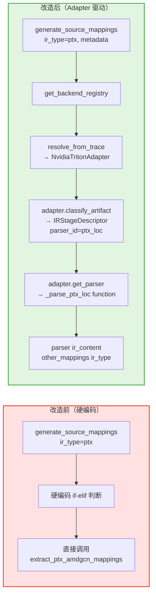

# PR: Parser 分发系统重构 - 从硬编码到 Adapter 驱动的 Parser 注册与选择机制

## 背景信息

- **RFC 文档**：https://github.com/meta-pytorch/tritonparse/issues/367
- **前置 PR**：https://github.com/meta-pytorch/tritonparse/pull/387 （Reader-side 基础设施层与通用 Parse 逻辑改造）

## 摘要

本 PR 是 **Flexible Backend Support RFC Phase 1 的第二个 PR**（Phase 1 总共拆分为 3 个 PR）。

**本 PR 内容**：Parser 分发系统重构。将原先硬编码在 `generate_source_mappings()` 中的 parser 选择逻辑重构为 Adapter 驱动的 Parser 注册与选择机制，实现 Parser 的分层注册（通用 parsers + 后端特定 parsers）和动态分发。

---

## 核心改动

### 1. Parser 注册中心 (`tritonparse/parse/ir_parser.py` - 新增)

**新增 ParserRegistry 类**：

```python
class ParserRegistry:
    """
    Registry for managing IR parser functions.

    This registry allows adapters to register and retrieve parser functions
    by parser_id. It supports both common parsers (shared across backends)
    and backend-specific parsers.
    """

    @classmethod
    def register(cls, parser_id: str, parser_func: Callable) -> None: ...

    @classmethod
    def get_parser(cls, parser_id: str) -> Optional[Callable]: ...

    @classmethod
    def list_parsers(cls) -> List[str]: ...
```

**核心设计**：
- **分层注册机制**：
  - 通用 parsers（generic_loc, none）在模块初始化时预注册
  - 后端特定 parsers（ptx_loc, sass_loc, amdgcn_loc）由各自 adapter 在初始化时注册
- **统一接口**：所有 parser 遵循相同的函数签名 `(ir_content, other_mappings, ir_type) -> Dict`

### 2. Parser 包装函数 (`tritonparse/parse/ir_parser.py` - 新增)

**5 个标准化 Parser 函数**：

```python
def _parse_generic_loc(ir_content, other_mappings, ir_type):
    """通用 IR 格式（TTIR/TTGIR/LLIR）解析器"""

def _parse_ptx_loc(ir_content, other_mappings, ir_type):
    """PTX IR 格式解析器"""

def _parse_amdgcn_loc(ir_content, other_mappings, ir_type):
    """AMDGCN 汇编格式解析器"""

def _parse_sass_loc(ir_content, other_mappings, ir_type):
    """NVIDIA SASS 汇编格式解析器"""

def _parse_none(ir_content, other_mappings, ir_type):
    """占位解析器（不支持 source mapping 的 stages，如 CUBIN）"""
```

**设计要点**：
- **保留原有逻辑**：包装函数内部调用现有的 `extract_loc_definitions`、`extract_ptx_amdgcn_mappings` 等函数
- **统一签名**：所有 parser 遵循 `(ir_content, other_mappings, ir_type) -> Dict` 接口
- **向后兼容**：不破坏现有函数调用，仅在注册中心层面统一

### 3. Adapter 扩展 (`tritonparse/backend.py` - 改造)

**CompilationPipelineAdapter 新增方法**：

```python
class CompilationPipelineAdapter(ABC):
    def get_parser(self, parser_id: str):
        """
        Get parser function by parser_id from the parser registry.

        Generic implementation that works for most backends.
        Subclasses can override if needed.

        Raises:
            ValueError: If parser_id is not found in the registry
        """

    def register_backend_parser(self, parser_id: str, parser_func) -> None:
        """
        Register a backend-specific parser to the parser registry.

        This allows adapters to register custom parsers for backend-specific
        IR formats that are not part of the common parser registry.
        """
```

**具体 Adapter 改造**：

```python
class NvidiaTritonAdapter(CompilationPipelineAdapter):
    def __init__(self):
        """Initialize and register backend-specific parsers."""
        # Register NVIDIA-specific parsers
        self.register_backend_parser("ptx_loc", _parse_ptx_loc)
        self.register_backend_parser("sass_loc", _parse_sass_loc)

        # Pre-initialize stage descriptors (immutable objects, can be reused)
        self._stages = [
            IRStageDescriptor("ttir", ".ttir", "TTIR", 10, True, True, "generic_loc", "mlir"),
            IRStageDescriptor("ttgir", ".ttgir", "TTGIR", 20, True, True, "generic_loc", "mlir"),
            IRStageDescriptor("llir", ".llir", "LLIR", 30, True, True, "generic_loc", "llvm"),
            IRStageDescriptor("ptx", ".ptx", "PTX", 40, True, True, "ptx_loc", "ptx"),
            IRStageDescriptor("cubin", ".cubin", "CUBIN", 50, False, False, "none", "plaintext"),
            IRStageDescriptor("sass", ".sass", "SASS", 60, True, True, "sass_loc", "asm"),
            IRStageDescriptor("json", ".json", "JSON", 100, True, False, "none", "json"),
        ]

class AmdTritonAdapter(CompilationPipelineAdapter):
    def __init__(self):
        """Initialize and register backend-specific parsers."""
        # Register AMD-specific parsers
        self.register_backend_parser("amdgcn_loc", _parse_amdgcn_loc)

        # Pre-initialize stage descriptors
        self._stages = [
            IRStageDescriptor("ttir", ".ttir", "TTIR", 10, True, True, "generic_loc", "mlir"),
            IRStageDescriptor("ttgir", ".ttgir", "TTGIR", 20, True, True, "generic_loc", "mlir"),
            IRStageDescriptor("llir", ".llir", "LLIR", 30, True, True, "generic_loc", "llvm"),
            IRStageDescriptor("amdgcn", ".amdgcn", "AMDGCN", 40, True, True, "amdgcn_loc", "asm"),
            IRStageDescriptor("json", ".json", "JSON", 100, True, False, "none", "json"),
        ]
```

**关键改进**：
- **Adapter 成为 Parser 注册的入口**：每个 adapter 负责注册其后端特定的 parsers
- **Stage descriptor 与 parser 解耦**：`parser_id` 字段指定使用哪个 parser
- **对象复用优化**：`_stages` 在 `__init__` 中预初始化，`get_ir_stages()` 直接返回（避免重复创建）

### 4. generate_source_mappings 改造 (`tritonparse/parse/trace_processor.py` - 改造)

**改造前（硬编码 parser 选择）**：

```python
def generate_source_mappings(ir_content, ir_type, other_mappings):
    # Hardcoded parser selection
    if ir_type == "ptx" or ir_type == "amdgcn":
        return extract_ptx_amdgcn_mappings(ir_content, other_mappings, ir_type)
    elif ir_type == "sass":
        return extract_sass_mappings(ir_content)
    else:
        # TTIR/TTGIR/LLIR: complex hardcoded logic
        loc_defs = extract_loc_definitions(ir_content)
        loc_refs = extract_code_locations(ir_content)
        # ... manual mapping construction
```

**改造后（Adapter 驱动的 parser 选择）**：

```python
def generate_source_mappings(ir_content, ir_type, other_mappings, metadata=None):
    # Step 1: Try adapter-based parser selection (new path)
    if metadata is not None:
        try:
            from tritonparse.backend import get_backend_registry

            registry = get_backend_registry()
            adapter = registry.resolve_from_trace(metadata)

            # Find the stage descriptor for this ir_type
            stage_descriptor = adapter.classify_artifact(f"kernel.{ir_type}")
            if stage_descriptor is not None and stage_descriptor.parser_id != "none":
                parser_id = stage_descriptor.parser_id
                parser = adapter.get_parser(parser_id)

                # Call the parser with standardized signature
                return parser(ir_content, other_mappings, ir_type)
        except Exception as e:
            # Fallback to old hardcoded logic if adapter resolution fails
            logger.debug(f"Adapter-based parser resolution failed for ir_type={ir_type}: {e}. "
                        f"Falling back to hardcoded parser selection.")

    # Step 2: Fallback to hardcoded parser selection (backward compatibility)
    if ir_type == "ptx" or ir_type == "amdgcn":
        return extract_ptx_amdgcn_mappings(ir_content, other_mappings, ir_type)
    elif ir_type == "sass":
        return extract_sass_mappings(ir_content)
    else:
        # ... original hardcoded logic for TTIR/TTGIR/LLIR
```

**关键改进**：
- **两级分发机制**：
  1. 优先：Adapter 驱动的 parser 选择（从 stage descriptor 获取 parser_id）
  2. 降级：硬编码 parser 选择（向后兼容）
- **Metadata 驱动**：新 traces 通过 `metadata` 触发 adapter-based parser 选择
- **向后兼容**：旧 traces（无 metadata）继续使用硬编码逻辑

### 5. process_ir 签名扩展 (`tritonparse/parse/trace_processor.py` - 改造)

```python
def process_ir(
    key: str,
    file_content: Dict[str, str],
    file_path: Dict[str, str],
    other_mappings: List[Any] | None = None,
    metadata: Dict[str, Any] | None = None,  # ← 新增参数
):
    ir_content = load_ir_contents(key, file_content, file_path)
    if not ir_content:
        return {}
    ir_type = key.split(".")[1]
    mapping = generate_source_mappings(ir_content, ir_type, other_mappings, metadata)  # ← 传递 metadata
    return mapping
```

**数据流传递**：`metadata` 从 `parse_single_trace_content()` → `process_ir()` → `generate_source_mappings()`

---

## 架构改进

### Parser 分发流程对比



**核心优势**：

- ✅ **动态分发**：parser 选择由 adapter + stage descriptor 驱动，无需硬编码 if-elif
- ✅ **可扩展**：新增 parser 只需在 adapter.__init__ 中注册，无需修改核心逻辑
- ✅ **解耦**：parser 逻辑集中在 `ir_parser.py`，adapter 只负责注册和调度
- ✅ **向后兼容**：降级策略确保旧 traces 仍然工作
- ✅ **类型安全**：adapter.get_parser() 对未知 parser_id 抛出 ValueError

---

## 测试验证

### 测试结果

Compatibility testing
To verify that the current parse path works for both new and old traces, I built the first version of the trace adaptation logic on my fork branch logs_creator. I used it to generate a new trace file for the new-trace validation case.
The validation results are good for both the new trace and the old trace. Both can be parsed correctly.

- old trace
image
- new trace
image


Format checking
The result of make format-check is shown below:
image


Functional testing
The result of make test-cuda is shown below:
image


The result of make test is shown below:
image


Multi-backend testing
The parse function also works properly in the Ascend backend.


---


## 总结

本 PR 完成了 **Flexible Backend Support RFC Phase 1 的 Parser 分发系统重构**，将硬编码在 `generate_source_mappings()` 中的 parser 选择逻辑改造为 Adapter 驱动的动态分发机制。

核心实现包括：新增 `ParserRegistry` 统一管理 parser 注册和查询，实现了通用 parsers 和后端特定 parsers 的分层注册；为 5 种 IR 格式（TTIR/TTGIR/LLIR、PTX、AMDGCN、SASS、CUBIN）提供标准化 parser 包装函数；扩展 `CompilationPipelineAdapter` 增加 `get_parser()` 和 `register_backend_parser()` 方法，由各 adapter 在初始化时注册其后端特定 parsers；改造 `generate_source_mappings()` 实现两级分发（优先 Adapter 驱动，降级硬编码逻辑），确保新旧 traces 完全兼容。

---

## RFC Phase 1 完成情况 & 下一步计划

### ✅ PR 1（已完成）：Reader-side 基础设施层与通用 Parse 逻辑改造
- Adapter 基础设施 + `trace_processor.py` 的通用 parse 调度逻辑改造
- 新增 `tritonparse/backend.py`：IRStageDescriptor、CompilationPipelineAdapter、NvidiaTritonAdapter、AmdTritonAdapter、PipelineAdapterRegistry
- 改造 `trace_processor.py`：动态 stage 发现（降级策略）、动态 stage 处理循环、动态映射构建

### ✅ PR 2（本 PR）：Parser 分发系统重构
- ParserRegistry 基础设施 + 5 个标准化 parser 包装函数
- Adapter 扩展：`get_parser()`、`register_backend_parser()`
- `generate_source_mappings()` 改造：Adapter 驱动 + 硬编码降级
- 完整的测试覆盖

### 🔜 PR 3：Analysis 与 Reproducer
- `ir_analysis.py` 和 `reproducer/` 模块迁移到 adapter 架构
