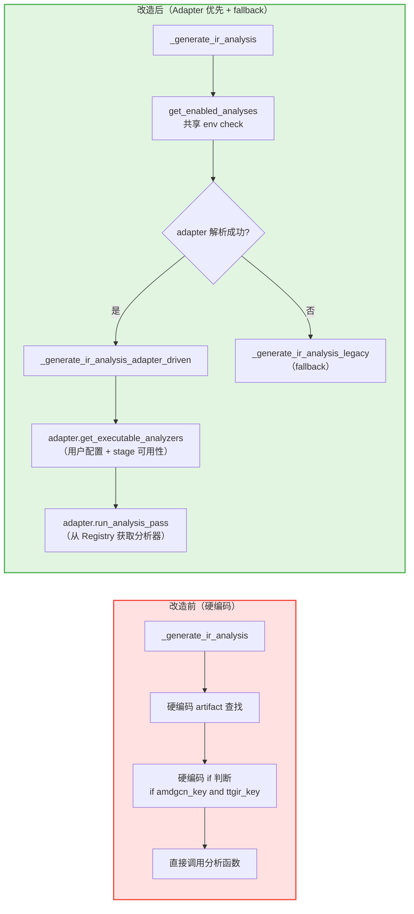

# PR: Analysis 分发系统重构 - 从硬编码到 Adapter 驱动的 Analysis 注册与调度机制

## 背景信息

- **RFC 文档**：https://github.com/meta-pytorch/tritonparse/issues/367
- **前置 PR**：
  - https://github.com/meta-pytorch/tritonparse/pull/387 （Reader-side 基础设施层与通用 Parse 逻辑改造）
  - https://github.com/meta-pytorch/tritonparse/pull/394 （Parser 分发系统重构）

## 摘要

本 PR 是 **Flexible Backend Support RFC Phase 1 的第三个 PR**（Phase 1 总共拆分为 4 个 PR，下一步计划见文末）。

**本 PR 内容**：Analysis 分发系统重构。将原先硬编码在 `_generate_ir_analysis()` 中的分析调度逻辑重构为 Adapter 驱动的 Analysis 注册与调度机制，实现分析器的分层注册（通用分析器 + 后端特定分析器）和动态调度；同时统一 `TRITONPARSE_ANALYSIS` 的入口逻辑，并保留 adapter 解析失败时的 legacy fallback。

---

## 核心改动

### 1. Analysis 注册中心 (`tritonparse/parse/ir_analysis.py` - 新增)

**新增 AnalyzerInfo 数据类**：

```python
@dataclass
class AnalyzerInfo:
    """注册分析器的元信息"""
    name: str                           # 分析器名称，例如 "amd_buffer_ops"
    func: Callable                      # 分析器函数 (entry, procedure_checks) -> dict | None
    required_stages: tuple[str, ...]    # 依赖的 stage，例如 ("ttgir", "amdgcn")
    adapter_affinity: str | None = None # 所属后端，None 表示通用分析器
```

**新增 AnalysisRegistry 类**：

```python
class AnalysisRegistry:
    """
    管理分析器注册、查询和元信息的注册中心。
    支持通用分析器和后端特定分析器的分层注册。
    """

    @classmethod
    def register(cls, analyzer_id, analyzer_func, required_stages, adapter_affinity=None) -> None: ...

    @classmethod
    def get_analyzer_info(cls, analyzer_id: str) -> AnalyzerInfo | None: ...

    @classmethod
    def get_analyzer(cls, analyzer_id: str) -> Callable | None: ...

    @classmethod
    def list_analyzers(cls) -> list[str]: ...

    @classmethod
    def list_analyzer_infos(cls) -> list[tuple[str, AnalyzerInfo]]: ...
```

**核心设计**：
- **分层注册机制**：
  - 通用分析器（`loop_schedules`、`procedure_checks`）在模块初始化时预注册（`adapter_affinity=None`）
  - 后端特定分析器（如 `amd_buffer_ops`）由各自 adapter 在初始化时注册（`adapter_affinity="hip_triton"`）
- **统一的 AnalyzerInfo 元信息**：每个分析器携带依赖声明（`required_stages`）和后端归属（`adapter_affinity`）

### 2. 标准化分析器包装函数 (`tritonparse/parse/ir_analysis.py` - 新增)

**3 个标准化 Analyzer 包装函数**：

```python
def _analyze_loop_schedules_generic(entry, procedure_checks=None):
    """通用 loop schedule 分析器 — 包装现有 _analyze_loop_schedules"""

def _analyze_procedures_generic(entry, procedure_checks=None):
    """通用 FileCheck 过程检测分析器 — 包装现有 find_procedures_with_patterns"""

def _analyze_amd_buffer_ops(entry, procedure_checks=None):
    """AMD buffer ops 分析器 — 包装现有 _analyze_buffer_ops"""
```

**设计要点**：
- **统一签名**：所有分析器遵循 `(entry, procedure_checks) -> dict | None` 接口
- **保留原有逻辑**：包装函数内部调用现有的 `_analyze_loop_schedules`、`_analyze_buffer_ops`、`find_procedures_with_patterns` 等函数，不改动分析函数本身
- **防御性检查**：通过 `_validate_required_stages()` 在执行前验证所需 stage 是否存在

### 3. Adapter 扩展 (`tritonparse/backend.py` - 改造)

**删除 AnalysisPassDescriptor/ API break**：

原 `AnalysisPassDescriptor` 数据类的职责已被 `AnalyzerInfo` 替代。分析器元信息现在由 `AnalysisRegistry` 统一管理，不再需要 adapter 侧单独的数据类。
`AnalysisPassDescriptor` 已从公开 Python API 中移除。`AnalysisPassDescriptor` 没有调用方，移除对现有生产业务无影响。

**CompilationPipelineAdapter 新增/改造方法**：

```python
class CompilationPipelineAdapter(ABC):
    def get_analysis_passes(self) -> list[str]:
        """返回当前 adapter 可用的分析器名称列表（基于 affinity 过滤）"""

    def get_executable_analyzers(self, file_content, enabled_analyses=None) -> list[str]:
        """
        综合判断哪些分析器可以执行：
        1. 用户是否启用（环境变量 TRITONPARSE_ANALYSIS）
        2. 所需 stage 是否在 file_content 中可用
        """

    def run_analysis_pass(self, pass_name, entry, procedure_checks=None) -> dict[str, Any]:
        """执行指定的分析器，找不到则抛出 ValueError"""

    def register_backend_analyzer(self, analyzer_id, analyzer_func, required_stages) -> None:
        """注册后端特定分析器（以 adapter_name 为 affinity）"""
```

**具体 Adapter 改造**：

```python
class AmdTritonAdapter(CompilationPipelineAdapter):
    def __init__(self):
        # 注册 AMD 特定分析器
        self.register_backend_analyzer(
            "amd_buffer_ops",
            _analyze_amd_buffer_ops,
            required_stages=("ttgir", "amdgcn"),
        )
```

**关键改进**：
- **Adapter 成为分析器注册的入口**：每个 adapter 负责注册其后端特定的分析器
- **适配器级别的能力过滤**：`get_analysis_passes()` 基于 `adapter_affinity` 自动筛选可用的分析器
- **执行前综合判断**：`get_executable_analyzers()` 同时考虑用户配置和 stage 可用性

### 4. _generate_ir_analysis 改造 (`tritonparse/parse/ir_analysis.py` - 改造)

**改造前（硬编码分析调度）**：

```python
def _generate_ir_analysis(entry, procedure_checks=None):
    # 硬编码查找 artifacts
    ttir_key = next((k for k in file_content if k.endswith(".ttir")), None)
    ttgir_key = next((k for k in file_content if k.endswith(".ttgir")), None)
    amdgcn_key = next((k for k in file_content if k.endswith(".amdgcn")), None)

    # 硬编码判断是否执行 AMD 分析
    if amdgcn_key and ttgir_key:
        io_counts = _analyze_buffer_ops(ttgir_key, amdgcn_key, ...)

    # 硬编码 loop schedule 分析
    if ttir_key and ttgir_key:
        loop_schedule = _analyze_loop_schedules(ttir_key, ttgir_key, ...)
```

**改造后（共享 env check + Adapter 优先 + Legacy 降级）**：

```python
def _generate_ir_analysis(entry, procedure_checks=None):
    enabled_analyses = get_enabled_analyses()
    if enabled_analyses is not None and len(enabled_analyses) == 0:
        return {}

    try:
        return _generate_ir_analysis_adapter_driven(
            entry, procedure_checks, enabled_analyses
        )
    except ValueError as e:
        logger.warning(f"Adapter-driven analysis failed: {e}. Falling back to legacy.")

    return _generate_ir_analysis_legacy(
        entry, procedure_checks, enabled_analyses
    )
```

**Adapter 驱动路径**：

```python
def _generate_ir_analysis_adapter_driven(
    entry, procedure_checks=None, enabled_analyses=None
):
    # 1. 解析 adapter
    adapter = get_backend_registry().resolve_from_trace(metadata)

    # 2. 获取可执行分析器（adapter 综合判断）
    executable = adapter.get_executable_analyzers(file_content, enabled_analyses)

    # 3. 逐个执行
    for analyzer_name in executable:
        result = adapter.run_analysis_pass(analyzer_name, entry, procedure_checks)
```

**关键改进**：
- **两级分发机制**：
  1. 优先：直接尝试 Adapter 驱动的分析调度
  2. 降级：仅当 adapter 解析失败时，回退到硬编码 legacy 逻辑
- **消除后端特判**：`if amdgcn_key and ttgir_key` 这类硬编码判断被 adapter 的 `get_executable_analyzers()` 替代
- **共享环境变量入口**：`TRITONPARSE_ANALYSIS` 的读取前移到分发器顶部，adapter-driven 和 legacy 两条路径共享同一份 `enabled_analyses`

### 5. 环境变量控制 (`tritonparse/shared_vars.py` - 新增)

**新增 `TRITONPARSE_ANALYSIS` 环境变量**：

```python
def get_enabled_analyses() -> set[str] | None:
    """
    从环境变量获取用户启用的分析列表。

    Returns:
        None: 启用全部分析（默认）
        set: 启用的分析名称集合
        空集合: 禁用全部分析
    """
    env_value = os.environ.get("TRITONPARSE_ANALYSIS", "all").strip()
    if not env_value or env_value.lower() == "none":
        return set()
    elif env_value.lower() == "all":
        return None

    raw_names = [n.strip().lower() for n in env_value.split(",") if n.strip()]
    if "all" in raw_names:
        logger.warning("TRITONPARSE_ANALYSIS contains 'all' mixed with other names")
        return None
    if "none" in raw_names:
        logger.warning("TRITONPARSE_ANALYSIS contains 'none' mixed with other names")
        return set()

    known = {name.lower() for name in AnalysisRegistry.list_analyzers()}
    unknown = {n for n in raw_names if n not in known}
    if unknown:
        logger.warning(f"TRITONPARSE_ANALYSIS contains unknown analyzer names: {unknown}")

    return set(raw_names) & known if known else set(raw_names)
```

**用法示例**：

```bash
# 启用全部分析（默认）
export TRITONPARSE_ANALYSIS="all"

# 禁用全部分析
export TRITONPARSE_ANALYSIS="none"

# 只运行特定分析
export TRITONPARSE_ANALYSIS="loop_schedules"
export TRITONPARSE_ANALYSIS="loop_schedules,procedure_checks"
```

---

## 架构改进

### 分析调度流程对比



### 新增组件的职责划分

| 组件 | 职责 |
|------|------|
| `AnalysisRegistry` | 管理分析器注册、查询、元信息 |
| `AnalyzerInfo` | 描述分析器的元信息（函数、依赖、归属） |
| `_validate_required_stages()` | 防御性检查所需 stage 是否存在 |
| `get_enabled_analyses()` | 在 `shared_vars.py` 中解析环境变量，并做名称校验 / 大小写统一 / `all` / `none` 混用告警 |
| `adapter.get_executable_analyzers()` | 综合判断哪些分析器可以执行 |
| `adapter.run_analysis_pass()` | 执行指定的分析器 |
| `adapter.register_backend_analyzer()` | 注册后端特定分析器 |
| `AnalysisRegistry.list_analyzer_infos()` | 向 adapter 暴露公开的分析器元信息枚举接口 |

---

## 文档更新

本 PR 同时补充了 `TRITONPARSE_ANALYSIS` 环境变量到 `docs/07.-Environment-Variables-Reference.md`，包括快速参考表条目和详细说明段落。

---

## 测试验证

Format checking
The result of make format-check is shown below:
image


Functional testing
The result of make test-cuda is shown below:
image


The result of make test is shown below:
image


Multi-backend testing
The parse function also works properly in the Ascend backend.

---

## 总结

本 PR 完成了 **Flexible Backend Support RFC Phase 1 的 Analysis 分发系统重构**，将硬编码在 `_generate_ir_analysis()` 中的分析调度逻辑改造为 Adapter 驱动的动态分发机制。

核心实现包括：新增 `AnalysisRegistry` 和 `AnalyzerInfo` 统一管理分析器注册、查询和元信息，实现通用分析器和后端特定分析器的分层注册；为 3 种分析（`loop_schedules`、`procedure_checks`、`amd_buffer_ops`）提供标准化包装函数；扩展 `CompilationPipelineAdapter` 增加 `get_executable_analyzers()`、`run_analysis_pass()`、`register_backend_analyzer()` 等方法；改造 `_generate_ir_analysis()` 为“共享 env check + Adapter 优先 + legacy fallback” 的分发结构；将 `TRITONPARSE_ANALYSIS` 解析逻辑收敛到 `shared_vars.py`，并增加名称校验、大小写统一与误用告警。

---

## RFC Phase 1 完成情况 & 下一步计划

### Phase 1 总览

RFC Phase 1 目标：Reader-side 后端收敛。将 reader-side 的后端相关规则从散落硬编码收敛到统一的 adapter contract 中。

RFC 原始计划将 Phase 1 拆分为 3 个 PR。在实际执行中，由于原始 PR2 和 PR3 各自包含的职责较多，拆分为 4 个 PR 以保持每个 PR 的边界清晰。

### PR 1（已完成）：Reader-side 基础设施层与通用 Parse 逻辑改造
- Adapter 基础设施 + `trace_processor.py` 的通用 parse 调度逻辑改造
- 新增 `tritonparse/backend.py`：IRStageDescriptor、CompilationPipelineAdapter、NvidiaTritonAdapter、AmdTritonAdapter、PipelineAdapterRegistry
- 改造 `trace_processor.py`：动态 stage 发现（降级策略）、动态 stage 处理循环、动态映射构建

### PR 2（已完成）：Parser 分发系统重构
- ParserRegistry 基础设施 + 5 个标准化 parser 包装函数
- Adapter 扩展：`get_parser()`、`register_backend_parser()`
- `generate_source_mappings()` 改造：Adapter 驱动 + 硬编码降级

### PR 3（本 PR）：Analysis 分发系统重构
- AnalysisRegistry 基础设施 + 3 个标准化 analyzer 包装函数
- Adapter 扩展：`get_executable_analyzers()`、`run_analysis_pass()`、`register_backend_analyzer()`
- `_generate_ir_analysis()` 改造：Adapter 驱动 + Legacy 降级
- 新增 `TRITONPARSE_ANALYSIS` 环境变量

### PR 4（待做）：派生能力实现 + Reproducer 迁移
- **派生能力**：在 `NvidiaTritonAdapter` 中实现 `get_derived_artifacts()` 和 `collect_derived_artifact_contents()`，将现有的 SASS dump 逻辑（`TRITONPARSE_DUMP_SASS` 环境变量）收敛到 adapter 的派生能力框架中
- **Reproducer 迁移**：将 `reproducer/` 模块中的 device normalization 逻辑收敛到 `adapter.normalize_device_string()`，消除 reproducer 中的后端特判代码
- **核心改动**：后端特定的派生逻辑和 reproducer device 处理从共享代码迁移到 adapter


**下一步**：完成 PR 4（派生能力实现 + Reproducer 迁移），此后 Phase 1 全部收工，进入 Phase 2 — Reader-side 前端迁移。
