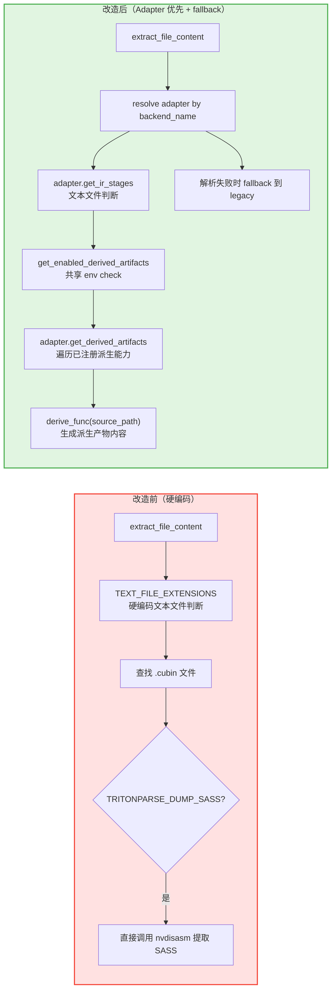

# PR: 派生能力系统重构 - 从硬编码 SASS Dump 到 Adapter 驱动的 Derived Artifact 机制

## 背景信息

- **RFC 文档**：https://github.com/meta-pytorch/tritonparse/issues/367
- **前置 PR**：
  - https://github.com/meta-pytorch/tritonparse/pull/387 （Reader-side 基础设施层与通用 Parse 逻辑改造）
  - https://github.com/meta-pytorch/tritonparse/pull/394 （Parser 分发系统重构）
  - https://github.com/meta-pytorch/tritonparse/pull/401 （Analysis 分发系统重构）

## 摘要

本 PR 聚焦 **Flexible Backend Support RFC Phase 1 的派生能力（derived artifacts）重构**。

**本 PR 内容**：将原先硬编码在 `structured_logging.extract_file_content()` 中的 CUBIN -> SASS 导出逻辑，重构为 Adapter 驱动的派生产物注册与调度机制；新增 `TRITONPARSE_DERIVED_ARTIFACTS` 统一控制入口；保留 `TRITONPARSE_DUMP_SASS` 的向后兼容，并在 adapter 解析失败时保留 legacy fallback。

**本 PR 不包含**：`reproducer/` 模块中的 device normalization 迁移。该部分将拆到后续单独 PR 处理，以保持本 PR 聚焦在 reader-side 的派生能力收敛。

---

## 核心改动

### 1. 派生产物注册中心 (`tritonparse/backend.py` - 改造)

**`DerivedArtifactDescriptor` 更新为 `DerivedArtifactInfo` / API break**：

原 `DerivedArtifactDescriptor` 是一个偏静态的描述对象，只包含 `source_extension`、`output_extension` 等元信息，无法直接承载“如何执行派生”的能力。本 PR 将其更新为 `DerivedArtifactInfo`，补充 `source_stage_name`、`target_stage_name`、`adapter_affinity` 和 `derive_func` 等字段，使派生能力从“声明式描述”升级为“可注册、可执行的运行时对象”。

`DerivedArtifactDescriptor` 在本 PR 之前并没有实际的生产调用场景：仓库中的出现位置主要停留在设计文档和抽象草案中，reader-side 真实执行路径并未基于它做派发。因此这次类型更新虽然属于公开抽象层面的 API 调整，但对现有生产代码没有实际影响。

**新增 `DerivedArtifactInfo` 数据类**：

```python
@dataclass
class DerivedArtifactInfo:
    """注册派生产物的元信息"""
    source_stage_name: str              # 源 stage 名称，例如 "cubin"
    target_stage_name: str              # 目标 stage 名称，例如 "sass"
    tool_name: str                      # 派生工具名称，例如 "nvdisasm"
    adapter_affinity: str               # 所属 adapter，例如 "cuda_triton"
    derive_func: Callable[[str], str | None]
```

**新增 `DerivedArtifactRegistry` 类**：

```python
class DerivedArtifactRegistry:
    """
    管理派生产物注册、查询与枚举的注册中心。
    adapter 在初始化时将各自支持的派生能力注册到这里。
    """

    @classmethod
    def register(cls, info: DerivedArtifactInfo) -> None: ...

    @classmethod
    def get_by_target(cls, target_stage_name: str) -> DerivedArtifactInfo | None: ...

    @classmethod
    def list_for_adapter(cls, adapter_name: str) -> list[DerivedArtifactInfo]: ...

    @classmethod
    def list_target_stage_names(cls) -> list[str]: ...
```

**核心设计**：
- **从描述对象到可执行对象**：旧的 `DerivedArtifactDescriptor` 只描述静态关系；新的 `DerivedArtifactInfo` 直接携带 `derive_func`，可以由 adapter 注册可执行的派生逻辑
- **分层注册**：每个 backend adapter 只负责注册自己的派生能力，注册中心统一做查询和枚举
- **统一校验入口**：`list_target_stage_names()` 为环境变量校验提供标准来源，避免在多个模块中硬编码可选值

### 2. Adapter 扩展 (`tritonparse/backend.py` - 改造)

**`CompilationPipelineAdapter` 新增/改造方法**：

```python
class CompilationPipelineAdapter(ABC):
    def get_derived_artifacts(self) -> list[DerivedArtifactInfo]:
        """返回当前 adapter 已注册的派生产物列表"""

    def register_backend_derived_artifact(
        self,
        source_stage_name: str,
        target_stage_name: str,
        tool_name: str,
        derive_func: Callable[[str], str | None],
    ) -> None:
        """注册后端特定的派生产物"""

    def collect_derived_artifact_contents(
        self, source_path: str, info: DerivedArtifactInfo
    ) -> str | None:
        """执行派生函数并返回产物内容"""
```

**具体 Adapter 改造**：

```python
class NvidiaTritonAdapter(CompilationPipelineAdapter):
    def __init__(self):
        from tritonparse.tools.disasm import extract as derive_sass

        self.register_backend_derived_artifact(
            "cubin",
            "sass",
            "nvdisasm",
            derive_sass,
        )
```

**关键改进**：
- **Adapter 成为派生能力注册入口**：后端相关的派生规则不再散落在 `structured_logging.py` 里
- **派生能力与 stage 语义对齐**：派生链路基于 `source_stage_name` / `target_stage_name`，而不是基于硬编码扩展名判断
- **为多后端扩展留接口**：未来其他 backend 只需要在 adapter 中注册新的派生能力，无需修改共享提取逻辑

### 3. `extract_file_content()` 改造 (`tritonparse/structured_logging.py` - 改造)

**改造前（硬编码文件提取 + 硬编码 SASS dump）**：

```python
def extract_file_content(trace_data, metadata_group):
    for ir_filename, file_path in metadata_group.items():
        if any(ir_filename.endswith(ext) for ext in TEXT_FILE_EXTENSIONS):
            ...

    cubin_keys = [key for key in metadata_group.keys() if key.endswith(".cubin")]
    cubin_path = metadata_group[cubin_keys[0]] if cubin_keys else None

    if TRITONPARSE_DUMP_SASS and cubin_path:
        sass_content = tritonparse.tools.disasm.extract(cubin_path)
        trace_data["file_content"][sass_filename] = sass_content
```

**改造后（Adapter 优先 + Legacy 降级）**：

```python
def extract_file_content(trace_data, metadata_group, backend_name):
    try:
        return _extract_file_content_adapter_driven(
            trace_data, metadata_group, backend_name
        )
    except ValueError as e:
        log.warning(
            f"Adapter-driven file extraction failed: {e}. Falling back to legacy."
        )

    _extract_file_content_legacy(trace_data, metadata_group)
```

**Adapter 驱动路径**：

```python
def _extract_file_content_adapter_driven(trace_data, metadata_group, backend_name):
    adapter = get_backend_registry().resolve(adapter_name=f"{backend_name}_triton")

    # 1. 通过 adapter 的 stage 描述判断哪些文件是文本文件
    text_extensions = {
        stage.extension for stage in adapter.get_ir_stages() if stage.is_text
    }

    # 2. 通过共享 env 入口决定哪些派生产物要执行
    enabled = get_enabled_derived_artifacts()

    # 3. 遍历 adapter 注册的派生能力并生成内容
    for info in adapter.get_derived_artifacts():
        ...
```

**关键改进**：
- **两级分发机制**：
  1. 优先：直接尝试 Adapter 驱动的文件内容提取与派生产物生成
  2. 降级：仅当 adapter 解析失败时，回退到 legacy 硬编码逻辑
- **消除共享层的后端特判**：`structured_logging.py` 不再显式写死 “找到 `.cubin` 就尝试导出 `.sass`”
- **文本文件识别也统一走 adapter**：是否可按文本读取，改由 `IRStageDescriptor.is_text` 决定，而不是依赖共享常量列表

### 4. 环境变量控制 (`tritonparse/shared_vars.py` - 新增)

**新增 `TRITONPARSE_DERIVED_ARTIFACTS` 环境变量**：

```python
def get_enabled_derived_artifacts() -> set[str] | None:
    """
    从环境变量获取用户启用的派生产物列表。

    Returns:
        None: 启用全部派生能力
        set: 启用的 target stage 名称集合
        空集合: 禁用全部派生能力
    """
    env_value = os.environ.get("TRITONPARSE_DERIVED_ARTIFACTS", "none").strip()

    # Empty or whitespace-only input behaves like "none".
    raw_names = [n.strip().lower() for n in env_value.split(",") if n.strip()]

    if not raw_names:
        if is_sass_dump_enabled():
            return {"sass"}
        return set()

    if "all" in raw_names:
        if len(raw_names) > 1:
            ...
        return None

    if "none" in raw_names:
        if len(raw_names) > 1:
            ...
        if is_sass_dump_enabled():
            return {"sass"}
        return set()

    if is_sass_dump_enabled():
        raw_names.append("sass")

    # Validate against registered derived artifacts and filter unknown names.
    ...
```

**用法示例**：

```bash
# 禁用全部派生产物（默认）
export TRITONPARSE_DERIVED_ARTIFACTS="none"

# 启用当前 backend 支持的全部派生产物
export TRITONPARSE_DERIVED_ARTIFACTS="all"

# 只启用 SASS
export TRITONPARSE_DERIVED_ARTIFACTS="sass"
```

**兼容策略**：
- 保留 `TRITONPARSE_DUMP_SASS=1` 的旧入口
- `TRITONPARSE_DUMP_SASS=1` 会把 `sass` 追加到当前已启用的派生产物集合中
- 当逗号列表中混用了 `all` / `none` 与其他名字时，记录 warning，并按全局关键字处理

### 5. 向后兼容与失败路径处理 (`tritonparse/structured_logging.py` + `tritonparse/shared_vars.py`)

**向后兼容点**：
- legacy 路径保留 `TRITONPARSE_DUMP_SASS`，确保 adapter 解析失败时仍可工作
- `TRITONPARSE_DERIVED_ARTIFACTS` 与 `TRITONPARSE_DUMP_SASS` 可以共存，并共同决定最终启用的派生产物
- `maybe_trace_triton()` 仅额外传入 `backend_name`，原有 trace 采集主流程保持不变

**错误处理**：
- adapter 解析失败时，`extract_file_content()` 自动降级到 `_extract_file_content_legacy()`
- 派生工具执行失败时，trace 中记录 `<tool failed: ...>` 或 `<error dumping derived artifact: ...>`，而不是直接中断整个 trace 流程
- 环境变量中出现未知 target stage 名称时，记录 warning，并只保留已注册的合法名称

---

## 架构改进

### 派生产物提取流程对比



### 新增组件的职责划分

| 组件 | 职责 |
|------|------|
| `DerivedArtifactInfo` | 描述单个派生产物的元信息（源 stage、目标 stage、工具、归属、执行函数） |
| `DerivedArtifactRegistry` | 管理派生能力的注册、查询和目标 stage 枚举 |
| `adapter.register_backend_derived_artifact()` | 注册后端特定的派生能力 |
| `adapter.get_derived_artifacts()` | 返回当前 adapter 可用的派生能力列表 |
| `adapter.collect_derived_artifact_contents()` | 执行派生函数并返回内容 |
| `get_enabled_derived_artifacts()` | 统一解析 `TRITONPARSE_DERIVED_ARTIFACTS`，处理校验、大小写归一和兼容逻辑 |
| `_extract_file_content_adapter_driven()` | 通过 adapter 驱动文本文件提取和派生产物生成 |
| `_extract_file_content_legacy()` | adapter 解析失败时的硬编码兼容路径 |

---

## 文档更新

本 PR 已同步更新官方文档 [docs/07.-Environment-Variables-Reference.md](docs/07.-Environment-Variables-Reference.md)。

本次文档补充包括：
- 在快速参考表中加入 `TRITONPARSE_DERIVED_ARTIFACTS`
- 新增 `TRITONPARSE_DERIVED_ARTIFACTS` 的详细说明，覆盖 `none` / `all` / 逗号分隔 target stage 名称的配置方式
- 明确 `TRITONPARSE_DUMP_SASS` 与 `TRITONPARSE_DERIVED_ARTIFACTS="sass"` 的兼容关系

---

## 测试验证

已验证的用例包括：

- `python -m pytest tests/cpu/test_multi_backend_stage.py -k test_get_enabled_derived_artifacts_env_parsing -q`
- `python -m pytest tests/cpu/test_multi_backend_stage.py -k test_get_enabled_derived_artifacts_runtime_override -q`
- `python -m pytest tests/cpu/test_multi_backend_stage.py -k legacy_fallback_honors_derived_artifacts_env -q`
- `python -m pytest tests/cpu/test_multi_backend_stage.py -k test_adapter_driven_missing_target_stage_is_skipped -q`

---

## 总结

本 PR 完成了 **Flexible Backend Support RFC Phase 1 中派生能力系统的 reader-side 收敛**，将原先共享代码中的硬编码 SASS dump 逻辑改造为 Adapter 驱动的通用派生产物框架。

核心实现包括：新增 `DerivedArtifactInfo` 和 `DerivedArtifactRegistry` 统一管理派生能力元信息与注册；扩展 `CompilationPipelineAdapter` 增加派生能力注册、查询与执行接口；在 `NvidiaTritonAdapter` 中注册 `cubin -> sass` 派生链路；改造 `extract_file_content()` 为“Adapter 优先 + legacy fallback”的两级提取结构；新增 `TRITONPARSE_DERIVED_ARTIFACTS` 共享环境变量入口，并保留 `TRITONPARSE_DUMP_SASS` 的向后兼容。

---

## RFC Phase 1 完成情况 & 下一步计划

### Phase 1 总览

RFC Phase 1 目标：Reader-side 后端收敛。将 reader-side 的后端相关规则从散落硬编码收敛到统一的 adapter contract 中。

原始规划中，Phase 1 的最后一个 PR 同时包含“派生能力实现”和“reproducer 迁移”两部分。为了保持 PR 边界清晰，本次先提交前半部分：派生能力重构；reproducer 迁移将拆到后续单独 PR。

### PR 1（已完成）：Reader-side 基础设施层与通用 Parse 逻辑改造
- Adapter 基础设施 + `trace_processor.py` 的通用 parse 调度逻辑改造
- 新增 `tritonparse/backend.py`：IRStageDescriptor、CompilationPipelineAdapter、NvidiaTritonAdapter、AmdTritonAdapter、PipelineAdapterRegistry
- 改造 `trace_processor.py`：动态 stage 发现（降级策略）、动态 stage 处理循环、动态映射构建

### PR 2（已完成）：Parser 分发系统重构
- ParserRegistry 基础设施 + 5 个标准化 parser 包装函数
- Adapter 扩展：`get_parser()`、`register_backend_parser()`
- `generate_source_mappings()` 改造：Adapter 驱动 + 硬编码降级

### PR 3（已完成）：Analysis 分发系统重构
- AnalysisRegistry 基础设施 + 3 个标准化 analyzer 包装函数
- Adapter 扩展：`get_executable_analyzers()`、`run_analysis_pass()`、`register_backend_analyzer()`
- `_generate_ir_analysis()` 改造：Adapter 驱动 + Legacy 降级
- 新增 `TRITONPARSE_ANALYSIS` 环境变量

### PR 4（本 PR）：派生能力重构
- DerivedArtifactRegistry 基础设施 + `DerivedArtifactInfo` 元信息对象
- Adapter 扩展：`get_derived_artifacts()`、`register_backend_derived_artifact()`、`collect_derived_artifact_contents()`
- `extract_file_content()` 改造：Adapter 驱动 + Legacy 降级
- 新增 `TRITONPARSE_DERIVED_ARTIFACTS` 环境变量，并兼容 `TRITONPARSE_DUMP_SASS`

### 下一步：Reproducer 迁移
- 将 `reproducer/` 模块中的 device normalization 逻辑收敛到 `adapter.normalize_device_string()`
- 消除 reproducer 中与后端类型相关的共享层硬编码
- 使 reproducer 的 backend 差异也统一落到 adapter contract 中


**下一步**：完成 reproducer 迁移和文档补充，此后 Phase 1 才算全部收工。