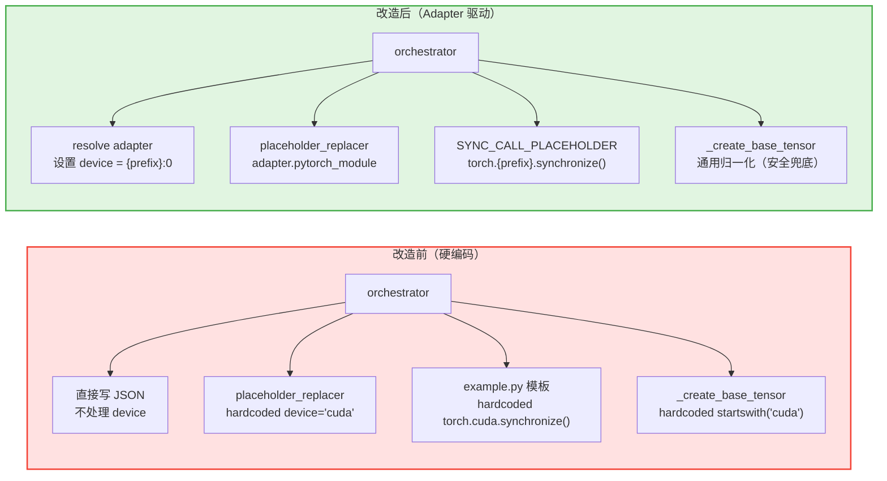

# PR: Reproducer 迁移 — 将 reproducer 模块的后端硬编码收敛到 Adapter 驱动

## 背景信息

- **RFC 文档**：https://github.com/meta-pytorch/tritonparse/issues/367
- **前置 PR**：
  - https://github.com/meta-pytorch/tritonparse/pull/387 （Reader-side 基础设施层与通用 Parse 逻辑改造）
  - https://github.com/meta-pytorch/tritonparse/pull/394 （Parser 分发系统重构）
  - https://github.com/meta-pytorch/tritonparse/pull/401 （Analysis 分发系统重构）
  - https://github.com/meta-pytorch/tritonparse/pull/403 （派生能力重构）

## 摘要

本 PR 完成 **Flexible Backend Support RFC Phase 1 的最后一个缺口**：将 `reproducer/` 模块中的后端硬编码迁移到 Adapter 驱动机制。

`reproducer/` 模块此前有三处 CUDA 硬编码（设备归一化、scratch allocator 设备、同步调用），且零引用 Adapter 系统。`context_bundle.compile["backend"]` 已捕获后端信息但从未被消费。本 PR 打通 `backend → resolve adapter → device/sync` 这条链路，使 reproducer 的后端差异统一收敛到 Adapter contract 中。

---

## 核心改动

### 1. `pytorch_module` 语义调整（`tritonparse/backend.py`）

`pytorch_module` 属性的返回值从完整模块路径 `"torch.cuda"` 改为设备前缀 `"cuda"`。

PyTorch 原生支持（in-tree）的加速器后端均遵循同一规律：

| 后端 | 设备字符串 | 同步调用 | 前缀 |
|------|-----------|---------|------|
| NVIDIA CUDA | `cuda:0` | `torch.cuda.synchronize()` | cuda |
| AMD ROCm | `cuda:0` | `torch.cuda.synchronize()` | cuda |
| Apple MPS | `mps:0` | `torch.mps.synchronize()` | mps |
| Intel XPU | `xpu:0` | `torch.xpu.synchronize()` | xpu |

注：ROCm 不是独立后端，走的是 PyTorch CUDA 兼容层（`torch.cuda` / `device="cuda:0"`），因此前缀与 NVIDIA 相同。

设备前缀 = `torch.{xxx}.synchronize()` 中间的词 = `pytorch_module` 的值。一个字段统一派生两个场景：

- 设备字符串：`f"{adapter.pytorch_module}:0"` → `"cuda:0"`
- 同步调用：`f"torch.{adapter.pytorch_module}.synchronize()"` → `"torch.cuda.synchronize()"`

### 2. Adapter-driven 设备归一化（`tritonparse/reproducer/orchestrator.py`）

在 `orchestrator.py::reproduce()` 中，`build_context_bundle` 之后、JSON 写入之前，新增 adapter-driven 设备归一化：

```python
_adapter = get_backend_registry().resolve(adapter_name=f"{_backend}_triton")
_normalized_device = f"{_adapter.pytorch_module}:0"
for _arg in context_bundle.raw_launch_event.get("extracted_args", {}).values():
    if isinstance(_arg, dict) and _arg.get("device", "cpu") != "cpu":
        _arg["device"] = _normalized_device
```

- 使用 adapter 的 `pytorch_module` 设置设备字符串，而非归一化 trace 中已有的值
- File mode（写 JSON 文件）和 embed mode（内嵌 JSON）两条路径均覆盖
- GPU 参数统一设为 `{prefix}:0`；CPU 参数保持不动

### 3. `normalize_device_string()` 默认实现（`tritonparse/backend.py`）

从 no-op 改为通用归一化逻辑：

```python
def normalize_device_string(self, device: str) -> str:
    if not isinstance(device, str) or not device or device == "cpu":
        return "cpu"
    prefix = device.split(":")[0]
    return f"{prefix}:0"
```

`NvidiaTritonAdapter` 和 `AmdTritonAdapter` 不需要 override —— 通用逻辑已覆盖。

### 4. Scratch allocator 设备参数化（`tritonparse/reproducer/placeholder_replacer.py`）

`_replace_launch_kernel_body()` 中 scratch allocator 的 `device='cuda'` 改为 adapter-driven：

```python
_adapter = get_backend_registry().resolve(adapter_name=f"{_backend}_triton")
_device_prefix = _adapter.pytorch_module
f"    return torch.empty(size, dtype=torch.int8, device='{_device_prefix}')"
```

### 5. 同步调用参数化（`tritonparse/reproducer/placeholder_replacer.py` + `templates/example.py`）

模板中的硬编码 `torch.cuda.synchronize()` 替换为 placeholder：

```python
# {{SYNC_CALL_PLACEHOLDER}}
```

新增 `SYNC_CALL_PLACEHOLDER` 常量及 `_replace_sync_call` handler，在生成时根据 adapter 替换为正确的同步调用。

### 6. `_create_base_tensor` 运行时归一化泛化（`tritonparse/reproducer/utils.py`）

从 CUDA 特判改为通用逻辑：

```python
# 改前
if isinstance(device, str) and device.startswith("cuda"):
    device = "cuda:0"

# 改后
if isinstance(device, str) and device != "cpu":
    prefix = device.split(":")[0]
    device = f"{prefix}:0"
```

此函数通过 AST 提取并嵌入生成脚本，在 reproducer 运行时执行（无 adapter 可用）。此归一化作为安全兜底，主归一化由 orchestrator 在生成时完成。

---

## 架构改进

### Reproducer 后端决策流程对比



---

## 测试验证

新增测试验证 adapter-driven 逻辑确实生效（而非硬编码碰巧通过）：

- `TestNormalizeDeviceString`：验证 `normalize_device_string()` 对各种输入的归一化行为
- `TestReproducerAdapterDriven`：通过 mock `pytorch_module` 返回非 `"cuda"` 值，验证 sync call 和 scratch allocator 的输出跟随 adapter 变化

```bash
python -m pytest tests/cpu/test_multi_backend_stage.py -k "TestNormalizeDeviceString" -v
python -m pytest tests/cpu/test_placeholder_replacer.py -k "TestReproducerAdapterDriven" -v
```

全量 CPU 测试无回归：411 passed。

---

## 改动文件总览

| 文件 | 改动 |
|------|------|
| `tritonparse/backend.py` | `normalize_device_string()` 从 no-op 改为通用归一化；`pytorch_module` 从 `"torch.cuda"` 改为 `"cuda"` |
| `tritonparse/reproducer/orchestrator.py` | 新增 adapter-driven 设备归一化，在 JSON 写入前统一设置 device |
| `tritonparse/reproducer/placeholder_replacer.py` | scratch allocator 设备参数化；新增 `SYNC_CALL_PLACEHOLDER` + `_replace_sync_call` handler |
| `tritonparse/reproducer/templates/example.py` | `torch.cuda.synchronize()` → `# {{SYNC_CALL_PLACEHOLDER}}` |
| `tritonparse/reproducer/utils.py` | `_create_base_tensor` 归一化从 CUDA 特判改为通用逻辑 |
| `tests/cpu/test_multi_backend_stage.py` | 新增 `TestNormalizeDeviceString` |
| `tests/cpu/test_placeholder_replacer.py` | 新增 `TestReproducerAdapterDriven` |

---

## 总结

本 PR 完成 **Flexible Backend Support RFC Phase 1 的最后一步**。至此，Phase 1 所有 reader-side 后端收敛工作全部完成：

- PR 1：Adapter 基础设施 + `trace_processor.py` 重构
- PR 2：Parser 分发系统重构
- PR 3：Analysis 分发系统重构
- PR 4：派生能力重构
- **PR 5（本 PR）：Reproducer 迁移**

`reproducer/` 模块中的所有后端硬编码已收敛到 Adapter contract，设备字符串和同步调用统一从 `adapter.pytorch_module` 一个字段派生。新增后端只需实现对应 adapter 并定义 `pytorch_module` 值，reproducer 即可自动适配，无需侵入共享代码。
