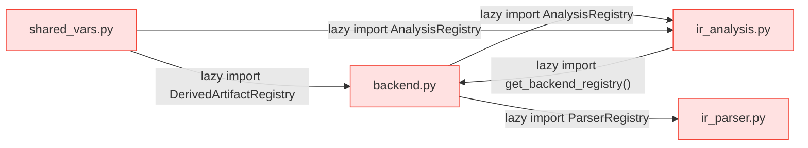
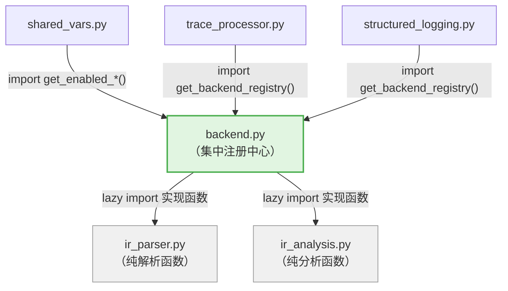
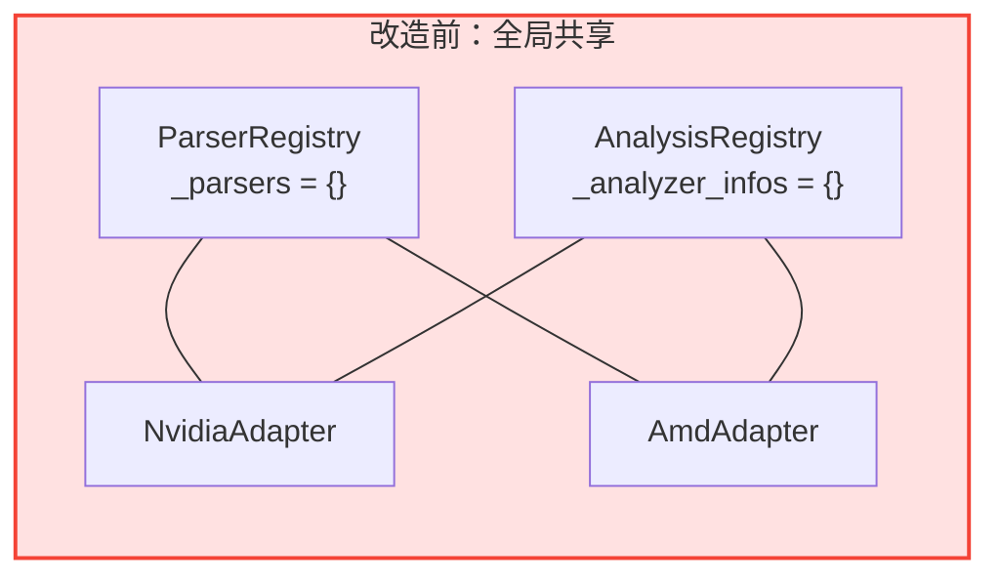
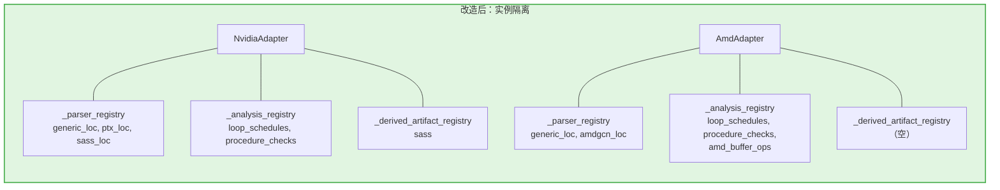
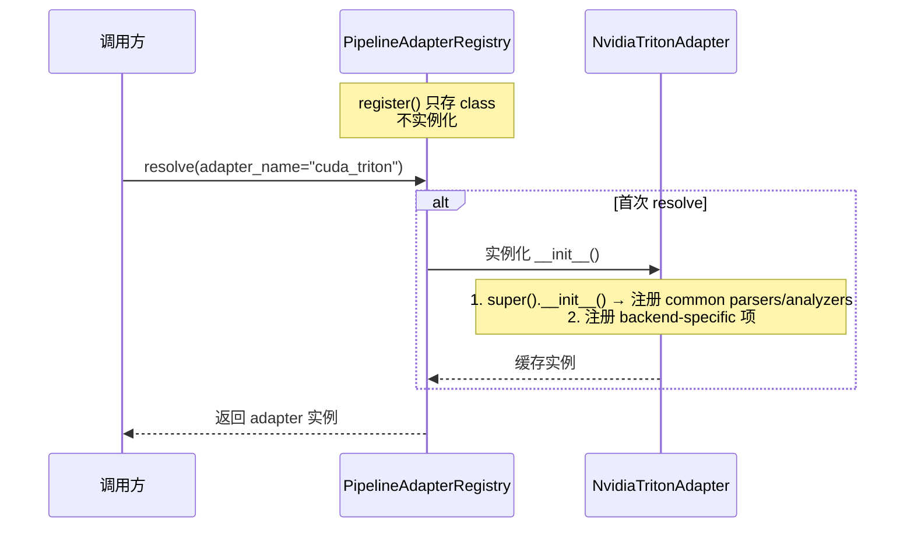

# PR: Registry 架构重构 — 消除循环依赖 & 实现实例级隔离

## 摘要

本 PR 包含两项核心重构，彻底解决 `backend.py`、`ir_analysis.py`、`ir_parser.py`、`shared_vars.py` 四个模块间的循环依赖问题，并将三个 Registry（Parser / Analysis / DerivedArtifact）从全局共享改为 per-adapter 实例隔离，同时引入 Adapter 延迟初始化机制。

---

## 任务 1：核心类迁移至 backend.py，消除循环依赖

### 问题

改造前，三个核心注册类分散在不同模块中，形成脆弱的三方循环依赖：



四个模块通过大量 lazy import（在函数体内部 `from ... import`）勉强避免 import 时循环，但非常脆弱。

### 改动

将 `ParserRegistry`、`AnalyzerInfo`、`AnalysisRegistry` 从 `ir_parser.py` / `ir_analysis.py` 迁移到 `backend.py`，与已有的 `DerivedArtifactRegistry` 对齐：



依赖方向统一：`backend.py` 作为集中注册中心，`ir_parser.py` 和 `ir_analysis.py` 只负责具体实现函数，不再持有 Registry 定义。

### 迁移明细

| 类 | 迁移前 | 迁移后 |
|---|---|---|
| `ParserRegistry` | `ir_parser.py` | `backend.py` |
| `AnalyzerInfo` | `ir_analysis.py` | `backend.py` |
| `AnalysisRegistry` | `ir_analysis.py` | `backend.py` |
| `DerivedArtifactRegistry` | `backend.py`（无变化） | `backend.py` |
| `_initialize_common_parsers()` | `ir_parser.py`（模块加载时执行） | `backend.py` |
| `_initialize_common_analyzers()` | `ir_analysis.py`（模块加载时执行） | `backend.py` |

---

## 任务 2：Registry 从类级共享改为实例级隔离 + 延迟初始化

### 问题

改造前，三个 Registry 均使用类级变量存储（`_parsers: Dict = {}`），所有 adapter 实例共享同一个 dict：



NVIDIA 和 AMD 的 parser/analyzer 注册耦合在一起，无法独立管理。

### 改动 1：Registry 实例化

三个 Registry 全部改为实例级存储，每个 adapter 持有独立的 Registry 实例：



### 改动 2：Adapter 延迟初始化

`PipelineAdapterRegistry` 改为存储 adapter class，首次 `resolve()` 时才实例化并缓存：



### 改动 3：Adapter 属性改为 class attribute

`adapter_name`、`runtime_backend`、`pytorch_module` 从 `@property` 改为 class attribute，统一风格并支持延迟初始化时无需实例化即可获取 adapter 名：

```python
# 改前
class NvidiaTritonAdapter(CompilationPipelineAdapter):
    @property
    def adapter_name(self) -> str:
        return "cuda_triton"

# 改后
class NvidiaTritonAdapter(CompilationPipelineAdapter):
    adapter_name: str = "cuda_triton"
```

### 改动 4：`get_ir_stages` 提升到基类

两个子类的 `get_ir_stages()` 实现完全相同（`return self._stages`），提升到基类，子类只需在 `__init__` 中设置 `self._stages`。

### 改动 5：验证逻辑从 `shared_vars.py` 延迟到 Adapter 层

`get_enabled_analyses()` 和 `get_enabled_derived_artifacts()` 中的早期验证被移除，改为在 adapter 方法中执行延迟验证：

| 验证项 | 改造前 | 改造后 |
|---|---|---|
| Analyzer 名称校验 | `shared_vars.py`（需 lazy import Registry） | `adapter.get_executable_analyzers()` |
| Derived artifact 名称校验 | `shared_vars.py`（需 lazy import Registry） | `adapter.get_applicable_derived_artifacts()` |

两个方法对称设计，均在 adapter 基类中实现验证 + 过滤：

```python
# Analyzer 验证
def get_executable_analyzers(self, file_content, enabled_analyses=None) -> list[str]

# Derived artifact 验证
def get_applicable_derived_artifacts(self, enabled_derived_artifacts=None) -> list[DerivedArtifactInfo]
```

### 改动 6：清理死代码

删除 4 个无调用方的方法：

- `PipelineAdapterRegistry.create_all()` — 无外部调用
- `CompilationPipelineAdapter.collect_derived_artifact_contents()` — 无外部调用
- `CompilationPipelineAdapter.get_stage_by_artifact()` — 无外部调用
- `CompilationPipelineAdapter.known_stage_extensions` — 无外部调用

---

## 改动文件总览

| 文件 | 改动 |
|------|------|
| `tritonparse/backend.py` | Registry 类迁移到此处 + 改为实例级 + Adapter class attribute + 延迟初始化 + 清理死代码 |
| `tritonparse/parse/ir_parser.py` | 移除 `ParserRegistry` 和 `_initialize_common_parsers()` |
| `tritonparse/parse/ir_analysis.py` | 移除 `AnalyzerInfo`、`AnalysisRegistry` 和 `_initialize_common_analyzers()` |
| `tritonparse/shared_vars.py` | 移除早期验证逻辑，`get_enabled_analyses()` / `get_enabled_derived_artifacts()` 只解析 env var |
| `tritonparse/structured_logging.py` | 调用 `adapter.get_applicable_derived_artifacts()` 替代手动过滤 |
| `tests/cpu/test_multi_backend_stage.py` | 更新测试以适配实例隔离语义 |

---

## 测试验证

全量 CPU 测试无回归：**472 passed**。

```bash
conda run -n torch-gpu python -m pytest tests/cpu/ -q
```

---

## 总结

本 PR 完成两项架构级重构：

1. **消除循环依赖**：三个核心 Registry 和公共初始化逻辑统一收敛到 `backend.py`，`ir_parser.py` / `ir_analysis.py` 降级为纯实现模块
2. **实例级隔离 + 延迟初始化**：每个 adapter 持有独立的 Registry 实例，`PipelineAdapterRegistry` 延迟到首次使用时才实例化 adapter

两项改动对外接口完全不变，调用方无需修改。新增后端只需继承 `CompilationPipelineAdapter`，设置 class attribute，在 `__init__` 中注册自己的 parser/analyzer 即可自动获得完整隔离。
