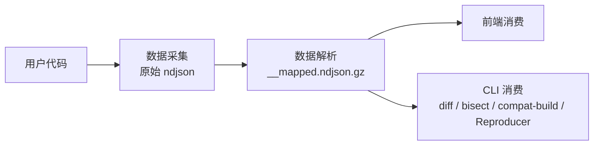
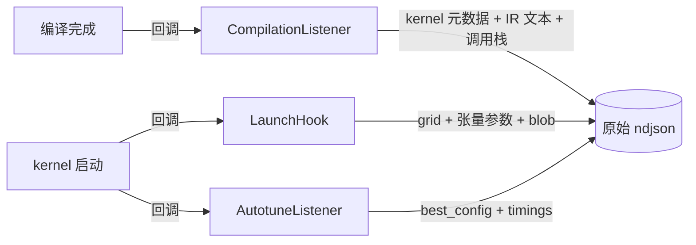
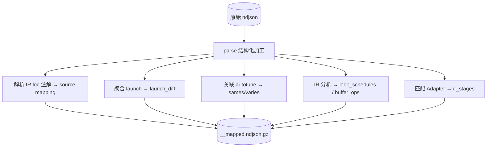

# TritonParse 使用分享 — 大纲


---

## 一、概述和原理

### 1.1 这是什么

- **是什么**：Meta 开源的 Triton kernel 编译过程可视化 & 分析工具
- **做什么**：让 Triton 编译从黑盒变成可见、可比、可复现
- **支持后端**：NVIDIA CUDA / AMD ROCm / Ascend NPU（CANN）


### 1.2 整体数据流



> 一句话：Hook 抓数据 → parse 结构化 → 多端消费。所有处理在本地，不传服务器。

### 1.3 各阶段做了什么

**数据采集**：Triton 在 JIT 编译管道中预留了回调点（`triton.knobs`），tritonparse 在 `init(enable_trace_launch=True)` 时把自己的回调注册进去：



> 只做原样采集，IR 文本存下来了但还没解析。

**数据解析**：原始 ndjson 是按时间交织的扁平事件流，parse 把它加工成以 kernel 为核心的结构化数据：



- **source mapping**：IR 文本中有 loc 注解（如 `#loc2 = loc("xxx.py":20:28)`），parse 逐阶段解析，建立 Python 行 ↔ 各 IR 阶段行的双向映射。这是前端**同步高亮**的数据基础。
- **事件聚合**：按 kernel hash 把 compilation + N 次 launch 归组，对比差异生成 launch_diff；关联 autotune 结果生成 sames/varies 表。
- **后端适配**：读 `metadata.backend_name`，匹配 Adapter，注入该后端的 ir_stages 给前端。

**数据消费**：产出的 `__mapped.ndjson.gz` 可通过 Web 前端可视化、CLI 工具（diff / bisect / compat-build）、Reproducer 独立脚本提取三种方式消费。Reproducer 的原理：


> Ascend：数据采集 → parse → Web 可视化 → Reproducer 完整可用。bisect 和 compat-builder 不可用。

### 1.4 使用限制

- **Python**：≥ 3.10
- **Triton**：≥ 3.4.0（Ascend 需 triton-ascend ≥ 3.5）
- **pyTorch**：和triton匹配的torch版本
- **GPU/NPU**：NVIDIA / AMD GPU 必需, Ascend 需 NPU

---

## 二、实际上手

TritonParse 工作流程包含三个主要步骤：

1. **生成跟踪** — 捕获 Triton 编译事件
2. **解析跟踪** — 将原始日志处理为结构化格式
3. **分析结果** — 使用 Web 界面进行可视化和探索

---

### 2.1 环境变量

配置 TritonParse 行为的环境变量，建议提前设置：

| 变量 | 描述 | 建议 |
|------|------|------|
| `TRITONPARSE_MORE_TENSOR_INFORMATION` | 收集张量统计信息（min/max/mean/std） | 推荐 `"1"` |
| `TRITONPARSE_SAVE_TENSOR_BLOBS` | 将实际张量数据保存为 blob 文件 | 需精确复现时 `"1"` |
| `TRITONPARSE_KERNEL_ALLOWLIST` | 过滤特定内核（逗号分隔的模式） | 按需 |
| `TORCHINDUCTOR_FX_GRAPH_CACHE` | 禁用 FX 图缓存，确保每次触发编译 | `"0"` |
| `TRITONPARSE_DEBUG` | 启用调试日志记录 | 按需 `"1"` |

> 💡 **参见[环境变量参考](https://github.com/meta-pytorch/tritonparse/wiki/07.-Environment-Variables-Reference)** 获取所有变量的完整文档。

### 2.2 标准设置模式

所有 TritonParse 工作流程都遵循此模式：

**初始化日志记录：**

```python
import tritonparse.structured_logging

log_path = "./logs/"
tritonparse.structured_logging.init(
    log_path,
    enable_trace_launch=True,              # 【必开】核心开关
    enable_more_tensor_information=True,   # 【推荐】张量统计
)
```

**解析跟踪：**

```python
import tritonparse.parse.utils

tritonparse.parse.utils.unified_parse(
    source=log_path,
    out="./parsed_output",
    overwrite=True
)
```

**替代方案 - 命令行：**
```bash
tritonparseoss parse ./logs/ --out ./parsed_output
```

> 这就是最基本的 init → 跑代码 → parse 三步走模式。

---

### 2.3 步骤 1：生成 Triton 跟踪文件

以 `tests/test_complex_kernels_npu.py` 为例——这是一个运行在 Ascend NPU 上的小规模神经网络前向推理脚本，串联了 Matmul、Add、Softmax、Fused Scale+ReLU 四个 Triton kernel。两次 forward pass 触发同一组 kernel 以不同参数执行（scale=1.0 vs 0.5），这会在 launch_diff 中体现参数变化。

> 完整源码见 [tests/test_complex_kernels_npu.py](tests/test_complex_kernels_npu.py)

核心模式：

```python
import torch
import torch_npu
import triton
import triton.language as tl
import tritonparse.structured_logging
import tritonparse.parse.utils

# 初始化日志记录
log_path = "./logs"
tritonparse.structured_logging.init(log_path, enable_trace_launch=True)

# ... 定义和运行你的 Triton kernel ...

# 解析生成的日志
tritonparse.parse.utils.unified_parse(
    source=log_path, out="./parsed_output", overwrite=True
)
```

**通过 `torch.compile` 追踪（Ascend / CUDA 均适用）：**

```python
import torch
import torch_npu                         # Ascend 必须先 import torch_npu
import tritonparse.structured_logging
import tritonparse.parse.utils

# 初始化日志记录
log_path = "./logs"
tritonparse.structured_logging.init(log_path, enable_trace_launch=True)

# torch.compile 自动触发 Triton 编译，无需手写 @triton.jit
@torch.compile
def simple_add(a, b):
    return a + b

device = "npu:0"  # 或 "cuda:0"
a = torch.randn(1024, 1024, device=device, dtype=torch.float32)
b = torch.randn(1024, 1024, device=device, dtype=torch.float32)
result = simple_add(a, b)

# 解析生成的日志
tritonparse.parse.utils.unified_parse(
    source=log_path, out="./parsed_output", overwrite=True
)
```

**`init()` 可选参数：**

| 参数 | 类型 | 默认值 | 描述 |
|------|------|--------|------|
| `trace_folder` | `str` | `None` | 跟踪文件存放目录 |
| `enable_trace_launch` | `bool` | `False` | **【必开】** 激活 JITHook + LaunchHook，捕获所有 launch 事件 |
| `enable_more_tensor_information` | `bool` | `False` | 记录张量 min/max/mean/std，用于 Reproducer 统计重建 |
| `enable_tensor_blob_storage` | `bool` | `False` | 保存完整张量数据为 `.bin` 文件，用于 Reproducer 精确复现 |
| `tensor_storage_quota` | `int` | `None` | blob 存储配额（字节），默认 100GB |
| `tensor_save_skip_runs` | `int` | `None` | 跳过前 N 次 kernel 运行的 blob 保存 |
| `tensor_save_max_runs` | `int` | `None` | 跳过后最多保存 N 次运行的 blob |
| `compression` | `str` | `None` | 压缩格式：`"none"`、`"gzip"`、`"zstd"`、`"clp"` |
| `enable_sass_dump` | `bool` | `False` | 启用 NVIDIA SASS 反汇编（仅 CUDA，较慢） |
| `enable_trace_launch_within_profiling` | `bool` | `False` | 仅在 `torch.profiler` RECORD 阶段开启 launch 追踪（与 `enable_trace_launch` 互斥） |

**运行：**

```bash
TORCHINDUCTOR_FX_GRAPH_CACHE=0 python tests/test_complex_kernels_npu.py
```

**预期输出：**

```
================================================================================
TritonParse NPU Example: Mini Neural Network Forward Pass
================================================================================

--- Forward Pass 1 (batch=4, seq=8, dim=16, scale=1.0) ---
  [Matmul]   input torch.Size([32, 16]) @ weight torch.Size([16, 16]) -> hidden torch.Size([32, 16])
  [Add]      hidden + bias_linear -> hidden torch.Size([32, 16])
  [Softmax]  hidden torch.Size([32, 16]) -> scores torch.Size([32, 16])
  [Fused]    scores * 1.0 + bias -> ReLU -> output torch.Size([32, 16])
  => output shape: torch.Size([32, 16])

--- Forward Pass 2 (batch=4, seq=8, dim=16, scale=0.5) ---
  [Matmul]   input torch.Size([32, 16]) @ weight torch.Size([16, 16]) -> hidden torch.Size([32, 16])
  [Add]      hidden + bias_linear -> hidden torch.Size([32, 16])
  [Softmax]  hidden torch.Size([32, 16]) -> scores torch.Size([32, 16])
  [Fused]    scores * 0.5 + bias -> ReLU -> output torch.Size([32, 16])
  => output shape: torch.Size([32, 16])

================================================================================
All forward passes completed successfully!
================================================================================
2026-06-10 11:04:30,472 - tritonparse.SourceMapping - INFO - Loaded 3 procedure checks from default_procedure_checks.json
2026-06-10 11:04:30,514 - tritonparse.SourceMapping - WARNING - Callsite #loc43 references undefined callee #loc10
2026-06-10 11:04:30,514 - tritonparse.SourceMapping - WARNING - Callsite #loc45 references undefined callee #loc10
tritonparse log file list: /tmp/tmpagwamzg4/log_file_list.json
2026-06-10 11:04:30,556 - tritonparse - INFO - Copying parsed logs from /tmp/tmpagwamzg4 to /home/zhudada/project/tritonparse/parsed_output

================================================================================
📁 TRITONPARSE PARSING RESULTS
================================================================================
📂 Parsed files directory: /home/zhudada/project/tritonparse/parsed_output
📊 Total files generated: 2

📄 Generated files:
--------------------------------------------------
   1. 📝 dedicated_log_triton_trace_zhudada_rank_none_pid_3905452_host_coder-70ce9b9d-40c4-4259-9aee-32dbfffd3982-57f9dfc5c6-jbhml__mapped.ndjson.gz (48.0KB)
   2. 📝 log_file_list.json (265B)
================================================================================
✅ Parsing completed successfully!
================================================================================

Logs parsed to ./parsed_output
```

---

### 2.4 步骤 2：解析跟踪文件

**Python API：**

```python
import tritonparse.parse.utils

# 基本解析
tritonparse.parse.utils.unified_parse(
    source="./logs/",           # 包含原始日志的输入目录
    out="./parsed_output",      # 处理后文件的输出目录
    overwrite=True              # 覆盖现有输出
)

# 高级选项
tritonparse.parse.utils.unified_parse(
    source="./logs/",
    out="./parsed_output",
    overwrite=True,
    rank=0,                     # 分析特定 rank（适用于多 GPU）
    all_ranks=False,            # 或分析所有 rank
    verbose=True                # 启用详细日志记录
)
```

**命令行：**

```bash
tritonparseoss parse <source> [options]
```

| 参数 | 描述 |
|------|------|
| `<source>` | 包含原始日志的输入目录或文件路径 |

| 选项 | 描述 |
|------|------|
| `-o`, `--out <path>` | 输出目录 |
| `--overwrite` | 覆盖已存在的输出目录 |
| `-r`, `--rank <N>` | 分析特定 rank（整数或 `none`） |
| `--all-ranks` | 分析所有 rank（包含无 rank 文件） |
| `-v`, `--verbose` | 启用详细日志 |
| `--torch-trace-dir <path>` | 多进程编译时恢复 kernel 归属的 torch trace 日志目录 |
| `--procedure-checks <path>` | 自定义 procedure check 配置 JSON 文件 |
| `--no-pre-init-attribution` | 禁用 pre-init kernel 自动归并到对应 rank |

```bash
# 基本用法
tritonparseoss parse ./logs/ --out ./parsed_output

# 带选项
tritonparseoss parse ./logs/ --out ./parsed_output --overwrite --verbose

# 多 GPU：解析特定 rank
tritonparseoss parse ./logs/ --out ./parsed_output --rank 0

# 多 GPU：解析所有 rank
tritonparseoss parse ./logs/ --out ./parsed_output --all-ranks
```

---

### 2.5 info：查看 trace 中有哪些内核

在解析后、可视化或提取复现器之前，可以用 `info` 命令快速浏览 trace 中的内容：

```bash
tritonparseoss info <input_file> [options]
```

| 参数 | 描述 |
|------|------|
| `<input_file>` | trace 文件的路径（`.ndjson` 或 `.ndjson.gz`） |

| 选项 | 描述 |
|------|------|
| `--kernel <name>` | 按确切名称查询特定内核的详细信息 |
| `--args-list` | 与 `--kernel` 配合，按参数值过滤 launch（如 `num_stages=3,num_warps=4`） |

```bash
# 列出 trace 中所有内核
tritonparseoss info parsed_output/trace.ndjson.gz

# 查询特定内核的 launch 信息
tritonparseoss info parsed_output/trace.ndjson.gz --kernel matmul_kernel

# 按参数值过滤（autotune 场景：只找 num_stages=3 的 launch）
tritonparseoss info parsed_output/trace.ndjson.gz --kernel matmul_kernel --args-list num_stages=3,num_warps=4
```

---

### 2.6 步骤 3：使用 Web 界面分析

**在线界面（推荐）：**

1. 访问 [https://meta-pytorch.org/tritonparse/](https://meta-pytorch.org/tritonparse/)
2. 拖入 `parsed_output/xxx__mapped.ndjson.gz` 文件
3. 所有处理在浏览器本地完成，不上传数据

> ⚠️ 注意：必须使用 parse **之后**的 `.gz` 文件（含 source mapping + launch_diff），原始 ndjson 功能不全。

**Web 界面的四大页面：**

#### Kernel Overview — 内核总览

展示了本次追踪到的所有 Triton 内核的编译概览信息：

- **编译元数据**：`num_warps`、`num_stages`、`num_ctas`、`target arch`、`cluster_dims` 等全部编译参数
- **调用栈**：触发本次编译的完整 Python 调用栈（文件 : 行号）
- **Autotune 分析**：sames / varies 对比表，winner 高亮 🏆，点击候选 hash 可跳转到对应 kernel 的 IR
- **Launch 分析**：同一 kernel 多次 launch 的参数变化分布（Unchanged / Differing 分类，分布统计）

#### IR Code View — IR 代码视图

- 左右栏**并排选择两个 IR 阶段**，同步查看
- 点击一边某一行 → 另一边**自动高亮对应行**（基于 parse 阶段建立的 source mapping）
- 支持所有 IR 阶段：Python Source ↔ TTIR ↔ TTGIR ↔ LLIR ↔ PTX / AMDGCN / NPUBIN

#### File Diff — 跨文件对比

- 加载**两个 trace 文件**，按 kernel hash 自动匹配同名 kernel
- Monaco DiffEditor **逐行对比** IR 代码
- 可选参数：忽略空白、只显示差异、上下文行数、单词级 / 行级 diff
- 支持 URL 分享：`?view=file_diff&json_url=A.gz&json_b_url=B.gz&kernel_hash=xxx`

#### IR Analysis — IR 深度分析（Beta）

- Buffer ops 计数（TTGIR / AMDGCN）
- Loop schedule 结构分析（prologue / loop_body / epilogue）
- Procedure checks 检测结果
- Module attributes、tile size 等展示

---

### 2.7 复现器 — 生成独立内核脚本

TritonParse 可以自动生成独立的 Python 脚本，用于复现特定的内核执行，对于调试、共享测试用例以及隔离性能问题非常有用。

**命令行：**

```bash
tritonparseoss reproduce <input_file> [options]
```

| 参数 | 描述 |
|------|------|
| `<input_file>` | trace 文件的路径（`.ndjson` 或 `.ndjson.gz`） |

| 选项 | 描述 | 默认值 |
|------|------|--------|
| `--line <N>` | launch 事件的行索引（0-based。行 0 是 compilation 事件，行 1 起才是 launch） | `0` |
| `--kernel <name>` | 按确切名称查找内核 | - |
| `--launch-id <N>` | 使用 `--kernel` 时的启动实例 | `0` |
| `--out-dir <path>` | 输出目录 | `repro_output/<kernel>/` |
| `--template <name\|path>` | 模板名称或自定义模板路径 | `example` |
| `--kernel-import <mode>` | 导入模式：`default`、`copy`、`override-ttir` | `default` |
| `--embed-context` | 将 JSON 上下文直接嵌入 Python 脚本 | 关闭 |

```bash
# 为指定 launch 事件生成复现器（--line 从 0 开始计数）
tritonparseoss reproduce ./parsed_output/trace.ndjson.gz --line 1 --out-dir repro_output

# 按 kernel 名字提取
tritonparseoss reproduce ./parsed_output/trace.ndjson.gz --kernel matmul_kernel --out-dir repro_output

# 嵌入内核源代码
tritonparseoss reproduce ./parsed_output/trace.ndjson.gz --line 1 --kernel-import copy
```

**Python API：**

```python
from tritonparse.reproducer.orchestrator import reproduce

result = reproduce(
    input_path="./parsed_output/trace.ndjson.gz",
    line_index=1,
    out_dir="repro_output",
    template="example"
)

print(f"脚本: {result['repro_script']}")
print(f"上下文: {result['repro_context']}")
```

**生成的文件结构：**

```
repro_output/<kernel_name>/
├── repro_<timestamp>.py              # 独立的可执行脚本
├── repro_context_<timestamp>.json    # 内核元数据和参数
└── <hash>.bin                        # 张量 blob（如果在跟踪期间已启用）
```

**张量数据重建策略：**

| 策略 | 如何启用 | 效果 |
|------|----------|------|
| 精确 blob | `enable_tensor_blob_storage=True` | 完全一致 |
| 统计近似 | `enable_more_tensor_information=True` | mean/std/min/max 重建 |
| 随机回退 | 默认 | shape/dtype 匹配，值随机 |

**常见用例：**

```bash
# Bug 隔离
tritonparseoss reproduce trace.ndjson.gz --line 42 --out-dir bug_repro

# 性能基准测试
tritonparseoss reproduce trace.ndjson.gz --line 1 --out-dir benchmark

# 内核比较
tritonparseoss reproduce trace_v1.ndjson.gz --line 1 --out-dir v1
tritonparseoss reproduce trace_v2.ndjson.gz --line 1 --out-dir v2
```

> 💡 **提示**：参见 [Reproducer 指南](https://github.com/meta-pytorch/tritonparse/wiki/09.-Reproducer-Guide) 获取完整文档。

---

## 三、可扩展能力 — IR 分析器

tritonparse 在 parse 阶段通过 Adapter 机制为每个后端注册 IR 分析器，在编译事件的结构化数据中写入深度分析结果，前端 IR Analysis 页面据此渲染。

### 3.1 现有分析器

| 分析器 | 分析的 IR | 适用后端 | 功能 |
|--------|----------|---------|------|
| `loop_schedules` | TTGIR | NVIDIA / AMD | 解析循环结构，识别 prologue / loop_body / epilogue 阶段 |
| `procedure_checks` | AMDGCN | AMD | 基于 FileCheck 的 pattern 匹配，检测 BlockPingpong 等特定调度模式 |
| `amd_buffer_ops` | AMDGCN | AMD | 统计 buffer 操作数量 |

> 以上分析器目前均为 NVIDIA / AMD 后端设计，**Ascend 后端暂不可用**。Ascend 的 IR 链路为 TTIR → TTAdapter → MLIRBC → BCMLIR → NPUBIN，与上述分析器分析的 IR 阶段不匹配。

### 3.2 未来支持 Ascend 分析器

tritonparse 的分析器架构支持按后端扩展。未来如果有 Ascend 侧的 IR 分析需求（例如检测 NPUBIN 中的特定指令 pattern、统计 CANN 特有的优化信息），可以通过 Adapter 机制注册自定义分析器并合入上游社区。参见 [10.-Adding-a-New-Backend.md](docs-zh/10.-Adding-a-New-Backend.md) 了解完整的后端扩展流程。

---

## 四、实战场景

### 场景 1：Bug 隔离 — 提取问题内核独立调试

你的模型在 Ascend NPU 上跑出异常结果，怀疑某个 Triton kernel 有问题。把那个 kernel 从完整工程中提取出来，脱离原始环境单独跑，方便加调试代码、改参数。

**步骤：**

```bash
# 1. 先看 trace 里有哪些 kernel
tritonparseoss info parsed_output/xxx__mapped.ndjson.gz

# 2. 按名字提取第一个 launch（或用 --line 指定行号）
tritonparseoss reproduce parsed_output/xxx__mapped.ndjson.gz \
    --kernel matmul_kernel --out-dir bug_repro

# 3. 进入生成的目录，直接运行
cd bug_repro/matmul_kernel/
python repro_*.py

# 4. 编辑 repro_*.py，加入调试代码（打印中间值、加断点等），反复调试
```

---

### 场景 2：内核比较 — 对比两次运行的编译差异

你改了 Triton 版本或编译器参数，想对比同一 kernel 在新旧环境下的 IR 差异。

**步骤：**

```bash
# 1. 在旧环境跑一次，产生 trace_old.gz
TORCHINDUCTOR_FX_GRAPH_CACHE=0 python tests/test_complex_kernels_npu.py
mv parsed_output/xxx__mapped.ndjson.gz trace_old.gz

# 2. 在新环境跑一次，产生 trace_new.gz
TORCHINDUCTOR_FX_GRAPH_CACHE=0 python tests/test_complex_kernels_npu.py
mv parsed_output/xxx__mapped.ndjson.gz trace_new.gz

# 3. CLI 快速扫描差异
tritonparseoss diff trace_old.gz trace_new.gz --trace

# 4. 浏览器 File Diff 逐行对比 IR，定位具体变化的阶段和行
#    打开 https://meta-pytorch.org/tritonparse/
#    左边加载 trace_old.gz，右边加载 trace_new.gz
#    Monaco DiffEditor 逐行对比，切 All IR 模式看全部阶段差异

# 5. (可选) 提取差异 kernel 独立验证
tritonparseoss reproduce trace_old.gz --kernel matmul_kernel --out-dir v1
tritonparseoss reproduce trace_new.gz --kernel matmul_kernel --out-dir v2
python v1/matmul_kernel/repro_*.py > v1_output.txt
python v2/matmul_kernel/repro_*.py > v2_output.txt
diff v1_output.txt v2_output.txt
```

---

### 场景 3：性能基准测试 — 提取 kernel 做独立 benchmark

你想对模型中的某个 Triton kernel 做性能分析，但不想每次跑完整模型。

**步骤：**

```bash
# 1. 提取 kernel（开启张量统计信息以获得更接近真实的输入数据）
#    运行时先确保 init 时开了 enable_more_tensor_information=True
tritonparseoss reproduce parsed_output/xxx__mapped.ndjson.gz \
    --kernel matmul_kernel --out-dir bench

# 2. 在生成的脚本中加入计时代码
cd bench/matmul_kernel/
# 编辑 repro_*.py，加入：
#   import time
#   start = time.perf_counter()
#   for _ in range(100):
#       # ... 原有的 launch 代码 ...
#       torch.npu.synchronize()
#   elapsed = time.perf_counter() - start
#   print(f"avg: {elapsed / 100 * 1000:.3f} ms")

# 3. 运行 benchmark
python repro_*.py
```

---

### 场景 4：分享协作 — 将内核提取为独立脚本发给同事

你发现了一个 kernel 的编译问题，想发给同事帮忙分析，但同事不需要你的整个工程代码。

**步骤：**

```bash
# 1. 提取时嵌入内核源代码（--kernel-import copy），生成自包含脚本
tritonparseoss reproduce parsed_output/xxx__mapped.ndjson.gz \
    --kernel matmul_kernel --kernel-import copy --out-dir shareable_repro

# 2. 把整个目录打包发送
cd shareable_repro
tar czf matmul_kernel_repro.tar.gz matmul_kernel/
# 发给同事

# 同事那边：
#   tar xzf matmul_kernel_repro.tar.gz
#   cd matmul_kernel/
#   python repro_*.py
# 不需要安装任何额外依赖（除了 torch + torch_npu + triton）
```

---

**资源链接：**

- 在线工具：https://meta-pytorch.org/tritonparse/
- GitHub：https://github.com/meta-pytorch/tritonparse
- Wiki：https://github.com/meta-pytorch/tritonparse/wiki
